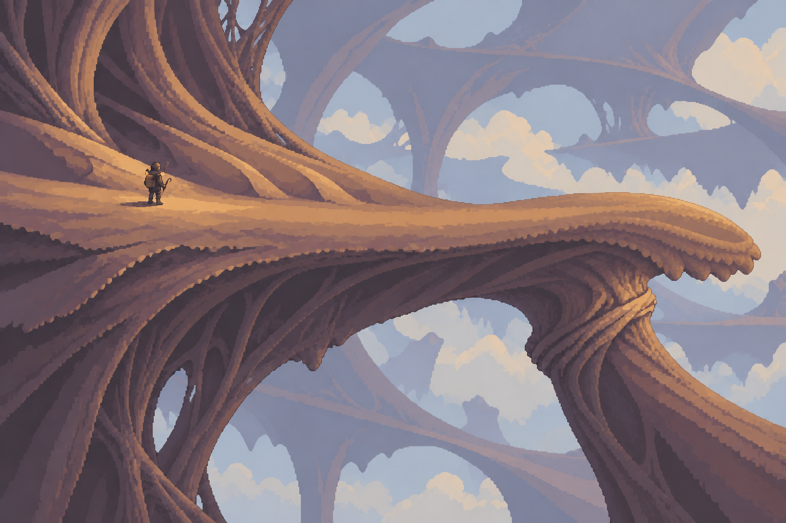
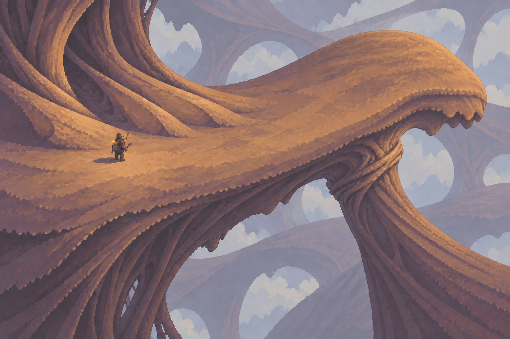
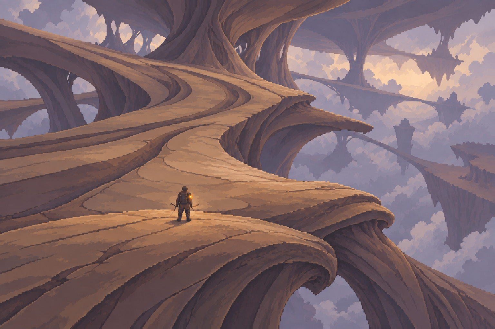

# 生命大陆：已被否决的三种概念静帧

迭代23 / DEC-160，2026-09-13生成；2026-09-15用户明确否决（DEC-161）。A/B在游戏设计上近似同类侧向平台空间，C偏向第三人称RPG；三张都是无法精确验证场景/镜头的概念图。**下文保留原交付时的判断作为失败记录，全部“待审/选择”均已被否决覆盖。** 不再从本组三图挑选，不以其为制作基准。当前直接做真实引擎内的场景，见[迭代23](../../tasks/iteration-23.md)。

**A**

**B**

**C**

## 取景与当前判断

- **A／侧向纵深：** 上表面、腹面、右侧承托和下方空腔同屏。支撑最直接，但可行走的纵深被压缩；不能据此决定正式游戏改为侧向移动。
- **B／斜上方：** 走面面积更充分，身体翻边与右下支撑仍可见。比较适合继续研究自由走动时的落脚阅读；实际图仍是中等斜角，不能把提示词中的48°当作已成立的几何投影。
- **C／向身体深处看：** 近处宽面沿生长折线延伸到远处肩部，右侧支撑与远层拉开尺度。深入群落的感觉更强；近处的转面、前后移动和遭遇阅读仍需下一阶段验证。

A/B保持了主要形体的对应，C重新绘制了沿纵深的展开。三张比较的是同一场景题目的视觉解法，**不是同一三维模型的严格三机位渲染**，细部接点尚不能逐点对应。所有图均由内置imagegen生成，尺寸1536×1024；原样复制，没有后期缩图、滤镜或局部拼接。人物也是概念重绘，不是生产精灵直接入图。

## 这批要判断什么

1. 第一眼是否能看懂人物的落脚面、下方空处，以及另一具身体接触它的位置。
2. 哪种取景更让人相信自己身处这种世界，同时愿意在里面移动、探索。
3. 当前角质/纤维形体和较亮的空气是否契合本作，还是仍像巨树、岩桥或奇幻风景。

我的观察是三张都比冻结实机保留了更连续的轮廓，但“不同生命”仍可能被理解为同一根系的分支；静帧也尚未证明它们活着。现阶段不指定胜者，不给画面记PASS。用户选定或修正静帧后，再做一次可读的承托变化、受力与恢复；之后才做最小引擎呈现和关卡。

## 记录

- [完整提示词、生成顺序与图像哈希](prompts.json)：8次生成/校正，保留3张本批交付原图。初稿曾有均匀碎纹、外缘似鸟头、C机位差异不够等问题，处理经过在清单中保留。
- [原图复审、八个游戏参考与后续验证顺序](../living-landmass-direction.md)。这些静帧是视觉假设，实际像素网格、相机、遮挡和运动还没有得到引擎证据。
- [迭代23](../../tasks/iteration-23.md)：实现继续冻结，短动态未开始；迭代24与四A供给验证仍保留，四B扩产未解锁。本批未提交或推送。
