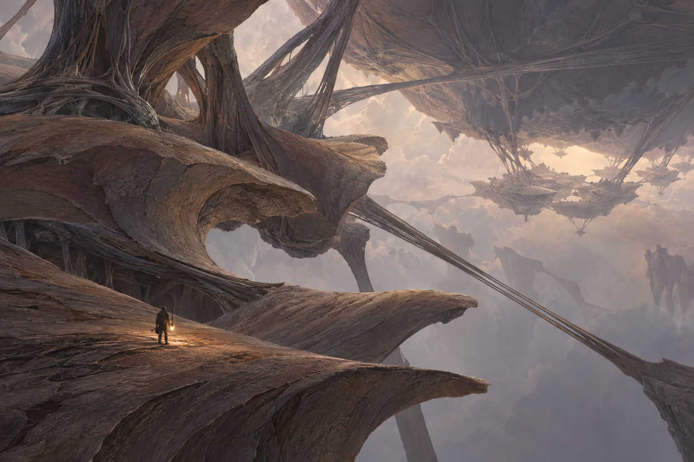
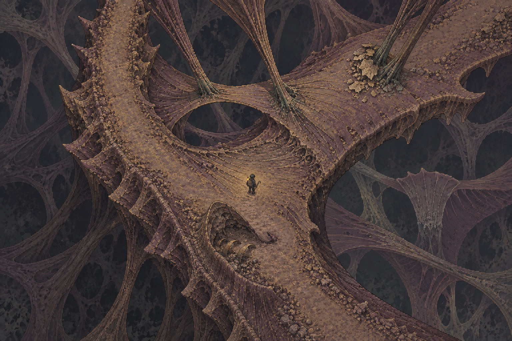

# 生命大陆：从概念到像素画面的视觉研究

**DEC-169 · 2026-09-16 方向终止归档。** 用户认可 R8 的视觉进步，但因制作成本和玩法损失决定回到俯视 2D 像素 Rift。三维/绘制式关卡探索停止，`218f773` 保留 R8 检查点；下文为历史实现、反馈和验证记录，不再构成继续制作或等待验收的授权。正式入口为 `/`（主菜单 → 净化点 → 裂隙），默认 `RiftScene` 保留原有 2D 地图与完整玩法。

**历史决定（DEC-167，2026-09-16）：** 用户新五条反馈指出前景惨白、中景异风格、晴空云海意象、双排平台桥和地形内容缺少体系。R6已按要求保存58b0605，R7继续实际重做：厚重连续承重网、前中远同族片层画法、无仙境云海空间，短规格见§16。原R6各次评审及技术结果为历史，不再写作等待人接受的已达标方案。

**上一决定（DEC-165，2026-09-15）：** 用户要求先归档当前状态及改进计划、提交，再继续实际制作。归档提交为`fac7eb9`；R4画面被否决，意图进步不等于交付成立。[用户原图](../qa/artifacts/iteration-23/vista-r4/user-review/feedback.png)指出中景低清而远景高清、近不可走体与中景过近、生命质感与微动不足、走面多边形感和贴图质量差，要求参考《八方旅人》让3D场景服务2D整体画法。当前R5规格见第13节；唯一执行清单为[迭代23任务](../tasks/iteration-23.md)末尾R5。直接制作并验证真实场景，不抽卡、不等新确认、不转玩法。

**上一决定（DEC-164）：** 用户曾授权完整实施分层远景、边缘质量、多地块路线、质感、生命关系和少量有因果的动态声音。第12节保存实际制作与两轮内审；随后人审已否决，不再作为待通过的当前方案。既有真实运行证据保留，不因此改记美术通过。

**上一决定（DEC-163）：** 用户认为R2移动原型只在一定程度上表达了意图，并明确纠正：不能进入搜撤，应继续打磨到可入游戏的视觉水平。场景构建、视角和整体风格仍开放；R2的35°相机、平面地形、绘景与程序岩块组合均没有被锁定为最终画法。第11节记录前一轮的实际改进与未决审美。

**上一决定（DEC-162）：** 用户将DEC-161实景观察场诊断为“完全不可用”：形体像被咬了一口的肉排，没有原画的壮阔感，只画局部且缺失背景，无法理解整个世界。泛绿不是本次否决的唯一原因，也不能靠换色解决。采用用户给出的分工：巨大的世界结构放在远处背景，建立可信的尺度及与探索区域的联系；玩家地图使用基础、通用、清楚的可走结构。第10节记录其简单移动原型和当时的内部复核，不代表美术通过。

原局部首次被否决的反馈为“我作为人类完全理解不了这是啥”，随后开展DEC-160研究与DEC-161真实局部样场。旧35°机位、1060跨度、固定XY、材料色表和视野表现不约束新体验场景；它们仍描述[冻结实现](../content/living-landmass.md)。整体风格、镜头角度和具体像素画法均未锁死，主题表达与实际游玩是判断依据。

**历史决定（DEC-161，已被本次反馈否决）：** 用户曾否决[三种生成静帧](iteration-23-visual/README.md)，改为真实引擎局部样场。下文第5–9节保留研究与失败样场的记录，不再作为当前执行前置，也不代表待人审的有效方案。第2节“脚下就是完整生命背面”等局部呈现建议同样不约束DEC-162。原概念继续表达世界意象；新背景是场景实际加载的绘景资产，通行、相机、落脚和遮挡证据来自引擎。

依据是用户认可的世界意象、[游戏世界观](../world.md)、本次实机反馈，以及下文列明的开发者/发行方资料。DEC-160研究没有沿用旧UX、像素模型、抽卡技能或既有美术HOW；DEC-163已显式阅读pixel-models，使用本质到形体、邻面差与实地复核方法，不用旧装置色板、相机或像素尺寸推翻用户对本批整体风格的开放。参考游戏的事实、画面观察与本项目推论分别陈述；研究不是某种路线已经可用的证明。

## 1. 先拿回原图，也重新审视原图



[原世界图](iteration-21-worlds/living-continent-world-r1.png)给出的是空间意象：人物站在宽而薄的巨大身体边缘；大体量之间隔着可见空气，连接跨过空腔，远处还有不同方向和大小的同类结构。视觉焦点是这种世界如何存在。



[原局部图](iteration-21-worlds/living-continent-scene-r2.png)给出一段较容易理解的走面：表面弯曲、边缘向下翻、纤维束扇形并入宽面，下面另有层次。它保留了局部属于更大结构的线索。

两图都不是运行时资产，也不是原生像素画面已经成立的证据。世界图主要是写实绘景质感；局部图包含密集细节，而且已经预先限定了高机位。这次可以重新选择机位与画法。它们看上去也可能被理解为巨大的根、骨架或纤维桥，单张图尚不能充分说明“活着”或“彼此托举”。原概念需要被提炼和补证，不应被当成不可质疑的成品。

## 2. 真正值得保留的核心

### 2.1 地面本身属于生命

玩家脚下的走面要能沿着连续形体，被追溯到一个巨大的身体。表面的生长纹向受力根部汇合，边缘逐渐变薄并卷向下方，连接在接点处融入本体。仅有褐色、角质噪点或一段升降地面，不能建立这种身份。

人的尺度是参照，不是解决所有问题的唯一办法。将人一再缩小，会同时损害动作和落脚识别；应主要用完整局部与更大体量的对照建立尺度。

### 2.2 它们相互维系，没有一块最终托住一切的地面

至少让人看见两级连续关系：脚下身体A由B承托或牵系，而B又与上方/远方C连接。无需画清整个世界的受力图，也无需给宇宙物理作解释；但不能只剩“一座悬浮岛+几根绳子”。

同屏画出一处完整接触和一处完整跨接，比在四周放许多相同浮岛更有效。不同体量和方向的存在向画框外延续，形成群落；相互维系不等于每个生命都要做成互相咬住的循环图案。

### 2.3 虚空是形体的一部分

原图的巨大空腔，使宽面、腹面与跨接束各自拥有可辨的边界。若把体块之间全部压成同一黑色，体量会粘在一起；若把下方填满细节，深度又会消失。

允许灰白的远处空气、低饱和雾层、稀薄天光和隐约下层轮廓参与分层。后克苏鲁的孤独、被改写与非人尺度可以在可读的画面中成立。颜色取自想要表达的关系，不先锁一套全景近黑的材料表。

### 2.4 活着，要有身体的主动动作与接触响应

静态轮廓先表达身体，短动态再表达生命：某处缓慢改变姿态，连接先松后紧，相邻宽面随接触改变形状，卸力时有重量感地恢复。动作发生在具体结构上，并沿连接传递；全图统一呼吸、贴图流动或平台匀速上下不能替代。

世界的尺度不要求整块大陆每隔十秒大幅抬升。可以让宏观动作极慢，同时在近处清楚看见一次局部负荷转移。声音在以后增强接触与重量；静音观看时也应读懂基本过程。

### 2.5 原生生命与污染需要能区分

世界本来就可以陌生。污染带来的变化可以是某一连接到了该松弛的时候仍绷着，使局部留下不自然的压折，而周围仍正常恢复。先建立正常动作，再呈现局部不匹配，玩家才有机会读懂改写造成的异常。

这是一种待验证的呈现建议，不在本轮锁定夹伤机制、12秒周期或可撬卡结。若画面最鲜明的特点最后适合别的局部玩法，应回到设计重新选择，不能让题材给已写好的机制作装饰。

## 3. 这版为什么失败

[用户原截图](../qa/artifacts/iteration-23/user-visual-rejection.png)作为失败证据原样保存。以下是画面诊断，不把尚未检查的每个像素都归因为具体shader。

1. **整体关系被截断。** 近处可见一块褐色表面，上下的大体量缺少足够清楚的完整轮廓和接点；人很难判断这些块属于一个身体还是几个独立平台。
2. **明暗边界像人为切片。** 深色矩形边、局部照亮区、弧形身体使用不同的轮廓逻辑，容易读成围挡、盒子或被裁切的舞台。
3. **宏观结构比装饰更难辨认。** 纹理和连接线仍能看到，承托者本体与空腔却糊在一起；图像的阅读次序反了。
4. **动作缺少可认出的主体。** 在不知道哪个形体是什么、接点在哪里时，形变可以被看成渲染错误，不能因为高度确实改变就认定生命感成立。
5. **制作顺序把画面锁在了几何里。** 前一包先确定通路、碰撞、危险与相机，再让美术适应它们。技术检查证明那段程序能运行，尚未证明这个世界能被理解。

另一个需要研究的冲突是：景观的尺度超出局部战术感知范围。可以提出“远处的大体量仍可辨，敌人/拾取/精细路线继续受感知限制”的分工；如何不误导通行、不泄露未知区域，要在后续视觉和规则验证中解决。本轮没有借此扩大正式视野、显示远处敌人或改记忆系统。

## 4. 从不同像素游戏中借什么

以下来源于2026-09-13查阅的官方资料和开发者正文。示例只证明它们自己的表达成立；应用到生命大陆的判断均是本项目推论，不是对方开发者的设计结论。没有照搬其世界题材、色板或战斗方式。

### Hyper Light Drifter：大形与空处可以直接说明尺度

**实际画面。** 官方[STORE_ScreenShot_02](https://images.squarespace-cdn.com/content/v1/619478d0d2aca04773e62fb7/4d2c7f71-e53b-40b9-8217-049ee2f40552/STORE_ScreenShot_02.png)里，一个巨大的倾斜遗存穿过画面，人物站在左侧边缘；大片较平静的蓝色空间将巨构与落脚面分开。巨物的轮廓比其表面细节更先被看到。[官方页面](https://www.heartmachine.com/hyper-light-drifter)提供截图及作品说明。

**转移到本项目。** 用一段具有明确身份的巨大身体跨越画框，给它留出空气；人脚下只占身体的一部分。无需高密度细纹也能传达尺度。

**限度。** 此图的大形有熟悉物体的辨认基础。陌生生命缺少这份先验，仍须设计足够明确的端部、包覆面和接点；其鲜艳配色也不是本项目的默认答案。

### Eastward：像素图形与现代光照各有职责

**官方事实与画面。** [官方媒体页](https://eastwardgame.com/media/)明确介绍像素原画与3D照明系统的组合。[features-1截图](https://eastwardgame.com/wp-content/uploads/2023/10/eastward-features-1.jpg)中，上层平台、楼梯、立面与下层空地具有连续关系；角色脚下的动作区域仍容易辨认。这里不凭图片推断其全部资产都是三维模型。

**转移到本项目。** 手工组织的大轮廓、色块、转面先说明形体，光照再增强体积、时间和空气。复杂照明无法弥补没有设计清楚的身体。

**限度。** 熟悉的楼梯和建筑天然提供空间线索，生命大陆必须自行创造等效的连续坡面、翻边和支点；不复制城镇装饰或密集信息量。

### Sea of Stars：有机走面也可以很清楚

**官方事实与画面。** [官方资料](https://sabotagestudio.com/presskits/sea-of-stars/)介绍像素表现、自由通行和动态照明。[Traversal-5截图](https://sabotagestudio.com/wp-content/uploads/2022/03/Traversal-5-launch.png)让人物站在弯曲树干上，顶面、侧面、断端、下方水面与投影各自可辨。树干不是规则地砖，但落脚位置明确。

**转移到本项目。** 宽面、侧缘和下面空间要分别描绘，表面纹理顺着形体走；能走的区域不必画成平板，也不必用明亮的轮廓线一圈圈标注。

**限度。** 单张树干图不能证明大陆互相支撑，更不能证明大范围动态曲面与战斗视角能直接沿用。其明快冒险色彩与角色比例没有被采纳。

### Rain World：形体间的空气与环境响应

**实际画面和官方说明。** [SCR1](https://www.rainworldgame.com/images/SCR1.png)与[SCR5](https://www.rainworldgame.com/images/SCR5.png)利用较亮空腔、深色近层、不同远近的结构，保留小角色的落脚边。[官网Animation说明](https://www.rainworldgame.com/)介绍传统动画与代码结合，让生物柔软、可弯曲且回应环境。未核实其完整图层数量或渲染实现。

**转移到本项目。** 空腔应获得积极的构图位置；接触、迟滞和身体响应可以承担生命感。近景清楚、远景克制并不等于把远景压成看不见。

**限度。** 这是侧面空间与其自身行动规则；不能凭这些图证明自由纵深战斗可行。工业管线也不等于生命纤维。

### Blasphemous：宏大与恐惧仍需可记住的形状

**实际画面和作者说明。** [官方废墟外景](https://shared.akamai.steamstatic.com/store_item_assets/steam/apps/774361/ss_bd57bcb1e9183cbea61339727a97bcc5206677b2.1920x1080.jpg)以浅天空托出巨大教堂，人物活动在清楚的近处地面；[地牢截图](https://shared.akamai.steamstatic.com/store_item_assets/steam/apps/774361/ss_b74f57919e88283fac75389e76ead2fed73997e5.1920x1080.jpg)保留行动层。设计师在[PlayStation文章](https://blog.playstation.com/archive/2019/09/09/the-creator-of-brutal-platformer-blasphemous-out-this-week-on-ps4-reveals-its-real-world-inspirations/)中解释现实建筑、地域与鲜明形象如何被夸张转化。

**转移到本项目。** 先画出可记忆的大形，再安排细节；恐惧不需要让每条边界都不可读。

**限度。** 上述实看图主要证明建筑尺度与分层，不能代替有机身体设计。宗教、刑具与血肉意象并未被采纳。

### OCTOPATH TRAVELER II：三维体积需要有目的的取景

**开发者事实。** [Square Enix/Acquire接受Unreal Engine的访谈](https://www.unrealengine.com/developer-interviews/octopath-traveler-ii-builds-a-bigger-bolder-world-in-its-stunning-hd-2d-style?lang=en-US)明确区分2D角色与以3D为主的背景，并讨论它们相处的困难；探索采用固定相机，地图设计尽量将让人想去的位置纳入同屏。[访谈船与码头图](https://cdn2.unrealengine.com/octopath-traveler-2-img-4-1920x1080-151cd2858184.jpg?resize=1&w=1200)把近处人物、码头走面与巨大船体放在同一空间关系里。

**转移到本项目。** 固定相机不等于任意俯角。每个区域的取景要保证主体、玩家与下一处空间能共同成立。三维可提供真实遮挡和接触，但最终像素形象仍须专门设计。

**限度。** 其背景的光滑光影、景深和材质不必照搬。本作此前三维样本的成功并不自动证明相同相机适合所有新世界。

### FEZ：像素读法可以进入形体制作本身

**开发者事实与画面。** 主程序员Renaud Bédard的[Trixels文章](https://theinstructionlimit.com/behind-fez-trixels-and-why-we-dont-just-say-voxels)说明三维场景、正交投影以及按不同方向设计的像素形体；[碰撞文章](https://theinstructionlimit.com/behind-fez-collision-and-physics)说明显示与深度/落脚规则需要共同处理。[官方图](https://shared.akamai.steamstatic.com/store_item_assets/steam/apps/224760/ss_a187b036f7bf387b9d2137403d915320bef7c55b.1920x1080.jpg)的顶缘、侧面和背景有清楚分工。

**转移到本项目。** 若选三维，需要从各面形状和最终投影组织像素，而不是仅在最后降采样；画出的可走关系也要有对应的空间规则。

**限度。** FEZ是体素式构造与三维正交呈现，不能统称传统二维像素背景。其规则块体和旋转谜题不直接解决有机曲面。

### REPLACED：侧向画面可以容纳厚实的纵深

**作者事实与画面。** 创意/游戏总监在[Xbox文章](https://news.xbox.com/en-us/2026/04/14/replaced-combat/)介绍逐帧角色动作以及配合动作编排的镜头和光照。[战斗图](https://xboxwire.thesourcemediaassets.com/sites/2/2026/04/Replaced_10-b1f8e0d4143f58d57ecc.jpg)有清楚的动作层；[街道图](https://xboxwire.thesourcemediaassets.com/sites/2/2026/04/Replaced_006-becd7348676895043bff-1900x1080.jpg)显示具有透视厚度的地面。

**转移到本项目。** 像素角色、纵深背景与灯光可以采用不同制作方法，共同服从最后的轮廓、色阶和构图。侧向取景不必等于完全扁平的布景。

**限度。** 图片并不证明角色可自由向纵深走，也不证明所有背景都是三维模型。强景深和频繁镜头变化可能损害搜撤信息；精细手工编排的成本要计入扩产。

## 5. 历史研究：不把镜头、画法与玩法混成一个选择

这三个问题分别回答：

- **镜头：** 从哪里看，哪些形体必须同屏，何时改变取景，移动时空间参照如何保持。
- **画法：** 手绘像素、图层/卡片、受控三维几何、预渲染与手工修像素如何分工；各层最终如何保持一致的轮廓、色块和细节密度。
- **玩法空间：** 人能在哪些方向移动，深度如何判断，战斗如何定向，远景能否到达。

“2.5D”没有自动回答其中任何一个。三维并不自动带来体量，像素也不要求每个表面贴满像素噪点。

本轮需要比较三种取景，不预先锁胜者：

### A. 从侧面看穿群落

人物在近处宽鳍的边缘，旁边有一处能看完整的跨接，后方是与它相连的大体量，空腔露出另一层。远处主体可以由手绘像素层或受控立体场景承担，画面首先读清上下与彼此支撑。

**值得验证：** 这是最容易把“悬在虚空、相互维系”讲清的候选之一，可以作为空间表达的强对照。

**必须面对：** 若变为纯侧向行走，路线、潜行和攻击方向需要重新设计；若保留带纵深的走面，前后位置又必须清楚。不能用美丽背景回避玩法变化。本轮只画，不切换正式控制。

### B. 从斜上方看一段身体与它下面的支撑

给行走区域足够面积，同时在一侧保留真正的“大开口”，让近处身体翻边、下层承体、跨接落点与远层都能出现。采用精心绘制的高差或三维体量都可以；不把每个空洞填满下层景物。

**值得验证：** 对自由平面搜撤更友好，原局部概念也有这个潜力。

**必须面对：** 顶面会遮住自身下面，容易退化成一段怪异桥面。必须在同屏保留“它属于谁”的证据；不能靠入口展示一次大景就假设后面所有局部都能读懂。

### C. 有透视的像素场景，按区域安排观看距离

较低的远眺镜头看见巨体轮廓与跨接；进入可操作区域后，沿连续、可理解的过渡调整到更适合辨认落脚和敌人的取景。也可保持单一方向，仅改变画面中心和观看距离。真实三维体量、手工像素图形与受控照明分别承担空间和画面。

**值得验证：** 最接近世界概念中的深远尺度，有机会让玩家看到脚下宽面是如何接入整个群落的。

**必须面对：** 角色像素大小变化、转面时的像素稳定、近景遮挡、移动/攻击方向感、镜头运动舒适度与资产制作量。自由相机、透视或多机位目前都没有被采纳；一次漂亮远景不能证明整趟体验成立。

当前研究倾向先用A检验最清楚的支撑轮廓，再用B和C比较行动阅读和景观损失；这是样稿研究顺序，不是生产路线决定。已有三维投入不成为排除A的理由，也不因用户开放探索就默认必须改成侧视。

## 6. 历史研究：三种路线应比较同一个场面

共同题目：一个人站在一片巨大生命的宽面边缘；这片身体的一处接点清楚地连向另一具生命；空腔里还能看到第二级支撑。画面里有一段容易指出的落脚面、一个临空边缘和一条可追溯的连接。

不要三张各画一个更壮观的新世界。固定核心关系与人物身份，改变镜头和画法；否则无法知道哪种呈现解决了问题。人物须能在正常观看大小被看见，其动作尺度也可辨。具体角度、分辨率、像素密度不沿用旧常数，按各方案实际画面比较后再定。

先以少量灰阶块整理大形，再制作明确的像素色块。保留大面安静区域，让纹理承担转面、生长和受力的方向。近处可以精描，远处可以更写意；它们仍需共享形体和色阶组织，不能出现近处稀疏大方块、远处摄影微纹的冲突。

草图上的注释只给设计讨论用。交给用户判断时先呈现无箭头、无标题解释的原图，然后才展示说明；解释不能代替看懂。

## 7. 历史研究：视觉验证的顺序和停止条件

本节是DEC-160当时的拟议顺序，已被后续用户指令替代；当前直接交付第10节的可移动体验场景，不先等静帧选定。

### 第一步：正常观看尺寸的静帧

三个同景取景草案，经内部自查后制作可比较的像素静帧。保留未注释原图和实际像素尺寸，不拿海报尺寸的绘画缩小后称作游戏像素资产。

要让未读说明的人能够指出：人在哪里；脚下是什么形体；它与哪个更大身体相连；哪些区域是空处。用户不必准确说出虚构生物的名字，但应形成大致一致的空间理解。如果仍被理解为一堆岩石、盒子或舞台切片，返回大形和构图，停止添细节。

### 第二步：选定静帧的短动态

制作约8–12秒、可暂停逐看的一次动作研究，时长只是可检视的片段安排，不是新玩法周期。保留同一身体、接点和相机关系；显示源头变化、连接响应、局部受力和恢复。运动方向不能互相矛盾，轮廓不能像纸片剪贴漂移。

检查“这是活的”和“谁在影响谁”是否成立。若仅凭说明才明白，返回形体或动作设计；不接敌人、掉落、HUD重做、搜撤或新危险以制造完成感。若使用AI生成画面，它只是待审视觉假设，须检查接点和形体跨帧一致性，不能代替引擎可实现性的证据。

### 第三步：最小引擎呈现

只有前两步视觉通过后，才把选择转为一个短小引擎场景。使用真实角色比例、相机和落脚关系，核对移动中的像素稳定、遮挡、近远关系以及动态承载。用同样位置比对静帧承诺与实际结果，避免图像与实现再次分离。

此时才确定需要修改哪些机位/感知/移动合同，并列出直接复用、适配、专属制作的部分。若只能从一张“英雄镜头”看懂，普通相邻位置立即崩溃，则尚未具备关卡制作条件。

### 第四步：恢复可玩局部与完整世界

按已确定的空间语言编排实际绕行、遭遇和撤离。规则数值回到CSV与既有spec维护，真实承载、消费、恢复与回归继续保留。关卡内多个普通取景都应能辨认基本空间，不能只在首次进入时成立。

**每一步交的是那一步的证据。** 静帧通过不等于动态通过，短动态不等于引擎实现完成，技术脚本通过不等于用户理解或欣赏画面。用户“先视觉验证”的要求来自本次明确指令，不是新增框架审批流程。

## 8. 历史研究结论与边界（DEC-160，后续路线已否决）

我的判断：这个世界具备可转成像素游戏的核心，但当前实现没有保住它。最应投入的是完整轮廓、空气、连续接点和有主体的动作；现在还不能承诺某一种机位和资产技术必然成功。

前一研究包完成原图复审、八个具名参考及主来源核对、呈现路线和验证要求，以及进度冻结。用户随后授权继续，本批已用内置imagegen制作[三张静帧](iteration-23-visual/README.md)，并保存[完整提示词与校正记录](iteration-23-visual/prompts.json)。没有短动画、代码修改或新的实机验收；没有为某种路线记PASS。

### 8.1 首轮静帧的实际结果

**A（r3）**用较低的侧向取景保留上表面、纤维腹面和右侧承体，空气分隔比冻结实机充分。**B（r2）**增加可见的上表面面积，仍保留外缘与支撑。**C（r3）**改为沿宽面向内看，近景身体与远处肩部的尺度变化更显著。外缘初稿的孔洞与尖钩曾被读成鸟头，A/B已改为无孔的宽钝翻边；A/C做过细节密度收敛，C早期过于接近侧视的构图未作为交付图。

这次得到的是同一语义场景的三种视觉解法，尚不是一个已建模空间的三机位截图。A/B主体对应更紧，C沿纵深展开时改变了细部连接；不能据此验证精确相机角度、通行、遮挡或下一步的几何一致性。三张都是1536×1024生成原图，具有像素风格的轮廓与色块；实际逻辑像素密度与生产角色比例尚未校准，不能称作已可直接上线的模型或资产。

内部观察的待审问题：身体仍有巨根/岩桥的误读可能，多个生命的边界尚不牢固；当前较亮的暖身体与灰紫空气可能削弱本作的陌生压迫感；B仍是中等斜角，未证明高机位下腹面也能成立。这些问题需用户反馈后收敛，静帧阶段不以动作或机制替其遮掩。下一步先审查和选择静帧，再进入第7节的短动态验证。

迭代23的完整世界与净化点往返暂停在视觉前置。迭代24构筑/共享能力仍保留；四A持续游玩供给验证NOT-STARTED，四B扩产继续锁定。返工记录写入实际制作成本，不能为了补回进度省略供给环节。


## 9. 已否决的真实引擎局部视觉场景（DEC-161）

**历史范围：** 以下记录原局部样场的制作与技术验证。用户已在2026-09-15诊断为完全不可用；不能把本节的技术检查改写为视觉成立，不能继续要求用户验收这个方案。

本批入口为 `living-landmass-stage.html`，直接由项目的Three与Phaser运行。目标是实际检验镜头、主体体积、像素绘制和人的落脚关系。原概念仅提供世界意象，不作为图片背景或模型材质加载。旧生成图、35°机位、早期色板和格子地表均不约束本批判断。

**最小范围。** 宽阔连续的生命背面允许正常上下左右行走；表面连续翻入腹面，下面另一具身体在具体位置承托它；更远一层与空气间隙建立尺度。地貌先静止，不借战斗、落物、危险或迷雾掩盖尚未成立的形体。形体必须依靠真实顶面、腹面、空隙和接触关系成立，不能靠黑色屏幕遮片假装洞穴。

**相机与角色。** 第一版用同一场景的42°、50°、58°正交机位调校，保持方位与尺度，默认50°；它们是实际参数实验而非三张概念解法。相机切换同时修改像素角色的投影基、卡片朝向与逐像素深度；沿用正式角色尺度、移动/转向和身体碰撞。人物落脚使用可见网格同一高度采样。选角并不锁定最终游戏的镜头或具体像素画法。

**验证边界。** Agent先用正常键盘走访、切角并检查脚底/遮挡/碰撞与源版本，保存原生画面；技术通过不能代签主题、审美或生命身份被看懂。当前不接完整搜撤关卡、战术视野和长期记录；动态承重与供给验证分别在后续节点承担。最多两轮有明确对象的内部视觉修正后交用户实景审查。


### 9.1 实际交付与读图边界

[实景入口](../dev/living-landmass.md)已交，正常角色可沿宽背面走动、在真实凹湾与外缘止步。当前是局部造型与相机样本，未接身体宏观动作。两轮内部修正处理了画面占幅、等距条纹、暗部发绿、规则外缘、受托接面和光滑PBR画法；具体源版本和未修图画面见[QA](../qa/iteration-23.md#engine-study-review)。

[默认机位实机帧](../qa/artifacts/iteration-23/engine-study-review-r1/01-start-50.png)当时用于证明可操作空间和人物落点。用户实际判断是肉排状局部，壮阔感与完整背景均缺失；第10节重新安排景观与通行层职责。完整世界、动态受托、正式视野适配与后续供给节点保持各自验收责任。

## 10. 完整远景与基础可走地图（DEC-162，R2原型记录）

### 10.1 画面分工

**远景负责世界。** 巨大、相互托举的身体及其空腔作为完整背景出现，优先保留整体轮廓、跨接两端与多级远近。原图最有价值的是比例悬殊、空气间隙和向画外延续的世界；不把一小块有机曲面放大，要求它独自解释整个大陆。背景允许专门生成的运行时绘景，必须实际加载进可移动场景；不把静帧当作本次最终成果，不将整图降采样为tile或平铺。

**近景负责探索。** 用基础岩质平台、宽路径和简洁高差承载玩家移动、碰撞、落脚与遮挡。前景不需要再做成肉质鳍面、咬口圆盘或复杂的生命腹面；形体的可信度来自能走、能停在边缘、与角色尺度一致。使用正式角色和正常移动控制，不能以一枚飘动光点代替可移动玩家。

**中间关系负责联系。** 近景的材质、侧面纹理方向与边侧延伸物沿着同一方向接入远景；至少能沿一处连续线索从岩台外缘追向远方巨体。可用少量空间中的根束或岩质纤维，不能在正中堆叠粗线，或只用文字说脚下属于大陆。此联系是本次待体验的视觉假设，未锁定身体动作或新玩法。

### 10.2 取景与表现约束

- 初始画面同时容纳玩家落脚面、完整巨构与空气深渊；上方约60%用于景观，下方约35%–45%容纳实际走面。比例是本批构图建议，需根据引擎实机检查调整。
- 背景保留3:2全幅的主形，不能由自适应裁切吞掉接点或完整身体。远景尺度和移动速度与近景区分；同速跟随会把巨构读成贴在玩家身后的墙。
- 暖灰褐身体与亮灰紫空气分开，远层对比递减；不以全屏绿色光照统一近远层。大色块和清楚轮廓先于表面微纹，避免写实噪声与粗方块前景直接拼接。
- 保留宽阔空腔和至少一处完整跨接。近景遮挡不侵占主要接点；实际站位变化时，世界的基本关系仍可辨认。
- 实际地形、落脚阴影、碰撞和角色遮挡由引擎负责。背景中的遥远结构不冒充本次可到达地图，也不在其上画战术对象。
- 不新增用于证明规模的背景人物、密集UI、说明箭头或中心面板。画面需要自行呈现距离和结构。

### 10.3 本次验收边界

Agent先检查普通键鼠移动、角色可辨、接触阴影、边界阻挡、近远层关系及完整背景是否实际加载，保留未修图的实机画面。绘景生成本身不算交付完成；机械检查不代签壮阔感、可信度或审美。用户接下来体验这一可移动场景，而非继续审查DEC-161局部。

本批当时不以完整搜撤、生命主动动作、污染机制、正式视野或长期供给宣称完成迭代23。背景与可走场景已经接入；用户后来只部分认可其意图表达，并要求继续视觉打磨。当前执行转第11节，不再以“已有背景和移动”作为视觉工作终点。

### 10.4 当前实机视觉复核（2026-09-15）

运行时背景为[实际资产](../../public/assets/dev/living-landmass/vista-r2.png)，生成请求及前景合成约束见[资产请求](../../public/assets/dev/living-landmass/vista-r2.request.md)。本次art直接查看了[当前实机诊断帧](../qa/artifacts/iteration-23/vista-r2/first.png)。该路径在材质与岩石面绕序修正后被覆盖，当前只指向修正版；不声称逐轮图像均在此目录留存。

**当前帧能观察到的内容：** 左侧较近巨体、右上巨大腹面、其间跨接与中央亮空腔均同屏，雾中还有数级逐渐淡出的远方结构。前景没有挡住主跨接和腹面下缘；世界的尺度信息来自完整背景关系。玩家站在下方温灰岩台上，脚下周围的纹理反差已降低；前景岩块有不规则轮廓和清楚侧面，第一版树桩状平顶已改。左侧笔直边界已退出取景，连接束沿左侧延入地面，近景与背景之间增加了可追踪的方向线索。

**仍存在的风格差异：** 背景的纤维、微小轮廓和明暗细节明显多于近景，且有更强的空气光；近景是安静的低反差地面和简化的多面岩块。两层目前通过温灰褐材料、明暗方向及左侧连接束联系，尚不能据此声称整套像素画法已统一或“脚下就是远处同一具生命”已被人理解。根束仍是克制的空间线索，未呈现受力与身体响应。

本节是对当时实机截图的视觉检查，未由art独立操作键盘验证移动或碰撞；运行测试由执行与QA记录承担。当时交付满足了简单移动原型的范围，不能据此宣称达到了可入游戏的美术水平。

## 11. 从意图原型打磨至游戏视觉（DEC-163，前轮记录）

### 11.1 诊断与本轮工作对象

R2保住了背景世界的完整关系，但近景仍像铺在画面下方的平面舞台。源码中的`groundHeightAt`恒为0，可见顶面只有一个平面；多数岩块靠随机三角面颜色表现体积。有限纹理改动能改善噪声，却不能给地表增加真实层理、坡度和厚度。五条近似恒半径的管束承担了全部接续，仍缺少一个可从近处追向远处的中等尺度主体。

本轮先处理三项实际对象：有厚度且有微坡的破碎岩台、向远方延展的承托脊、可在开口下看见的下层空间。远景暂沿用已接入资产，是否替换取决于真实合成后的结果。人物应继续清楚可控；不通过缩小人物补偿景观尺度。

### 11.2 具体场景搭建建议

**近景主形。** 将一整块等高地面组织为三段连通的岩质平台：近处宽行走带、左后较高的承托肩、右后较窄的望台。它们由低缓坡连通而非新增跳跃机关。两侧远缘错开，中央向下敞开；初始镜头应能看到一段真实岩壁侧厚，以及岩壁与下层之间的空气。边缘有少量大尺度内收和斜切，不能每隔固定距离重复一个锯齿。

**坡度与层理。** 两三条跨越宽面的低缓脊决定宏观起伏，幅度以角色脚到膝盖的高度为起点；低处宽、转折缓，不能把玩家操作面变成细密丘陵。顶面、侧壁、角色脚底和接触阴影使用同一高度来源。表面层理沿一个整体方向缓慢偏转，在断壁处露出厚薄不等的压叠层；不要把岩壁画成等距水平条纹。几何先决定转面，贴图只补材质。

**岩块。** 少量低矮石片互相叠置，扁长的主块与短小断片构成一组，层理方向接续地面。每块只有几个有理由的大切面，光照和邻面差负责体积；取消三角面随机跳色。岩块根部部分埋入地面，不再重复七边锥、树桩或整齐独立的陈列件。

**中景接续。** 用一条宽厚、非对称的承托脊替代并排电缆读法：近端扇开并入左后岩台，远端渐窄并转向背景巨体；有可見顶缘和下垂的腹部，不只是一条线。局部分成少量不同粗细分支，分支在实体根部汇合。承托脊避开中央主空腔，不能横向盖住背景接点。

**下层空间。** 在中央开口下放置一片较低的肩体或层叠岩片，近端轮廓清楚、远端进入灰紫空气；留出空隙，使玩家能判断脚下岩台悬在它上方。只需一两处接点，不用铺满下方制造繁复。下层保持不可走场景身份，不出现可交互物或似乎能跳到的诱导标记。

### 11.3 镜头与画法

相机从30°–32°俯角作为可调整起点，焦点稍向远处，让断壁侧厚进入画面，同时保持前后移动可判断。不是锁定一个新角度；若降低视角造成脚下过窄、岩块遮人或中央洞口被近台遮住，应同步调整布局与焦点。初始画面以近景约35%–40%、完整世界与中景约60%–65%作为构图起点，不用百分比替代实图判断。

选取第4节已有参考的具体做法：Hyper Light Drifter的大形和空处组织比例；Sea of Stars的顶面、边缘、侧面分工；OCTOPATH TRAVELER II将人物、落脚结构和大体量同屏的取景。它们的鲜艳冒险色彩、树干身份和强景深均不自动转入本作。

近景材质维持低饱和温灰褐，远端逐步混入背景灰紫空气。表面大面安静，中尺度断层和石片成簇，极细颗粒最少；前景的边缘密度要承接背景的纤维与层面，不能一边极密绘景、一边光滑低多边形。避免绿色环境光、纯黑外描边、统一金色高光和强曝光将岩台洗平。角色底色沿用生产资产，主要用安静的落脚区域及接触阴影保留识别。

### 11.4 实际地面材质资产请求

asset: living-landmass-ground-strata-r3
用途: 三维岩台顶面的微表面材质，实际由场景加载；不是全景图，不承担坡度或断壁形体。
工具: 内置imagegen，由ROOT执行生成。
尺寸: 1024x1024 px
输出格式: PNG
固定 Prompt 前缀: 本轮风格开放；以下正文完整描述此单块岩面纹理，不冒充已锁定美术基线。
Prompt 正文:

```text
1024x1024 square seamless orthographic albedo texture only, one atomic weathered layered stone surface, no scene, no perspective, no objects. Warm neutral grey-taupe with muted grey-violet crevices, low saturation. Broad quiet worn rock planes cover 70 percent; sparse long irregular shallow strata seams gently favor left-to-right with slight diagonal drift, irregular chipped overlapping stone flakes only in small clusters. Fine controlled pixel-painted clusters, angular breaks and directional mineral grain. Seamless opposite edges, consistent feature scale. No photoreal speckle, noisy gravel, checkerboard, cobblestone or tile grid, tree bark or woodgrain, strong baked lighting or shadows, green, red, text. Avoid a large distinctive central crack that repeats visibly.
```

反向 Prompt: 已并入正文。
工具参数: 内置默认；全新生成，不附加参考图路径。
期望输出文件名: public/assets/dev/living-landmass/ground-strata-r3.png
后处理 config: 无；Code可根据实际像素密度设定采样与UV密度，不以全景降采样替代原子材质。
锁定色板: 无；本批材质与最终画法待实机及人审收敛，不修改既有生产角色色板。
验收标准:

- 只含一个完整岩面材质，四边可相接，不含人物、透视地平线、岩石剪影或烘焙投影。
- 近看可辨稀疏层理，实际观察尺寸仍有大面积安静走面；裂纹不在平铺后形成一眼可见的周期图案。
- 顶面UV连续，不在每个三角面重新开始纹理；侧厚的层理比例单独组织，不能把顶面纹理直接拉成长条。
- 最终判断以运行时地形、角色与远景同屏为准；材质生成成功不代表视觉质量达标。

### 11.5 本轮复核与状态

Art最多复核两轮实际运行截图：第一轮指出形体、构图与接续的具体缺口；第二轮记录修改后的可见结果与仍存差异。每轮须保存独立原始截图路径，不覆盖成同一文件后声称过程完整。Code负责真实移动、坡面脚底、阴影、深度遮挡及边界阻挡验证；Art不以看过截图冒充操作过场景。

本轮交付目标是可入游戏的视觉水平，但仅在用户实际认可后才可记录美术通过。当前为视觉打磨进行中；搜撤、战斗、收益、净化点往返、正式视野和长期供给均未因此开启。R2只获得“意图一定程度表达”的反馈，不能登记为美术通过。

### 11.6 第一轮实际画面复核

Art查看了独立保留的[28°](../qa/artifacts/iteration-23/vista-polish/2026-09-15T09-01-43-205Z/camera-28.png)、[32°](../qa/artifacts/iteration-23/vista-polish/2026-09-15T09-01-43-205Z/camera-32.png)、[36°](../qa/artifacts/iteration-23/vista-polish/2026-09-15T09-01-43-205Z/camera-36.png)、[近崖](../qa/artifacts/iteration-23/vista-polish/2026-09-15T09-01-43-205Z/near-cliff.png)与[右行](../qa/artifacts/iteration-23/vista-polish/2026-09-15T09-01-43-205Z/right-walk.png)原帧。

**实际观察。** 地表已出现方向性层理与较细的微表面，角色在这些站位均可找到；但地面宏观转面仍弱，贴图深缝比真实坡度更显眼。重复层叠岩块像等厚石饼，根部和侧面都过于规整。中景的深色直梁形成巨大的X形遮挡，切断原背景的空腔、跨接与腹面；左肩读成直立树干。这是本轮最主要的构图倒退，真实几何存在不能成为保留它的理由。

**发给执行者的最后一轮修正。** 撤掉中央X梁，将中景缩回边侧支点与雾下局部，降低对比并保护中央空处。地表微纹不继续加密，压低最深缝的对比、略缩小纹理特征，避免同尺度石板拼铺；同时让一个坡肩露出完整的顶面、斜折面和短侧壁，使用真实转面的明暗分工。石块取消绕满一周的同厚台阶，主块偏长、单侧压低、底片错位并部分埋入，轮廓有局部破口。32°可作本批默认观察角，三种角度均没有替形体解决上述问题，不将其登记为最终镜头锁定。

本节只记录原帧的视觉判断，没有为坡度几何、碰撞或运行测试背书。第二轮观察修改后的实际画面与残留差异。

### 11.7 第二轮实际画面复核与未决审美

Art查看了独立保存的[32°](../qa/artifacts/iteration-23/vista-polish/2026-09-15T09-06-22-751Z/camera-32.png)、[近崖](../qa/artifacts/iteration-23/vista-polish/2026-09-15T09-06-22-751Z/near-cliff.png)与[右行](../qa/artifacts/iteration-23/vista-polish/2026-09-15T09-06-22-751Z/right-walk.png)原帧。第一轮中央X梁已撤，主要空腔、背景接点和巨腹重新露出；岩块的等厚闭合台阶圈已打断，主体与偏移断片形成不对称轮廓。人物在这些位置仍可定位。

**须在交付前收掉的明确风险：** 中央较低肩体几乎填满湾口，并直接与左右可走地面相接，32°及近崖帧中容易读成同层可走的紫褐色斜坡。最后限定修正为缩小此肩体、降低它与雾的反差，并在左右端及面向玩家的一端保留连续可见的空气间隔。仅调颜色不能解决通行误读。此记录描述第二轮原帧及发给执行者的修正要求，不把尚未复看的最终补丁写成已经观察到；执行者保存最终原帧并核对间隔。

**未决审美：** 近景仍比远景简化，平台大面和贴图层理占主导；中距接续只提供局部线索。真实微坡、材质接入和中央大景重新可见，并不等于近景已经拥有远景的形体表达，也不证明人会把二者认成同一世界。本轮没有新增其他需要阻止用户查看成果的明确画面错误，但可入游戏的视觉水平、壮阔感与整体统一仍由用户判断，不能记美术通过。

两轮复核已完成；最后的肩体通行读法修正属于已指出对象的收尾，不扩成第三轮方案设计，也不借机开启搜撤。移动、坡度支撑及碰撞结论继续由实际运行证据承担。

## 12. 完整路线中的分层世界与因果声景（DEC-164，R4归档）

### 12.1 本轮对象与完整范围

这是约2200×1900（当前地形边界2200×1904）、五块连通地形的真实可移动场景。路线有分岔和回环，玩家在不同位置看见远近关系与开敞、收拢的变化。矿化硬壳石质是可走表面的基础材料；生命身份来自定向断层、受力搭接与摩擦积屑，不来自肉块、皮肤、绿色装饰或统一呼吸。

本轮同时处理：有效抗锯齿与移动边缘稳定、独立远景巨构、真实3D中景、五地块路线和镜头、分距离材质/光照、静态搭接及积屑、非承载结构慢动作、同相位克制声音。ROOT负责资产生成及渲染/声音，Code负责地形与通行，Art负责本节合同与最多两轮原帧复核；不会因局部完成而替剩余范围登记完成。

### 12.2 四个距离层与资产分工

**极远层。** 继续使用`vista-r2.png`作为最远世界底景，保留原图的大空腔、天空与极远轮廓。它不承担当前地图接点，不授予通行。不得在其前复制整张同构的大陆群；这会被读成重影而非纵深。

**独立远景。** 至少一张新透明巨构层，在实际世界坐标内独立于底景存在。优先生成A：一片侧向延展的层叠背壳和下垂腹叶，局部遮住底图左侧较近形体，右方保留大面积空气。需要侧廊框景时再生成B：一条偏侧的窄承托脊和两处分叉接面。最多两张新透明层；它们是新的局部体量，不能各再画出一整套天空、群岛和原图巨腹。

**3D中景。** 接在非通行一侧的矿化承托肩、部分腹面和悬于下层的壳片。至少一个接点能看见一方覆盖另一方、接缝暗部及受压边；用真实深度产生遮挡。避免再出现中央X梁或贯穿全部画面的直树干。中央主空腔留给空气，下层肩体与可走边缘保持明确间隔。

**前景。** 五块不同大小的岩台共享材料和高度规则，局部用侧壁、缓坡、断层肩及石片群改变轮廓；不是五个同尺寸圆盘。路线边界与完整人物身体支持来自同一实际地形。装饰根部、悬片和远景不生成碰撞地板。

雾用于隔开既有实体距离，不能以增加雾层数量替代独立远景和3D中景。

### 12.3 同相机的视差与接点

现有长焦透视相机可直接承担视差。新增透明层固定世界坐标与朝向；以首帧到可走焦点的距离D为参照，A约放在2.3D，B约放在1.7D，再按距离放大平面的物理尺寸，以取得合适的首帧占幅。2600的现有工作距离只是调校起点；扩图后须覆盖完整来回路线及远裁面。

这组距离使A/B在小横移下大致产生近景0.43/0.59的相对位移，是校核视差方向的起点，不是给图层手写的屏幕漂移速度。实际结果由同一透视相机投影产生。相机停止时除明确的生命动作外，各静态层停止；返回同一观察点应回到同一关系。禁止每帧让卡片跟相机平移，或所有层使用同一屏幕位移。

不同深度的透明层不硬接一根连续细线。每张图的远端收进自己的实体轮廓；其近端若接3D中景，使用与图根部同一深度的实际承台遮住接缝，再由3D体量向前景接续。多个位置都能看见的关键接点必须由实体负责，不能只在出生镜头对准一次。卡片按固定方向放置，不随相机绕行无限旋转；超出可用观看范围时通过实体遮挡或构图移出，不露矩形边或薄片侧边。

验视差至少比对入口、分岔两支、汇合及回程：前后顺序正确、远层位移小于近层、连接没有撕开、回程恢复关系。源码位置或层数本身不能代替这些画面证据。

### 12.4 沿路线的开敞与收拢

当前实际地图来自[regions](../../data/living-landmass-vista-regions.csv)、[route-nodes](../../data/living-landmass-vista-route-nodes.csv)及[connectors](../../data/living-landmass-vista-connectors.csv)：外环`arrival → west → crown → east → lower → arrival`，另有`west → east`中部窄脊。以下按该布局分配画面职责，不另造通路或玩法数据：

- `arrival`沉积肩台：低位开敞入口，偏心搭接板和沉积坡说明材质、人物尺度及前路。往西北升向矿化脊，向东可沿低位回环；主图第一次露出完整巨构。
- `west`矿化脊：左侧壳肩收拢，扇形断口与浅矿化缝沿北上坡和向东窄脊分流。新A透明层主要为此处的左后方提供较近巨体；遮住局部天空，不截断玩家两条路。
- `crown`高位冠台：上坡之后重新开敞，以完整外缘与叠合脊冠作为地标，允许看见前景断面、两处空气孔及远处接点。这里承担本轮主要大景，不再加上方横梁。
- `east`纤维台：北路与中部窄脊汇合，长向沟与嵌合石片明确受力方向。B若生成，仅用在路线外的东侧或窄脊侧边作局部遮蔽，进入宽台后让轮廓退开。人物在北下窄路、横向窄脊两种朝向均不能被遮没。
- `lower`回折台：位置较低，以深色矿化表层和弯折内湾区别于冠台；回看上层时能识别同一肩体的腹面，再沿低位回路返回入口。颜色差别保持材料内的低饱和变化，不把五地块做成五种配色世界。

两处真实空气大孔属于路线形体，不能让新增透明层或下层肩体塞满。每帧不强求固定远景比例；回程仍应从另一方向认出同一组搭接和冠脊。

遮蔽来自侧边、画面上方或路线外中景，人物正前方落脚区保持可见。狭路的画面宽度须表现真实可走宽度，不用黑遮片伪装逼仄，也不出现“看似能走、碰撞不让走”的装饰桥。开敞处允许远眺，收拢处允许背景暂时退出主焦点；最终镜头依据完整出去和回来的路线调校，不只为出生英雄镜头服务。

### 12.5 边缘、材质与受光

- 真实几何斜边需要有效AA；角色本身的像素颗粒保留，不能用全屏模糊同时抹掉人物。静止边缘与移动中的闪烁分别检查；卡片透明边缘不能带白底、黑边或棋盘格。
- 石质顶面以安静的矿化硬壳为主，断面露出定向厚薄层；接面有磨平棱、压痕和沿重力积留的短碎片堆。三者有不同的空间位置与方向，不能把同一平铺纹理贴满顶面、侧壁和根部。
- 地块间共享整体低饱和温灰褐及灰紫空气，变化来自受光、厚度、磨损和局部材料分量。近处有可读接触阴影和断口，中景只保留大层理，远景减少细节及对比，不发生远景反比脚下更锐利的倒置。
- 受光方向保持与既有绘景一致的右上柔光；暗部保留材料色，避免绿色泛光和纯黑背光墙。几何转面先于纹理裂缝，顶面纹理不再承担全部高差。
- 新透明层的主形与相邻空处须保留至少8/255的中位灰阶差作为读图下限；这是轮廓可检测性的最低值，不是审美目标。QA在实际角色站位画面取样，同处若被雾抹平须降低雾或调整材料，不把透明度当作全部距离语言。
- 岩块局部埋入地面且有不同长短和受力方向；不重复叠饼轮廓，不按三角面随机涂色。人物接触阴影紧随真实坡面，不漂在独立平面上。

### 12.6 生命身份与慢动作

静态身份先成立：长层理汇向受力根部；一片硬壳覆盖另一片，搭接端有受压光滑带；摩擦积屑落在接点下方可承接的位置。此关系允许读成陌生矿化生命组织，不靠肉、毛、眼睛或动物轮廓直说身份。

只给不承载玩家的中远结构一个缓慢卸力过程：远端稍抬或收紧，接点稍后滑移，下层壳片再延迟回应，末段恢复并沉静。近根的锚点不漂移，活动集中于悬出的自由端；同一张图不能整张上下浮动。**当前工作实现采用26秒共享周期**：第5–22秒有姿态变化，其余阶段静止；主承体幅度10个世界单位，响应体延迟1.4秒、幅度6个世界单位。它们是运行参数，不是已核准的最终观感；实际屏幕位移由相机决定，待连续画面判断是否克制。不可移动玩家地面、桥或碰撞轮廓，不把动作变成新跳跃、夹伤或时机玩法。

动作、积屑和声音共享一个相位源。低沉应力随收紧渐起，滑移时出现短摩擦，碎屑稍后落下；后继结构只在上游动作之后响应。不能每个物件独立正弦摆动，再铺一条无关的循环音。暂停、页面隐藏、恢复和销毁同时处理相位与声音；恢复时不补播离开期间的所有事件。减少动态偏好下停止姿态动作及相应摩擦事件，安静底层可保留。

### 12.7 克制声音合同

遵循[audio-direction](../audio-direction.md)：环境声优先、无旋律、不以巨响或史诗音乐说明规模。这里是矿化组织的慢承重，声质应是低沉的石壳共振、粗糙但克制的滑动、极少干涩碎屑；避免湿肉、心跳、动物叫声、机械报警、风铃和不间断轰鸣。

本批最多同时三类声音：极低的空气底层、一个当下承重/摩擦点声源、一个短碎屑尾音；不接混乱增密、敌人警觉或战斗音轨。承重事件从近似静默渐起，摩擦只覆盖可见滑移阶段；一轮事件后留出明显寂静，不每几秒重复提醒“它活着”。当前摩擦从同一26秒周期的第8.2秒开始；不另起一个无关计时器，也不把26秒周期做成可感BGM节拍。距离衰减与左右方向由实际活动接点和玩家位置决定，同地点进退可听出变化；不让画面左侧动、右声道响。

音源由ROOT实际生成并注册，Art不把prompt或波形检查称为试听。环境响度遵循现有-28至-24 LUFS、峰值不超过-6 dBTP的起点；短摩擦也先按环境事件处理，不放大到战斗命中档。30Hz以下清理，音量不得在解锁、恢复、循环或销毁时突变。源文件保存WAV，交付播放OGG及MP3备用，44.1kHz；编解码与响度处理由Code/ROOT执行。

**承重音源请求：** `sfx-rift-landmass-strain`，4–6秒，mono；“A single restrained low mineral-shell strain and slow granular stone friction, swelling gently from near silence then releasing, dry massive material, subtle nonharmonic resonance, no boom, no impact, no wet flesh, no breath, no music, no vocals, no background ambience.” 不预烘长回响或左右声像，空间由运行时处理。

**积屑音源请求：** `sfx-rift-landmass-settle`，0.8–1.5秒，mono；“A very small dry sprinkle of thin mineral flakes settling after a large structure slides, irregular soft ticks and fine gritty tail, no crash, no glass sparkle, no musical tone, no voices, isolated on silence.” 它应在滑移之后出现，不与承重起点同时爆发。两项是资产声音的规格，不是要求增加两套独立动态。

### 12.8 新透明层的实际生成请求

两张图均为运行时资产，不能作为概念图单独交付。固定风格前缀为本轮完整描述，尚无新锁定色板；生成后由ROOT保存来源与prompt，Code验证alpha和实际载入。需要真alpha透明底，不能把棋盘格画进RGB。

**A：独立中远背壳**

asset: living-landmass-distant-shell-r4
用途: 左后方固定世界坐标的独立远景，遮住旧底图一部分以形成真实不同距离。
工具: 内置imagegen，由ROOT执行。
尺寸: 1536x1024 px
输出格式: PNG RGBA
固定 Prompt 前缀: Controlled pixel-painted mineral life environment, broad designed color clusters, weathered low-saturation warm grey-taupe hard shell, muted grey-violet underside, soft upper-right light, restrained directional strata.
Prompt 正文: One isolated enormous sideward layered back-shell with hanging irregular underside plates. The single body occupies mainly the left two thirds; its right end tapers into a short narrow attachment tongue. Broad uneven top curves into a layered underside, one shallow asymmetric side opening, no repeated holes. Several thickness levels merge naturally at the load-bearing root. Entire silhouette is visible with transparent padding. This is a single distant physical scenery asset for a 3D game, not a landscape or a whole world. Genuine transparent background, no sky, no ground, no surrounding islands, no human, no labels. Avoid meat, mushrooms, tree trunk, cylindrical log, regular floating disk, giant straight beam, black outline, photorealistic speckle. Keep interior large planes quiet, fine details sparse, no baked cast shadow beyond the silhouette.
反向 Prompt: 已并入正文。
工具参数: 内置默认；若附原图仅作材质参考，先view_image并明确不复制其构图。
期望输出文件名: public/assets/dev/living-landmass/shoulder-r4.png
后处理 config: 无；透明边缘验证及纹理采样由Code执行，不平铺。
锁定色板: 无；本轮待实景和人审。
验收标准: 真透明底且外缘留余量；只一个侧向壳体；没有天空或第二套大陆群；移动路线中不露图卡边界；实际投影后主轮廓满足第12.5节下限。

**当前接入记录（待整场复核）：** ROOT已生成`shoulder-r4.png`，1536×1024 RGBA；报告alpha范围0–254。使用弯曲卡面而非屏幕背景，世界锚点(-1100,-850,-1950)、尺寸4700×3133、32°朝向。根端位于左侧画外，这与请求中的完整透明padding不同：实际路线必须由既定3D体或画外构图遮住该切边，不能将它当成完整透明外轮廓。B尚未因此被要求生成。三条真实中景安排在西侧与两孔深处，是否保留空气由实际走访画面验证。

**B：偏侧承托脊（只在侧廊确有需要时生成）**

asset: living-landmass-oblique-rib-r4
用途: 比A更近、固定世界坐标的偏侧远景局部，支持收拢路段，不承担玩家通行。
工具: 内置imagegen，由ROOT执行。
尺寸: 1024x1536 px
输出格式: PNG RGBA
固定 Prompt 前缀: 与A逐字相同。
Prompt 正文: One isolated narrow oblique mineralized supporting rib with two asymmetrical spreading contact ends, compact on the right side of the composition and ample transparent air to its left. A bent tapered hard-shell ridge with layered cracks, one broad root tapering to a thinner upper end, flattened irregular cross-section, a short branch merging back at the lower contact. It must read as a fragment of a vast load-bearing body, not a tree trunk, rope, cable or straight building beam. Show restrained weathered warm-grey mineral surfaces and grey-violet underside. Genuine transparent background and transparent padding all around. No landscape, sky, islands, player, text, flesh, round mushroom cap, symmetrical Y, X-shaped beams or a horizontal bar spanning the entire image. No baked shadow outside the silhouette.
反向 Prompt: 已并入正文。
工具参数: 内置默认；以A作为材质参考时先查看A，不重画一整套世界。
期望输出文件名: public/assets/dev/living-landmass/oblique-rib-r4.png
后处理 config: 无；同A。
锁定色板: 无；同A。
验收标准: 真透明底；偏侧弯曲而非直梁；没有贯穿中央的横杆；能用实体遮住根部并在往返路线保持接续；不把alpha图移动当生命动作。

### 12.9 感知边界、复核与收尾

当前仍是走动观察，尚未接真实战术视野。今后允许宏观背景轮廓继续可见，近处敌人、拾取物、细路口和交互信息须回到正式感知规则；背景不提前泄露战术内容。场景物体遮挡和近处空气表现不等于FOV已实现，本批不据此扩大感知半径或改记忆规则。

Art最多两轮查看真实原帧，覆盖入口、两条支路、汇合和回程，不只检查初始画面；每轮独立保存。动态和声音需连续视频及实际录音审听，由ROOT/QA保留相位、暂停恢复与无泄漏证据；Art若只看过静帧，只报告静帧可证明的范围。有效AA要有移动证据和真实帧时间，不能只放大一张静图判断。

本轮当前为制作中。最终记录必须逐项说明上述距离层、路线、材质、生命动作、声音及未接FOV的实际状态；真实运行或机器检查不替用户签字。R2及R3仍没有美术通过记录，不能将本轮完成实现写成用户已认可可入游戏视觉。

### 12.10 第一轮真实路线画面复核

Art查看了[入口32°](../qa/artifacts/iteration-23/vista-r4/diagnostic-1/camera-32.png)与[右行](../qa/artifacts/iteration-23/vista-r4/diagnostic-1/right-walk.png)原帧。边缘在静帧中较上一轮平顺，角色可定位；这两帧不能证明移动边缘稳定、声音或视差正确。

主要问题是路线与体量的表达：五地块读成连续大岩饼上挖两个孔。厚而近黑的内壁占满孔的绝大部分可见面积，孔更像井，几乎没有空气；北方地形填满画面，旧背景与独立远景没有足够可见面积。西侧中景又像一面实墙。不能因为模型、独立图层或几何厚度存在，就认为它们在画面中承担了预期职责。

本次发给执行者的取舍是先取回空处、节点轮廓和远景，不再添加细节：崖厚约降至100并保留背光面材料；内孔下缘退让出亮空气。镜头以24°为下一轮工作角，同时调整入口和冠台的目标/构图，使至少两处大景站位看见完整远层，不强求每帧远景占比一致。连接口两侧留清楚的肩颈内收，保留路线中心及身体支持，削去非通行外缘，避免窄脊与台面融成大片连续扇面。西侧中景缩成下方局部支点，每个孔内下层实体至多占约三分之一可见孔面积，其余留作空气。

第二轮只核这些具体修改及全路线实际结果；该第一轮没有完成远景空间、地图形体或审美验证。

### 12.11 第二轮原帧复核与交付限制

Art查看了本轮独立保存的[入口](../qa/artifacts/iteration-23/vista-r4/2026-09-15T10-48-18-698Z/00-start-locked.png)、[西台](../qa/artifacts/iteration-23/vista-r4/2026-09-15T10-48-18-698Z/route-02-west.png)、[冠台](../qa/artifacts/iteration-23/vista-r4/2026-09-15T10-48-18-698Z/route-04-crown.png)、[东台](../qa/artifacts/iteration-23/vista-r4/2026-09-15T10-48-18-698Z/route-06-east.png)、[回折台](../qa/artifacts/iteration-23/vista-r4/2026-09-15T10-48-18-698Z/route-08-lower.png)、[底回路](../qa/artifacts/iteration-23/vista-r4/2026-09-15T10-48-18-698Z/route-09-bottom.png)、[中脊](../qa/artifacts/iteration-23/vista-r4/2026-09-15T10-48-18-698Z/route-15-middle.png)与[回入口](../qa/artifacts/iteration-23/vista-r4/2026-09-15T10-48-18-698Z/03-return-spawn.png)八处实际原帧。

当前工作机位为24°，没有登记为最终镜头锁定。Code报告本轮外崖厚108、孔内崖厚77.76，连接宽度以当前CSV为准；五地块与六连接保留。上述尺寸说明实际制作调整，不替代下文对画面的判断。

**该组画面已体现的计划内容：** 第一轮黑井式内壁改为可见材料的较短断面，孔中露出足够明确的天空与下层空间；宽台与窄连接的肩颈较清楚，不再只有“整饼挖洞”的读法。冠台与东台形成开敞大景，西台相对收拢；新透明壳在西台画面横跨左上，至冠台偏左，到东台退出大部分画面，与最远底景具有不同的位置变化。真实下层承体可从孔内看见。各图中的人物和当前落脚面没有被场景遮没；返回入口时静态构图关系与初始相符。静帧边缘较前轮平顺，地面、岩块与断面已有不同表现。

**尚未解决到可代用户判定的审美问题：** 新独立绘景比底图更柔且体量偏大，有明显画片质感；3D断壁依然呈较整齐的带状层理，下层承体可能读成弯曲木板。地面裂缝存在重复，各区域地标与磨损分工的差异仍较弱。新层位置变化能说明其独立存在，不能仅凭八张图证明所有中间帧的视差、接点和透明边缘都稳定，也不能据此宣称近中远画法已统一。

当前没有发现需阻止用户查看本轮成果的新增明确画面错误，不继续扩大内审设计范围。生命姿态的因果、26秒周期是否克制、动作与声音同相位、实际听感、AA移动稳定性与帧时间由连续视频、录音及QA运行证据承担；Art没有把看过静帧写成试听或操作验证。ROOT已尝试读取实际录音，但当前工具明确不支持音频输入；真实录音已交，听感保持未验证，不能声称已审听。当前仍未接正式FOV，远景层和场景遮挡不改变此事实。

两轮原帧复核完成，交付时保留上述限制，并由用户判断是否达到可入游戏的视觉水平。没有美术通过或用户认可记录；本节不代替R4完整执行清单的运行、音频和收尾项。

## 13. 空间、有效造型与绘制质量（DEC-165，R5当前）

### 13.1 参考事实与本项目方法分开

2026-09-15重新核对了Unreal Engine于2023-08-22发布的[Square Enix/Acquire《Octopath Traveler II》开发者访谈](https://www.unrealengine.com/developer-interviews/octopath-traveler-ii-builds-a-bigger-bolder-world-in-its-stunning-hd-2d-style?lang=en-US)。开发者明确说明：角色为2D像素、背景几乎全3D；续作提高地图分辨率并保留像素观感；光照需要协调角色与环境；探索使用固定镜头，尽量把想去的地方置于同屏。访谈没有给出可照抄的shader、纹理密度、雾、bloom或景深配方。

**本项目推论与执行方法：** 先让角色、手绘材料和几何轮廓共享最终屏幕上的细节尺度，再以克制光照增加转面和空气。不是把低模、低清卡片、照片纹理放在一起后加全屏效果。以下数值均为本项目这一轮的制作起点，不是《八方旅人》的内部参数，也不是人已锁定的最终风格。

### 13.2 先重做中景的占幅与距离

R4的1536×1024图被铺到4700宽卡面，在用户画面中横跨大部分天空，近而糊；最远图反而细而清楚。这是投影占幅、资产形体和采样共同造成的错误，不能只靠往前再加雾或整屏模糊修复。

R5换成一个偏侧、能看完整根梢关系的受力体。最宽站位下，主要可见形体先控制在960逻辑宽中的约480以内；不要求每帧都看到它，但不能再次形成压顶横幅。源宽至少1536，构图中让主体占到足够源像素，避免把只有图宽一半的主体再放大铺屏。裁切根端由3D承台或画外位置承担，不露矩形边。

近不可走肩体退到可走区外，与当前落脚面之间留明确空气。其顶面不能与步行面共边，材质对比低于脚下；靠近它时依然应看见落差和接点。中景同样位于两孔之外或深处，不填满孔、不遮住冠台主空腔。保留真实透视与固定世界锚点，新的清晰度不以牺牲既有视差换取。

### 13.3 近中远的清晰度与材料

- **前景：** 最清楚的崖唇、脚下纹理、石片边和接触暗部。顶面至少约65%为安静大面；方向性笔触成簇、碎屑成组，去掉写实颗粒与全区重复的同一裂纹。表面细节不能把玩家面罩、身体和双腿的有限像素淹没。
- **中景：** 先保证源像素及投影大小充分，清楚主轮廓、根部厚度及几条方向层片，再减少最细微纹。不得故意低清来模拟距离。相对前景降低局部对比，混入灰紫空气，同时保持主轮廓；不同深度面的边界由材质和遮挡分开，不添加黑色描边。
- **最远景：** 空气更多、局部对比和饱和度更低，只保留巨构的大形与主要接续。不能出现中景软糊、远底图微纹锐利的反序。远景减对比是在足够清楚的源图上做深度处理，不把低清资产当空气。
- **采样：** 环境绘景之间使用一致的过滤策略，再按距离安排细节，不让同一材质出现一层最近邻、一层大幅线性放大。像素角色继续按自身像素资产规则渲染；统一的是最终尺度与面色组织，不强制所有对象使用同一种底层采样。
- **光照：** 先看未被强光洗掉的材料基色，再给柔和右上主光与少量空气反照。顶面、斜折面、侧壁平均明度比例可从1/.83/.66开始；不按每个三角面随机跳色。接缝更暗但面积小，不再生成纯黑崖墙。关闭效果也应能辨认主要形体；不机械移植景深、bloom或全屏像素滤镜。

### 13.4 地貌的有效造型合同

保留五区、六连接、两孔及正常移动；提高有效造型，不以增加顶面三角数量交差。以下所有影响外缘的改动同步有效地形、身体支持与可见表面；不制造看似有地却没有碰撞的假崖唇。

**外轮廓：** 大尺度台体和肩颈关系不变。沿约60–120世界单位的段落安排一次有理由的磨圆转折或破口，偏移约8–18；长缓面配少数深缺口，不等间距齿化。每块台体有主受力方向，微轮廓跟随该方向，不往四周均匀加噪声。

**崖唇与侧壁：** 崖唇宽约8–14世界单位，局部中断且厚薄不同，不能绕整圈形成亮边。以主侧面约占高度60%、崖唇与基底各约20%为起点，但分界沿段落漂移、断开；不再保留八条统一环带。每块台体只在两三处叠出较厚壳片，其余为连续面；外108、内77.76可作平均厚度，不能全周挤出同样剖面。断壁底部略收、局部形成短楔面，避免蛋糕切面或平直木板。

**岩块：** 主块长短轴约1.5–2.1，顶片偏心，倒角约主块半径的10%–15%。最大主面保持完整，受力底片埋入约30%–40%，暗缝与积屑集中根部。硬壳、脊、层片、积屑四种语法通过体量与位置区别，不只换颜色；每类不另造一套描边、光照或纹理尺度。

**材料走向：** 地表、崖壁、岩块共享材质家族，各自UV方向沿实际表面连续；不为每个三角重新铺满整张图。顶面画磨平壳质，侧面画定向断层，接点画压痕和摩擦积屑。近处一两格细节服务材质，宏观地形与层理仍由几何承担。

**五区地标：** 入口偏心搭接、西脊扇形断口、冠台叠合脊、东台长向嵌合、低台弯折内湾沿用原CSV身份。各区优先让一个形体特征主导，其余陪衬。地标位于路线旁，不能挡住人物前方一至两身长的落脚区，也不能把五块做成五种主题配色。

### 13.5 主中景的局部形变

主中景须有明确固定端、受力段和自由端。一端宽根与实体承台相接，另一端逐渐变细；硬壳表面之下可出现较柔韧的层片与短连接。不是一排像鸟翼或蘑菇鳍的重复单元，也不是平直树干。生命身份来自受力组织，不画肉块或湿润组织。

沿用26秒相位与既有声音触发，在网格或分件上让自由端缓慢屈曲；根部不动，变形权重从固定端的0逐渐增加到梢端。受力段稍后回应，下层非通行承体继续保留延迟。至少能在固定根、动梢的同屏对照中看到变化，不能只有整张卡片平移或整体刚性摇摆。走面和碰撞不动，减少动态、暂停、隐藏恢复、销毁仍保持既有正确行为。

新姿态不是新增玩法；声音跟随实际受力阶段。R4实际录音已存在但听感未验证，真实失焦也仍未验证。R5不能因视觉改造顺手抹掉这两项限制，不能仅凭相位数值称作听过或看懂生命响应。

### 13.6 实际替换资产请求

asset: living-landmass-support-shell-r5
用途: 替换R4大而糊的主中景，固定根端并允许局部梢端屈曲的实际游戏资产。
工具: 内置imagegen，由ROOT执行。
尺寸: 1536x1024 px
输出格式: PNG RGBA
固定 Prompt 前缀: Painterly game-environment asset with controlled broad color clusters, muted warm-grey mineral hard shell and grey-violet underside, sparse directional strata, clean readable silhouette, soft upper-right lighting. The material is hand-painted and belongs beside a small pixel-art character; no photographic noise.
Prompt 正文: One complete asymmetric load-bearing shell fragment, with a broad compact attached root on the left and a single gently curved narrowing free end on the right. The root has thick mineralized overlap plates; the underside transitions into a few supple layered lamellae converging toward the anchored root. Clearly distinct root, supported section, and tapered free end suitable for a local slow bend. Compact oblique composition, not a horizontal strip across the whole canvas. Show the entire subject with transparent padding; use most of the central image for the actual subject, avoid huge empty margins. Broad quiet planes and a few chipped edges, no uniform repeated fins. Genuine transparent background without colored fog or halo. No sky, landscape, surrounding islands, player, text, tree trunk, mushroom, bird wing, meat, rope, metal beam, black outline, glow, bloom or cast shadow beyond the silhouette.
反向 Prompt: 已并入正文。
工具参数: 内置默认；若ROOT使用参考图，只借材料方向，不重复旧横幅构图。
期望输出文件名: public/assets/dev/living-landmass/shoulder-r5.png。
后处理 config: 无；Code负责alpha、源像素占用及实际屏幕投影检查，Art不运行处理脚本。
锁定色板: 无新增锁定；本轮整体画法开放，既有角色色板不改。
验收标准:

- 有真alpha、完整边缘和可供锚定的宽根；没有烘焙雾晕或棋盘格。
- 主要站位的主体宽不再超过约480逻辑像素起点，源图有效细节足以支撑该占幅，不出现相对远底图低清。
- 固定根与活动梢可从轮廓分辨，形变不拉开根部接点；非通行体与路线间留可见空气。
- 与脚下手绘材料及像素角色同屏后检查；图像生成成功不算通过。

**本轮原资产检查：** ROOT已生成[shoulder-r5](../../public/assets/dev/living-landmass/shoulder-r5.png)和[ground-mineral-r5](../../public/assets/dev/living-landmass/ground-mineral-r5.png)，完整原prompt分别保存在同目录的`shoulder-r5.generation.json`与`ground-mineral-r5.generation.json`。Art已直接查看两图：地材为方向性笔触和较安静的面，但源图自身仍有斜向纹样重复，需在实际UV密度下避免地毯读法。承体为左下宽根到右上窄梢，仍有多层鳍状枝冠，未完全遵循单片自由端的请求；有宽暖色alpha雾晕，ROOT将处理低alpha边缘后合成。原承体为1536×1024 RGBA、报告alpha0–254，地材1254×1254。此处只记录素材特征，不认为实际合成或局部动态已经成立。

### 13.7 质量段、两轮复核与状态

先在完整背景中检查入口附近一段真实可走质量段：地面、崖唇、断壁、岩块、角色、新中景同时出现。画面至少包含一处接点、一个空处和实际落脚面，不能在空白背景中只验漂亮岩石。通过内部具体问题修正后，保持同套造型与材质应用到五区；不把入口单一镜头的成立当作整条路线成立。

Art最多两轮看独立原帧，覆盖质量段及主要路线站位；第一轮给定向改动，第二轮记录实际结果与残留问题。局部形变、边缘稳定及接点需连续画面，声音需实际试听；静帧只能说明该帧。ROOT/QA跑新的正常全环、中线、返程、身体支持、障碍、松键、刷新、减少动态、错误、性能与哈希证据，旧R4记录不代替R5验证。

R5当前已实现并完成本节后续记录的合成原帧检查，等待用户实景审美。R4状态明确为人审否决；R5没有人审认可。正式FOV、敌人、搜撤、收益、完整第二世界和后续供给仍不在这次视觉制作范围。运行与收尾状态继续由任务末尾R5清单追踪，不以文档写完或提交过归档视为达到了游戏视觉品质。

### 13.8 第一轮完整质量段原帧复核

Art直接查看了[出生](../qa/artifacts/iteration-23/vista-r5/2026-09-15T12-52-28-642Z/00-start-locked.png)、[西升坡](../qa/artifacts/iteration-23/vista-r5/2026-09-15T12-52-28-642Z/quality-west-rise.png)、[西台](../qa/artifacts/iteration-23/vista-r5/2026-09-15T12-52-28-642Z/quality-west.png)三张独立原帧。QA记录此段来自普通键盘移动，Art本节仅报告直接观察到的画面。

中景原细节比R4清楚，位置退到左上与偏侧；西台中央的大空腔重新露出，没有再横跨全屏形成糊屋檐。中景和最远层的空气及对比顺序较R4合理。本轮不建议靠继续整体缩小中景掩盖材质问题。角色在三处均可定位，岩块已出现较圆缓的磨蚀面，地面更偏绘制笔触。

**明确阻断：** 孔内壁与外崖有极细长尖片、透空裂口和被拉长的竖面，读成网格破损，不是矿化断片。修正须恢复连续承体与局部有厚度的断口；不能只压暗破面或用雾遮掉。ROOT与Code已接收此项。

**第二轮限定材质修正：** 台面大面积同斜角刷痕仍有斜纹地毯倾向，近远密度相近。入口和西台的行走核心区可再压约10%–15%纹理对比，用两三片大而缓的面色打断贯穿刷痕，断口与根部继续保留方向细节；不重生图、不加噪声、不全屏模糊。大岩块有圆面包或黏土的误读可能，只需保留一处清楚主切面和短硬脊，不把每条棱都磨软。此项属于对现有形体的收敛，不另换风格。

第一轮没有证明局部形变、接点跨帧、声音、移动AA或全区运行正确；也没有美术通过。第二轮看上述具体改动以及全路线关键站位，记录实际结果和未决审美。

### 13.9 第二轮质量段原帧复核

Art直接查看了独立保留的[出生](../qa/artifacts/iteration-23/vista-r5/2026-09-15T13-01-27-873Z/00-start-locked.png)、[西升坡](../qa/artifacts/iteration-23/vista-r5/2026-09-15T13-01-27-873Z/quality-west-rise.png)、[西台](../qa/artifacts/iteration-23/vista-r5/2026-09-15T13-01-27-873Z/quality-west.png)三张第二轮原帧。

**明确改善：** 第一轮的细长垂针、孔壁透空裂缝和被拉长的竖列在这三处均已消失，崖顶与侧壁连成实体；入口大岩块有更清楚的主切面。入口和西台的笔触反差略收，人物的落脚区域保持可读。新中景轮廓清楚、处在偏左位置，最远层有更多空气，没有重回R4糊横幅的读法。

Code报告尖片的实际根因是边界高度查询在Float32量化后未命中而退回0，并将崖顶改为直接读取实际顶面顶点、补充接缝与列长检查。这是技术修复记录；Art的结论只限于以上原帧已不见该画面错误，不将修复归功于美术造型或写成审美通过。

**残留差异：** 地表仍有明显同斜向笔触，崖壁的大面较统一，岩块仍可能读成磨圆黏土；中景枝冠结构较繁，与近处石质大面之间的材质统一仍须人判断。静图不能证明主中景局部形变、锚点跨帧、声音或整条路线正确。

这三处未发现需要阻止进入最终全路线核查的新增明确画面错误。两轮造型内审到此收口；随后只在冠台、东台、低台、中脊、回程原帧中检查遮人、穿帮、露卡边、接点和尖片回归，不重新打开造型或生成方案。R5没有人审通过记录，最终运行检查仍须使用本轮实现的新证据。

### 13.10 冻结实现的其它路线位置核查

在最终正常键盘长趟目录中，Art直接查看了[冠台](../qa/artifacts/iteration-23/vista-r5/2026-09-15T13-02-56-653Z/route-04-crown.png)、[东台](../qa/artifacts/iteration-23/vista-r5/2026-09-15T13-02-56-653Z/route-06-east.png)、[回折台](../qa/artifacts/iteration-23/vista-r5/2026-09-15T13-02-56-653Z/route-08-lower.png)、[中脊](../qa/artifacts/iteration-23/vista-r5/2026-09-15T13-02-56-653Z/route-15-middle.png)与[最终回入口](../qa/artifacts/iteration-23/vista-r5/2026-09-15T13-02-56-653Z/route-22-spawn.png)。这是二轮造型收口后的其它站位穿帮核查，不是第三轮方向或造型设计。

这些帧没有看到第一轮极细垂针及透空裂口回归。人物与当前落脚面均未被遮没；冠台与东台保留巨構和空气，新主中景随路线走到东侧退出画面，没有在这些站位露出矩形卡边。中脊上下孔仍有可见空气，下层承体与当前走面分开；返程的静态层次与入口相符。未发现需解除冻结的新增明确画面错误。

材料残差继续保留：地面同斜向笔触、局部侧壁细竖痕与大岩块磨圆感仍可见；近中远统一程度没有因路线核查而被判定通过。少数静帧无法排除中间帧的所有问题，主中景局部形变、固定锚点、延迟响应、声音和运行正确性由ROOT/QA的连续证据承担。Art没有实际试听，不签声音或动画通过；R4听感与真实失焦未验事项仍应按实际后续证据处理。

本轮Art规格、两轮合成原帧评审及其它站位穿帮核查已完成，R5最终运行与收尾状态以任务清单/QA为准。用户审美尚未确认，不能据此标记可入游戏视觉已通过。


## 14. DEC-166：自然地貌自审与下一轮计划归档

初次归档未制作新资产。用户指出R5岩石/走面同纹理和全图公园式单调。源码确认地面、岩石、崖壁共用albedo且尺度相近；五区大体仍为平缓台面+规整连接+少量摆石。此前以“统一风格/行走清楚”为理由压低材质与地貌差异，属于评审不足；技术闸门和第13节内审不抵消人的判断。

后续完整正文和唯一未开始清单见[迭代23 R6](../tasks/iteration-23.md)。核心是各材料的独立质地/方向/尺度与接触关系、由裸露/堆积/弯折/摩擦/断裂形成的分布、中尺度露岩脊/壳体/浅洼/剥落/堆积坡、五区自然过渡，以及克制绘制感下的材料辨识。验收问题为“脚下是什么、为何这样形成、换一处发生什么变化”，不能退化为随机换色、撒石或再换一张通用贴图。R6尚未实施；声音听感/真实失焦等限制保持。

### 14.1 独立场景评审核实并入R6

独立art报告的七项建议全部纳入原R6-01～07，映射与优先级见唯一执行清单。ROOT复核同质表面、重复平台/摆石关系和冠台留白，接受“让脚下值得探索”作为本轮制作重心：两站一转折先提供可达目的地；每区一个可记住的主形，冠台完整大面与天空口保留；一处可追踪组织关系连接脚下与承体；角色、双脚及前方落脚面保持清楚。材料沿路自然分配，避免每区等量陈列。上述为制作与验收处方，尚未证明玩家空间记忆或动态表现；不改角色/HUD，不启动新玩法。

### 14.2 用户追加：中景、远景背景同步打磨

用户要求背景部分继续打磨，纳入[唯一R6计划](../tasks/iteration-23.md)新增R6-08。首段同步推敲近中远大形、组织质地、实际显示清晰度、空气/遮挡层次与光色，保留宏大尺度和天空留白；沿路背景显露与可达目的地共同组织观看节奏。既有生命动作、接点、视差与画片边缘须结合全五区去回程复核；避免中景模糊而远景过锐、距离压扁及背景遮人抢焦点。背景不因R5已有改进而冻结，也不新增可达背景承诺。该项仍未实施，与地表质量段一起验收。

## 15. R6实际场景制作与原帧质量核查（DEC-166，2026-09-15）

### 15.1 当前任务、证据与判定范围

R6八项实施与Agent实景/技术复核现已交，用户审美待验；本节按顺序保留各次失败与定点修正，最终候选结论见15.9。第14节的“未实施”描述归档时点。唯一执行清单仍为[迭代23末尾R6](../tasks/iteration-23.md)，不另开制作分支、抽卡、玩法或HUD。

本次独立Art已显式读取CLAUDE、art agent定义、美术方向、世界观约束、R6八项及本方向正文；查看pixel-models的适用范围。本次对象是现有三维地貌与绘景的实景关系，不改角色精灵、像素图集或净化点装置，不将旧装置画布/色板/相机强套到用户开放画法的R6。

Art直接用原图查看[首批入口](../qa/artifacts/iteration-23/vista-r6/2026-09-15T14-50-26-483Z/00-start-locked.png)与[首批冠台](../qa/artifacts/iteration-23/vista-r6/2026-09-15T14-50-26-483Z/quality-crown.png)，没有用图述、代码统计或源资产替代实景。**首批前景视觉失败**：入口和西侧出现两块相似完整尖楔；厚侧壁由长直、近等距横带构成；冠台主要读作空褐泥面。材质与构成未接住背景已经具有的层片组织和尺度。

这批仍使用旧沉积表现。ROOT报告已替换的细沉积及Code后续高度场修正，必须在新批原帧实际查看后才能记录效果。QA的2482次采样断言及40项稳定哈希只说明首批技术证据范围，不抵消此处视觉失败；本节不据两张静帧签行走、五区辨识、空间记忆、视差、接点动态或声音。

### 15.2 已交给ROOT与Code的七条处方

1. **入口肩壳埋回地层。** 首批尖楔可见完整闭合轮廓，像摆上去的切块。让宽缓壳背至少两侧接入真实坡面，只在偏侧露一个硬断口；沉积顺低处覆盖壳根。主形应改变附近坡向和外缘，不能只有摆件周围一圈碎石。
2. **西脊承担转折。** 不复制入口楔形；连续斜脊从地面升起、局部断开、再埋回，通行从凹侧绕过。入口安静落脚→西脊侧站→转向看冠台，至少两站一转折；冠台吸引力由实际可达壳肩与天空口共同承担，不能把远处不可达巨构当下一站。
3. **材料分布服从坡向。** 硬壳保留少数完整大面与有限硬边，沉积在凹槽、背侧和根部逐渐增厚，接触方向连续。裸岩、积屑、剥落与断面沿路出现，各有细节尺度；不把四种材料平均陈列，也不以五块分色地板表示五区。
4. **冠台留白要有材料身份。** 以完整、相对较亮的硬壳大面承接天空，偏侧接缝和风化缘集中变化；中央与角色前方一至两身长保持安静。拒绝用撒石、密裂纹或满铺沉积填空，完整面本身应说明这是壳肩，而非尚未装修的泥平台。
5. **断壁停止全周等距分层。** 首批连续平直暗横带读作纸板裁面。保留主要通行边缘的清楚轮廓，在少数受力段加入有方向、有厚度的层片断裂和局部错台；顶面层理跨过外缘，接到侧壁和外侧承体。暗度用于转面，不能代替结构，也不能以密竖划痕掩盖平板。
6. **近景用主面接住背景。** 入口左侧绘景细节密，脚下单色大面弱；近景通过少数清楚硬断面、浅凹和材料接触建立与背景的组织关系。细纹集中在断口/弯折/接根，避免满铺细纹与精细背景争夺焦点。保持身体、双脚和前方落脚面的辨认。
7. **保留冠台的观看回报。** 首批冠台天空口、远景巨构递进和柔和光色可以保留；新前景不能堵住这个开敞方向。前望与到达需认出同一完整壳肩，回程从另一侧仍能认出主形与空腔。以上是制作目标，静帧判断不等于实际玩家记忆已验证。

### 15.3 五区推广与背景共同验收

按原R6合同，入口是偏心半埋壳肩、西脊是斜向露壳、冠台是完整大面与天空口、东台是定向长折面、回折是内湾搭接积屑。**每区一个主形，材料跨区连续。** 东台纹理随长折面受力方向展开；回折变化集中内湾、外弧安静，中线呈方向性搭接。自然感来自连续地层的起伏、破口和沉积原因，不能重新退回圆台接等宽步道与等量摆石。

背景与脚下同步核查：近处承体和可走地层有可追踪接续，但保留落差/空气；中景清楚轮廓、根梢和少量层片，远景以巨构大形、遮挡和空气递进，不能中景糊而远景微纹锐。五区、转折、前望/到达及去回程均需看实际镜头，检查背景是否抢走可达目的地、遮人、贴脚、堵孔或露画片边。首批两帧只支持该两站的观察，不能外推整条路线。

### 15.4 下一次定向复核与停止边界

下一批先直接看新入口、西脊前望和冠台到达原帧，逐项核埋根主形、材料接触、断壁厚度及冠台留白；再看东/回折/中线/返程的同批原帧，以本节七条和R6八项记录变化、未决项及证据。最多两轮定向造型复核，不循环研究，也不把持续存在的主问题降格成“风格残差”。

实际高程、坡度、整身支持、通行和生命周期由Code/QA验证，动态接续需连续证据；Art不运行后处理，不用技术通过代签审美。既有音频听感与真实OS失焦未验保持，完整第二世界及后续玩法仍未开启。新图和代码写完不算视觉批准，用户终审尚待实际画面。

### 15.5 第二批质量段：实际改善与两个定向问题

Art直接逐张查看了独立保存的[入口](../qa/artifacts/iteration-23/vista-r6/2026-09-15T14-59-34-091Z/00-start-locked.png)、[西升坡](../qa/artifacts/iteration-23/vista-r6/2026-09-15T14-59-34-091Z/quality-west-rise.png)、[西脊](../qa/artifacts/iteration-23/vista-r6/2026-09-15T14-59-34-091Z/quality-west.png)、[转折前望](../qa/artifacts/iteration-23/vista-r6/2026-09-15T14-59-34-091Z/quality-upper-west.png)与[冠台到达](../qa/artifacts/iteration-23/vista-r6/2026-09-15T14-59-34-091Z/quality-crown.png)五张新批原帧。本节评价新沉积实际入景后的画面，不混用首批证据。

**已见变化：** 完整大楔已经消失，入口/西侧改为接入地面的宽缓壳脊；粉状沉积、较整块的露壳与灰紫断面能够分辨。崖壁不再是首批纯平横带，已有局部断面纹理和错台。转折位置能前望冠台同一壳肩，到达时天空与远景巨构重新展开；五帧角色身体、双脚和前方落脚区均可定位，没有被背景遮住。

**尚需定向处理，不能签质量段视觉完成：**

- 转折前望和冠台帧的左侧壳肩，露壳边界附近有连续之字折返纹；孔下中线的露岩左端有多层扇状拉丝。画面读成贴图折痕或拉伸。材质混合、UV或三角插值是待Code定位的推测，不以原帧直接断言根因；应修正生成此形状的映射/边界，不加细纹覆盖。
- 冠台后半已有硬壳，前半仍被与入口、西台相近的粉砂覆盖。将完整硬壳大面延伸至角色脚下和冠台前半，沉积收在偏侧低凹弧，保留中央安静；西脊保留一条连续主露壳方向。目标是从前望到到达读出完整壳肩，不能靠再添摆石制造区别。

侧壁总体仍呈规整长带，前景层理与背景的分枝层片关系也仍弱；这是未关闭的美术质量问题，不能因表面纹理增加而记为风格统一。以上两处局部问题已交ROOT和Code，源是否解冻由ROOT协调。本轮两次造型评审至此收口；后续只按明确缺陷做定点复核，并在同批完整路线检查区域主形、接触、遮挡、画片边及角色落脚，不重开方向研究。QA的2462次断言/43项稳定哈希属于该批技术结果，Art未签动态、操作、玩家记忆或声音。

### 15.6 明确缺陷定点复核：可进入完整路线核查

Art直接查看[修正入口](../qa/artifacts/iteration-23/vista-r6/code-uv-fix/00-start.png)、[修正转折前望](../qa/artifacts/iteration-23/vista-r6/code-uv-fix/quality-upper-west.png)和[修正冠台到达](../qa/artifacts/iteration-23/vista-r6/code-uv-fix/quality-crown.png)三张实际原帧；本次只复核15.5已经点名的问题，不重新设计造型方向。

- 左壳肩的连续之字折返消失，主要露壳纹理跨坡面连续，没有前批密集的扇状重复折痕。孔下中线露岩左端仍有一处低反差扇形过渡，留作最终中线站位的关注点，不据此另开方向迭代。
- 冠台完整硬壳已经覆盖角色脚下与前半，沉积收在侧缘低处；入口仍以沉积为主，两者材料覆盖差异现在可见。冠台中央没有添加摆石填空，人物双脚、当前落脚区和天空开口仍清楚。
- 前批侧壁多条悬叠亮条已不再出现，崖面现在读作连续断面。Code报告将错台合入主崖网格、移除独立叠皮，以及用连续世界坐标UV替换按顶点主地层切图表；这些属于实现根因记录，Art没有以源码替代本次原帧观察。

**可以进入最终完整路线QA与全五区实帧核查。** 此结论只解除以上明确缺陷对下一验证步骤的阻断，不代表整个场景、美术风格或用户体验通过。规整长断面、近中景组织关系及其它区域主形仍随最终实帧如实记录。

ROOT随后调整的western承体首端与入口侧壁下部接点，不包含在本组三张证据中；须在最终新批入口/返程/侧视站位及连续动作中核实连接、落差与遮挡。本节不能称该接点已见或已通过，也不据静图签视差、动作、声音及操作体验。

### 15.7 第一趟完整路线原帧：接点已见，东/下主形仍需收口

Art直接查看本次[完整路线证据目录](../qa/artifacts/iteration-23/vista-r6/2026-09-15T15-26-38-246Z/)中的16张原帧：`00-start-locked`、`route-02-west`、`03-upper-west`、`04-crown`、`06-east`、`08-lower`、`09-bottom`、`14-middle-west`、`15-middle`、`22-spawn`，以及逆向的`25-lower`、`27-east`、`29-crown`、`30-upper-west`、`31-west`、`33-spawn`（路线文件均带`route-`前缀和`.png`后缀）。此处是正常镜头静帧的直接观察，不宣称已观看完整视频或操作过角色。

**接点、观看和材料：** [入口新接点](../qa/artifacts/iteration-23/vista-r6/2026-09-15T15-26-38-246Z/00-start-locked.png)的western承体从左下进入、连接入口侧壁，顶面低于可走台面，未遮人或双脚，当前角度未读成平接步道；[逆向回入口](../qa/artifacts/iteration-23/vista-r6/2026-09-15T15-26-38-246Z/route-33-spawn.png)仍保留此关系。壳脊、沉积与灰紫断面区别保留，先前连续之字折返和悬叠亮条未在这些帧回归。转折/冠台去回程均可见完整壳肩与天空口；中线两孔有空气，人物未被上方台体遮住。西侧近绘景、冠台天空、东侧远处桥形巨构随站位转换，已看帧没有露出矩形画片边缘或中景糊而远景细纹更锐的反序。

**R6-04的核心问题仍未关闭：** [东台](../qa/artifacts/iteration-23/vista-r6/2026-09-15T15-26-38-246Z/route-06-east.png)与西脊主要仍是“粉砂浅盆＋边侧岩脊”，身份较依赖位置和背景；[回折台](../qa/artifacts/iteration-23/vista-r6/2026-09-15T15-26-38-246Z/route-08-lower.png)仍以宽粉砂面、完整孤立棱块和少量碎屑为主，内湾搭接不够明确。逆向东/下两帧复现同一不足。不能据无新破面或已有CSV身份写“五区一主形已充分验证”，也不能把该项缩成待用户包容的小残差。三条长断壁同屏时仍显裁板式轮廓；前景岩面与背景分枝层片的画法和组织距离也尚在。

ROOT接受东/下主形为本轮应收口的任务，待该趟QA结束后仅推进两处定向改动；入口、西脊、冠台保持。Art已给两条具体处方：东台把人物外侧圆缓边脊收成顺行进方向的一条长硬折壳，外侧完整受光面、内侧连续受力槽收住沉积，中段一次清楚折肩；回折把孤立棱块并入内湾短壳搭接，宽根埋回弯折走面，片下暗缝/积屑集中凹侧、外弧安静。两处仍须保护角色与前方落脚区，不新增道具或玩法。

本趟已看静帧没有新增遮人、卡边或UV折返阻断，但**R6-04仍需以上定点制作与新证据，场景没有完成审美验收**。本目录保留为本趟真实记录，后续修改不能复用它证明新实现。固定接点的跨帧动作、视差稳定、全程碰撞/落脚、性能/资源释放、声音和玩家回程记忆仍各由对应连续、技术或人的证据承担；Art没有代签。

### 15.8 东台与回折台定点收口：进入新源最终QA

Art直接查看新批[东台](../qa/artifacts/iteration-23/vista-r6/code-east-lower/quality-east.png)、[回折到达前](../qa/artifacts/iteration-23/vista-r6/code-east-lower/quality-lower-east.png)和[回折到达](../qa/artifacts/iteration-23/vista-r6/code-east-lower/quality-lower.png)三张正常镜头实际原帧，仅复核15.7的两条处方；没有重开入口、西脊或冠台方向。

东台外侧现在是连续展开的长硬面，内侧凹槽收住浅沉积，材料和转面不再只靠圆缓边脊包住整片粉砂；长折壳的方向在本帧可见。回折旧完整孤立楔已经撤去，宽短壳接入弯折走面，在内湾颈部形成斜向接缝与搭接，碎屑偏内侧集中为一簇；外弧保持较完整的大面。到达前帧能先看到下台短壳，接近后看到同一片结构。三帧身体、双脚和路线仍清楚，没有看到新UV折返、悬叠皮或背景遮人。

**本轮两处定点画面意图已有可复核的表现，可以进入新源最终QA。** 这只确认本次针对“东长折、下内湾压叠”的实现已在真实画面出现；东台大面仍偏缓弯，回折搭接厚薄感较克制，五区是否足够可记住、自然与整体画法是否达到游戏品质仍不能代用户判断。旧长趟继续保留为修正前证据，不证明本次源的操作、动态或逆回程。

当前目录没有单独的东台到达前帧；最终路线补看upper-east与东台的前望/到达关系，同时用新批五区/中线/返程检查材料、主形和已修缺陷是否保持。Art没有将静帧推断写成真实行走体验、空间记忆或生命动作已经通过。

### 15.9 最终新源：前望、到达与逆回程核查（ROOT收尾）

证据为[最终新源目录](../qa/artifacts/iteration-23/vista-r6/2026-09-15T15-42-32-583Z/)，独立于15.7的修正前长趟。ROOT直接查看`route-05-upper-east`、`route-06-east`、`route-08-lower`、`route-04-crown`以及逆回`route-25-lower`、`route-27-east`、`route-33-spawn`七张实际原帧（均.png）。Art已独立回报该新趟入口、冠台、upper-east前望和east到达观察；ROOT接管本节记录，不将Art尚未回报的逆回帧记成已被其复核。

**已见变化。** upper-east前望的右下能看到长硬折面和浅色内槽，东台到达及逆回时同一连续硬面穿过人物附近的行走画幅；内侧沉积集中，已不同于旧西/东均以粉砂盆为主的构成。回折到达与逆回原帧保留短壳接入内湾的斜向层面，旧独立大楔块未回归，碎屑向凹侧收拢，外弧较安静。冠台脚下与前半保持完整硬面、天空开口；回到入口仍能看到下侧接向western承体，接点低于走面。已看帧人物、双脚与可走区域可定位，无新增之字UV折返、悬叠亮皮、背景遮人或矩形画片露边。

**判断与限制。** 东/下两处本轮要求的主形修正已有可见结果；本次ROOT复核没有发现需要再开源修复的新回归。但长崖依然有规整裁板式轮廓，东台折面仍偏缓弯，下台搭接厚薄克制；地表岩面与中远景分枝层片的画法差别仍在。制作与技术检查完成，不能据此宣称自然感、壮阔感、整体游戏品质或人的空间记忆已经通过。正常机位沿路线的构图证据已齐；看过成对静帧不等于看过完整连续视频或亲自操作。

QA独立完成34节点正常输入去回程、动态/支持/边界/资源释放回归，新趟21613次采样断言无失败、43项源资产哈希稳定，详见[最终报告](../qa/artifacts/iteration-23/vista-r6/README.md)。这些证明对应运行事实，不代替本节的画面判断；声音听感、真实OS失焦仍未验。最终状态R6-IMPLEMENTED / HUMAN-REVIEW-PENDING，本轮不再扩风格方案或玩法。

## 16. DEC-167 / R7：厚重的生命承重网

2026-09-16。按用户五条反馈及`iteration-23.md` R7-01～07制定本轮短规格。原art任务中断后由vista_qa临时接管本节；已显式读art定义、world基调和现有方向。以下为制作及实景复核标准，不是资产或画面已经通过。ROOT新`vista-r7.png`、`shoulder-r7.png`、`shell-mineral-r7.png`已存在，此处未代称看过原图或实际合成。

1. **重量来自厚面与明暗，不靠全屏压黑。** 深矿壳为大面积本体，暗紫灰承担向下断面；有限铁赭留给局部矿化/受力转折。大面、转面和断口应先于细纹被看见。人物身体、双脚及前方一至两身长的落脚面，在正常镜头中均可定位；不要把白粉换成全片黑糊，也不靠新角色发光补救背景。
2. **前中远使用同一套形体语法。** 统一片层搭接、束状承体与受力折肩的轮廓、边缘软硬和刻画密度；近处以真实截面和接触关系成立，中景保持可读的大面转折，远处缩减细节/对比并留间隔。距离变化不应把近景变成粗多边形、把中景变成另一幅精细奇幻插画；禁止用整体模糊掩盖差异。
3. **撤仙境天气意象，保留危险空间的深度。** 撤掉晴空积云、日轮和白色云海，用无天气主角的深暗空间、远处同族承体和稀薄介质分隔距离。world的依据是残骸仍在异质规则下运转、黑暗底色与危险美感；世界观没有禁止一切气体，DEC-145也允许陌生原生自然秩序。本轮只改取景与表达，不增写世界正史。
4. **主干、分叉、薄鞍、破口是连续结构。** 主干厚截面向分支逐渐收窄，合流处出现真实撑开/叠压，薄鞍表现张紧，破口露出内部层次。走面高度、侧壁厚薄、材料方向和碎块来源共同由地层数据组织；不能把同一平板切成多个孔后仅靠贴图解释。错台与下方承体增加遮挡层次，但不冒称上下交叉两层均可走。
5. **沉积收根侧，硬壳保留连续主面积。** 沉积集中凹湾、根侧、搭接背面及少量受力槽，随地势变厚变薄；凸脊/张紧面连续露壳。硬软交界沿结构发展，碎屑有来源和偏侧方向，不绕每个石头等量撒一圈、不把白粉铺满所有可走面。各处变化在同一材料体系内成立，不做整齐分色的展台。
6. **用完整首段和去回程审画面。** 首段在真实角色、正常镜头及完整背景中走入口→分叉→交汇→孔边，能看到选择、转折和后续可达形体，保留前望/到达成对原帧。多孔大小形状不均、分流合流可辨；孔下承体与走面必须分清，接点不遮人、不产生假可达面。画法同族、重量、探索吸引力与自然感由实际画面评审；图论、支持断言、静帧和节点返程均不代签用户审美、真实操作或空间记忆。

### 16.1 R7首质量段实帧：结构成立，近景暗部需定向校正

证据为[本段目录](../qa/artifacts/iteration-23/vista-r7/2026-09-15T16-30-32-090Z/)。vista_qa按临时art职责直接查看`00-start-locked.png`、`quality-core.png`、`quality-west.png`三张未编辑的正常引擎原帧；其余两站和连续视频已保留，但不冒称本次看完全部视频。正常键盘五点路线实际完成，技术事实另见本段README。

**直接所见。** 天气积云和日轮已撤，远处同族承体沉在暗紫空间中；片层/承体的铁赭与暗紫灰关系接近前景，旧惨白仙境读法明显减弱。入口到core的多孔壳网不再读成两排圆台，core画面能指出前行脊、左右连接和空腔；west能看到近网与远大承体的尺度差。三个已看帧中角色身体可定位，没有看到明显矩形卡片边或新增UV锯齿。

**尚未达规格的部分。** 入口及core内孔侧壁接近纯黑大带，部分走面也被同等级暗色覆盖；core角色前方的薄鞍转面和凹凸因此弱于远处背景的层片。west角色靠浅色身体可定位，但其脚前近处横断纹与阴影混在一起。问题不是要求恢复白粉，而是近处主干、薄鞍与向下断面缺少足够的明暗层级。平直的黑断面轮廓也仍有裁切板感；多孔数量不能替代厚薄与层次的可见性。

**本轮有限修正，先不扩大重做。**

- 优先抬走面与薄鞍的中间调，保留铁赭/深矿色本身；局部降低近处过重阴影，向下断面继续比顶面暗。先保证角色前方一至两身长的坡向、落脚与分支方向可读，不做全屏增亮或再铺浅沉积。
- 用少量有方向的断面受光/根部转折拉开厚主干和薄连接，避免长崖成为一整条黑带；保留安静大面，不补满同密度细纹。背景可以保持当前尺度与撤云结果，若仍抢近景焦点，再减近中景高频亮边而非全屏模糊。

本段判断为**视觉仍需上述定点修正，不准入完整长趟**。这是已看原帧的具体问题，不以等待用户为由免除Agent自查；同时不是用户终审结论，不证明整张地图的自然感、世界观表达、所有孔的操作或回程记忆已经通过。后续只对冻结修正版重拍同段比较，保留本段失败画面。

## 17. R8：连续地形中的三维色块与局部笔绘

2026-09-16。**R7已被用户fatal否决。** 用户的“网状”指路线拓扑，上一版把它做成布满孔的实体壳网，误解了任务；§16.1仅要求修光的判断不足，已被本次否决覆盖。R7旧质量修光和完整网路计划停止，不把旧技术图论/行走事实当成视觉认可，也不继续修补孔网。

R8采用已接受的单一方向：**真实三维体量与空间＋统一色块塑形＋有位置含义的局部二维笔绘。** 首候选为现2200世界内约1300×950连续主地，偏心高壳体组织两侧绕行、汇合与坡地；工作镜头32°、span960以保留上部深景。这些是制作基线，尚无R8实际画面证据。

1. **先做可玩的空间。** 连续主地拥有宽窄变化与坡向；一座偏心高壳体遮住部分后路，玩家可从两侧绕行，在另一侧汇合并登坡。路线图描述行动选择，不直接拉宽边生成实体，也不设孔洞数量目标。崖口或凹陷因局部构图需要存在，不能再次变成整张地图的字面网。
2. **形体先于细节。** 高壳体、侧坡、较低地面形成可记住的前后/高低关系。宽阔转面、断口厚度、埋入根部与少量倒伏片体由真实几何表达；主形周围留下可走空间。轮廓不强制方块或体素，面数也不是美术目标。
3. **近中景共用非写实画法。** 用底色、亮面、阴面组织宽阔体积，接触阴影局部收根，不让长墙压成纯黑带。停用全面覆盖的AI岩纹；二维笔绘只解释局部断口、受力压痕或软沉积边。颜色有重量但角色和脚前地形可读，不能退回白粉或统一暗糊。
4. **背景服从这一段路。** 中景承体使用相同的大面/折肩与色块语法，远景保留少量大轮廓和空气间隔，细节随距离退去。尺度和遮挡给壮阔感，不以一幅高密度插画掩盖粗糙近景；背景不遮目的地与人物，不恢复仙境积云或编新正史。
5. **首段是完整组合。** 约30秒正常五站，入口前望→一侧绕行转折→汇合→坡地到达→回看，具体安全站位由code制定。镜头能同时说明人物脚下、一个下一步转折和后续可达形体，上部保留远处空间。保持既有80移动与20×20真实支持，无新增跳跃/攀爬/战斗/搜撤。
6. **首段实帧验收。** 逐点看目的地能否指出、两侧路线是否可辨、前望与到达是否发生观看变化、回看是否仍能定位同一主壳体、身体/双脚/前方一至两身长是否清楚，以及前中远是否读作同一画法。内部关闭细节覆盖时体量和路线仍须成立；交付原帧应是完整着色场景。构建、几何、素材或像素统计不代签审美、探索欲望和玩家记忆。

目前只完成规格和QA准备。R8浏览器未运行；待ROOT确认首候选冻结后才取原帧并写本节后续实际判断。R7失败证据保留，真实声音听感和OS失焦仍未验证。

### 17.1 R8 首质量段实际评审：连续空间成立，绘制与入口构图未达标

证据为[本段报告](../qa/artifacts/iteration-23/vista-r8/2026-09-16T12-27-37-575Z/README.md)。vista_qa按临时art职责直接查看入口、west、look、rejoin、east、wall-front六张正常引擎原帧，没有代称看完连续视频。10次节点访问真实完成，运行技术事实另记。

**首段视觉FAIL，暂不准入完整回归。** 连续主地已替代字面孔网，同一偏心石体的前、侧、后视图发生了变化，人物身体可定位；这些是本次实际进展。可是入口走面占满到上沿，深景只留边角；地面几乎整片同一棕色，高坡、凹盆和可达目的地没有形成清楚的明暗与地貌组织。look/rejoin中精细层片远画与低信息大平面、孤立折纸石并置，仍不属于足够统一的画法。rejoin脚部贴近石后缘，但仅凭该静帧不报告真实碰撞或脚部遮挡Bug；需后续连续证据核查。

定向修正顺序：先让正常入口保留明确上部深景；再让真实坡向在大面积走面上通过连续宽阔明暗和局部沉积被读到；主壳宽根嵌入地表，接触暗部/积屑只组织在偏侧，不沿石均匀撒一圈。远景应减少抢近景的细碎亮层并与近中景色块尺度协调。禁止恢复全面AI岩纹来填空，也不能仅增加面数或道具把画面填满。

本次不是否定连续主地与三维色块的方向，而是当前实现没有表现出规格要求的体量、坡向和画法一致性。技术无报错、47项hash稳定不代签这些画面要求，也不代用户终审。

### 17.2 R8定点轮1实际评审：仍FAIL，新增汇合处支撑读法冲突

证据为[第二段报告](../qa/artifacts/iteration-23/vista-r8/2026-09-16T12-38-30-957Z/README.md)。直接查看入口、west、look、rejoin、wall-front五关键原帧；10次节点访问完成，无技术fatal。新增18处CSV色洗/刻线已在画面出现，走面有局部暖暗变化；主壳增加厚面，look/rejoin上部远景开口也明显扩大。这些进展没有解决全部首段问题。

**本轮视觉仍FAIL，暂不准入完整回归。** wall-front主壳表现为三块长直侧缘的规则斜板依次叠摞，倾斜亮面与层级重复，读作阶梯而非埋入地层的天然高壳。rejoin中人物实际仍处于支持地面路线，画面却使双脚落在主壳最高完整面内，读作站上不可走石顶；这是实帧中的支撑/遮挡表达冲突，不能因身体支持断言通过而忽略，也未擅自诊断为物理穿透。入口上部仍被本地坡顶压住，look的远景改善未同样作用于出生构图。宽坡/盆地的体量仍弱于整齐细折线，精细远画与低信息斜板近景尚不一致。

后续先核主壳非等距阶梯的整体轮廓、根部接地和汇合时的真实遮挡/落脚，再处理入口深景与宽坡明暗；不靠更多细线、贴图或全屏提亮补救。五静帧判断不代称看完连续视频，不代签用户终审、生命动作或空间记忆。该段源/资产49hash前后稳定只是版本事实，不能转写为视觉通过。

### 17.3 定点轮2制作方法修正：定向绘制景物与整块地貌画面

ROOT在连续两次实帧FAIL后调整资产制作方法，保留真实三维地形、正常物理和两条绕行回环。主wall与倒伏体改由为本场景专门绘制的RGBA景物呈现；旧程序阶梯只保留不可见的碰撞/投影代理（colorWrite/depthWrite关闭），绘制景物采用固定32°机位下的世界深度遮挡。地表改用为唯一地貌制作的gouache atlas，按实际地貌bbox一次映射，不repeat、不将同一岩块纹理复制铺满地面。新近景资产为carapace-r8、fallen-r8、ground-atlas-r8，与vista-r8远景组成完整画面；整齐程序marks撤去。

这是针对已见失败的制作方法修正，不把“纯色阶、禁止一切图像”升级成硬约束。此前禁止的仍是通用AI岩纹全覆盖与靠细节掩盖失真的体量；定向绘制应承担当地主壳轮廓、面色、根部和沉积组织，与真实可走地形共同成立。ROOT已检查生成资产，不等于QA已看到集成画面。

第三质量段继续同一普通10次节点路线，重点入口/west/look/rejoin/wall-front五原帧：景物边界与实际碰撞尺寸对齐，人物前后遮挡可靠，rejoin不再读作站上不可走壳顶；alpha边无白框/光晕/裁切矩形；地表一幅画的沉积、坡向和根部位置服从真实地貌，不能靠图中假高度制造可走错觉；近中远绘制属于同一画法。先等源码冻结，第三段尚未运行。前两次FAIL及其证据完整保留，不因方法改变改写旧判断。

### 17.4 定点轮2实帧：准入完整QA，保留制作与遮挡风险

证据为[第三质量段](../qa/artifacts/iteration-23/vista-r8/2026-09-16T12-53-10-981Z/README.md)。本轮最终还有第五张middle-carapace-r8，中景主悬挑采用同族绘制画片；其余低处承根仍真实三维。直接查看入口、west、look、rejoin、wall-front五关键原帧，普通10次节点访问完成。

**本首段可准入完整QA，不是用户审美PASS。** 程序规则阶梯已经撤去，主壳出现非等距破片、内层与根部的绘制关系，近景/中景与远画比上轮更接近同族。look/rejoin上部的深景开口成立。rejoin人物读作壳尖后方地面上的行者，不再读作双脚落在完整不可走石顶平面内；五帧没有看到白框、矩形卡边或新增明显裁切。角色身体可定位，源自两轮FAIL的主要近远画法落差已有实质修正。

仍有可见制作不足：入口本地走面占据上部较大面积，atlas细节偏密、所画层缘不等于实际错台，前沿紫灰光滑崖面与地表的绘制接缝尚明显，小source-flake仍显程序低模。rejoin壳尖靠近脚部，单帧不能认证整段连续遮挡；隐藏碰撞与画面轮廓对齐必须在完整QA以实际按键核查，不能用loaded/depthWrite布尔值代验。

52项hash稳定、5图加载、atlas一次bbox映射仅是运行事实。下一步需要完整路线、逆回、边界和资源释放证据，不能把这一准入结论转写成地图已自然、已壮阔、玩家已认路或用户已认可。前两次失败保留。

### 17.5 完整路线发现倒伏体遮挡问题：首段准入不等于交付通过

新增cutface-r8在真实入口崖面可见，旧纯色侧崖有所收口；完整44次节点访问随后在[倒伏体接触原帧](../qa/artifacts/iteration-23/vista-r8/2026-09-16T13-02-11-527Z/check-fallen-rib-contact.png)暴露人物脚落进左侧绘制肋片。ROOT明确判定FAIL，不能将它解释为设计允许进入空腔；物理身体支持为true不足以验证透视像素深度、遮挡与视觉占地对齐。§17.4的首段准入结论保留为当时范围，不扩大为完整验收通过。

ROOT/code将优先核共享actor-pixels的透视/正交深度兼容，再按正常原路复核接触/绕背及生产正交回归；画片/几何目前不因猜测而改。完整技术事实与53hash基线保留在[报告](../qa/artifacts/iteration-23/vista-r8/2026-09-16T13-02-11-527Z/README.md)。另已发现主WebM录屏黑底，正常PNG有效，但不得据该视频称连续遮挡已被视觉验证。最终视觉仍未通过，本轮不代用户终审。

### 17.6 深度修复后：不穿片不等于脚缘对齐

[正常遮挡专项](../qa/artifacts/iteration-23/vista-r8/2026-09-16T13-12-00-351Z/README.md)直接看主壳接触、倒伏接触、rejoin，并从新的有效画布录像直接看六帧。倒伏体现在挡住角色身体，只剩头部；22.31/24.71秒两已看帧同样近乎藏人，相隔2.40秒，退回25.36秒恢复。此事实说明错误穿片已改变，却不能证明绘制基底与真实阻挡相符。ROOT继续判倒伏停点FAIL，不将隐藏人物作为修复完成。

新被动canvas视频确有Three内容，旧Playwright黑视频限制保留；没有把抽帧检查称成看完全部视频。下一次只需倒伏附近普通走近、绕背、退回验证尺寸/脚缘/藏人情况，不重复整张地图或扩大画法方向。

### 17.7 当前六资产与生成记录

以下六张资产均由内置`image_gen`生成，已逐一核对同名`.generation.json`中的tool/source字段；完整prompt、原始生成路径及相关制作记录保留在JSON，不在本节重复。资产生成完成不等于实景验收通过。

- 远景：[vista-r8.png](../../public/assets/dev/living-landmass/vista-r8.png) · [生成记录](../../public/assets/dev/living-landmass/vista-r8.generation.json)。
- 主壳：[carapace-r8.png](../../public/assets/dev/living-landmass/carapace-r8.png) · [生成记录](../../public/assets/dev/living-landmass/carapace-r8.generation.json)。
- 倒伏体：[fallen-r8.png](../../public/assets/dev/living-landmass/fallen-r8.png) · [生成记录](../../public/assets/dev/living-landmass/fallen-r8.generation.json)。
- 唯一地貌图：[ground-atlas-r8.png](../../public/assets/dev/living-landmass/ground-atlas-r8.png) · [生成记录](../../public/assets/dev/living-landmass/ground-atlas-r8.generation.json)。
- 中景悬挑：[middle-carapace-r8.png](../../public/assets/dev/living-landmass/middle-carapace-r8.png) · [生成记录](../../public/assets/dev/living-landmass/middle-carapace-r8.generation.json)。
- 独立岩层剖面：[cutface-r8.png](../../public/assets/dev/living-landmass/cutface-r8.png) · [生成记录](../../public/assets/dev/living-landmass/cutface-r8.generation.json)。

此刻倒伏体正从300×129等比收至280×120.4并同步重算绘制底缘碰撞CSV，以保护原路线完整身体通行；这些是待冻结的新实现值，尚未实跑最终定点。此前只露头的FAIL仍成立，不能用资产链接或新尺寸代替正常走近/绕背/退出验证。


### 17.8 最后绘制基底对齐实帧：接触阻断解除，待用户终审

[最后正常专项](../qa/artifacts/iteration-23/vista-r8/2026-09-16T13-22-22-213Z/README.md)已按§17.7待冻结值完成：倒伏画片280×120.4，独立24点基底匹配绘制底缘。QA直接看原失败位置附近、左右接触、东侧绕行及回gap原帧；ROOT独立核同三接触和绕行。三个触点完整身体/双脚均位于绘制落地边外，旧“脚进肋片”和“仅露头停住”未再出现。真实持续推边阻挡后可以退回，不以只隐藏人物收尾。

有效canvas录像确有实际Three画面。QA直接看解码15.48/17.58/18.54秒接触、持续推边和退回，人物完整；42.60秒东侧绕行清楚。返回gap的51.25秒有主壳短暂局部遮挡，52.42/53.59秒完整露出；保留这种实际前后关系，不宣称所有遮挡消失，也不把抽帧当完整逐帧观片。

**本轮已见具体视觉阻断解除，可交用户体验，非用户审美PASS。** 与首两轮相比，定向绘制的主/倒伏/中景与远景已形成更一致的材料语言，真实路线和可见接触关系已得到补证。入口本地面占比、atlas绘制层缘不等于真实错台、整体壮阔感、回程辨认和动作生命感仍由实际体验终审；技术数字不代签这些要求。所有历史FAIL保留，声音听感/真实OS失焦未验证；六资产与内置imagegen来源仍见§17.7。
