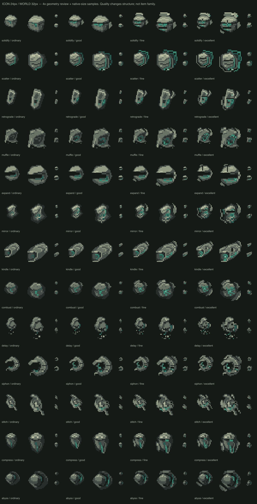

# 十三族异物内容目录

这是本轮已实施内容的阅读索引，机制正文归 system-growth-tide、system-purification-impact 与 system-field-inventory。名称、数值和描述来源为 data/contaminants.csv / contaminant-qualities.csv；改动应先改 CSV 并生成代码。

四品质顺序：普通 → 优良 → 精良 → 卓越。同族品质提升余次与物件侵蚀形态，不改变技能操作和目标。24px 图标 / 32px 世界物共用身份几何。

生产完整展板：

## 完整目录

### 凝滞的石块 · 主动

冰冷的结块，裂面里滞留着尚未落下的尘埃。

- 裂隙：使视野内无遮挡的最近地面实体停滞4秒，阻止移动、感知与攻击。受到伤害后提前解除；重新出手须完整预兆。不作用于占漆或占空场域。
- 供奉：凝滞的石块将冲击的一部分留在停滞裂面里，减伤35%，无额外副作用。
- 四品质次数：5 / 6 / 7 / 8。

### 重影碎片 · 被动

薄片的边缘总比自身慢半拍，像一件没有合拢的遗物。

- 裂隙：被动生效。当敌人新一次开始怀疑你的存在时，感知填充速度降低30%。同一怀疑事件只消耗一次。
- 供奉：将集中冲击分散到全部模块，总伤害不减少，脆弱模块也可能受伤。
- 四品质次数：5 / 6 / 7 / 8。

### 记忆碎片 · 被动

刻痕从旧碎片的背面浮起，记着尚未彻底离开的东西。

- 裂隙：被动生效。新一轮追击中，敌人离开你的视线后，在最后看见的位置留下6秒残影。同一轮追击只消耗一次；不追踪视野外的实时位置。
- 供奉：减伤15%。每次在供奉中承受冲击后，记下下一轮准确目标与强度；取下或成熟后本次记录仍有效。
- 四品质次数：5 / 6 / 7 / 8。

### 不落的砂砾 · 主动

破口里漏出的砂粒迟迟不落，每一颗都悬着一小段未完的时间。

- 裂隙：推迟视野内无遮挡且尚未释放的最近气团、雾团或尘絮群的下一次释放5秒。距离4格以内；不作用于已释放危险或持续占漆。没有合法目标不消耗。
- 供奉：悬住的砂粒承接冲击，稳定减伤30%。
- 四品质次数：4 / 5 / 6 / 7。

### 附着的空壳 · 被动

壳片向内抱住空洞，像还在保护一具早已不在的身体。

- 裂隙：被动。真实受伤后增加20点污染抗性，持续8秒，与装备抗性叠加至现有上限。生效期间再次受伤不重复消耗，不回血，也不消除已经积累的混乱。
- 供奉：减伤15%。在供奉中实际承受冲击后，下一次有效注入额外修复最多6点完整度。额度不累积，取下或成熟后仍有效。
- 四品质次数：5 / 6 / 7 / 8。

### 带缺口的石头 · 主动

缺口穿过石心，隔着它看去，近处与远处偶尔重合。

- 裂隙：向面朝方向越过一格薄墙，抵达全身可站立的安全位置后实体化1秒。不能穿厚墙、虚空或边界；没有合法落点不消耗。
- 供奉：缺口令40%冲击失去着力点，稳定减伤40%，不扣稳定度。
- 四品质次数：3 / 4 / 5 / 6。

### 消声的旧布 · 被动

布褶深处积着灰，揉动时听不见纤维摩擦的声音。

- 裂隙：压住能够引起敌人听觉发现的声音，不屏蔽视觉或接触危险。连续听觉遭遇消耗1次；最后一份效果完整维持，连续1.5秒无有效听觉信号后结束。
- 供奉：声响消失在折布内，吸收30%冲击，不改变后续出击。
- 四品质次数：5 / 6 / 7 / 8。

### 回声空壳 · 主动

壳口里没有活物，却会重复它曾经收进去的声响。

- 裂隙：向面朝方向的合法位置抛出回声空壳，持续6秒发出可被96像素范围内敌人听见的声音。不会造成伤害，也可能引来其他威胁。
- 供奉：减伤20%。壳内回声让自身每轮供奉积累翻倍，不加下次出击混乱。
- 四品质次数：5 / 6 / 7 / 8。

### 打结的细线 · 主动

旧线结的两端接不到同一处，拉紧时却会让附近的地面绷住。

- 裂隙：在面前1格处横铺2格长的打结的细线，持续10秒。每个地面实体首次跨线时止步1.5秒，仍可感知和攻击。不跨墙或虚空，无法铺成完整线段时不消耗。
- 供奉：减伤20%，再将主要受冲击模块最多4点伤害转给余血最多的另一模块。接收方至少保留1点完整度，没有安全接收者时不转移。
- 四品质次数：4 / 5 / 6 / 7。

### 沉重的石块 · 主动

断面朝下坠着，放到地上以后，附近的脚步也像被它攥住。

- 裂隙：在脚下留下半径2格的沉重区域，持续6秒。区域内地面实体移速降低50%，离开即恢复；不改变方向、感知或攻击，场域本身不受影响。
- 供奉：承住冲击最集中的一股，使主要模块受到的伤害减少50%。不减轻其他模块的余波。
- 四品质次数：4 / 5 / 6 / 7。

### 留影玻璃 · 主动

旧玻璃留下的不是面容，而是刚刚站过的位置。

- 裂隙：在原地留下一具持续8秒的视觉诱饵。只有能实际看见它的敌人才可能被吸引；不会抹去敌人已经确认的目标。
- 供奉：减伤25%，非主要目标承受的余波再减少25%。不返还薪柴或误导预告。
- 四品质次数：4 / 5 / 6 / 7。

### 映出别处的珠子 · 主动

珠子背面的黑始终朝向你，藏在黑里的微光却映着别处。

- 裂隙：在6格以内沿可通行空间回探，短暂标记实体、环境危险核心及未翻找堆的位置，保留6秒。只记录施放瞬间，不显示内容物或实时追踪，不越过封闭墙体探知另一侧。
- 供奉：各模块减伤20%；冲击前完整度不高于40%的模块改为减伤50%。不伤害其他模块。
- 四品质次数：3 / 4 / 5 / 6。

### 冷却的余烬 · 主动

余烬早已冷透，暗缝仍缓慢吞下周围躁动的微光。

- 裂隙：压住4格内可见且无遮挡的最近活动污染源5秒。气团、雾团、尘絮群的各活动阶段及持续占漆均可作用；已受压制或暂缓的目标不能重复使用。实体仍可攻击；没有合法目标不消耗。
- 供奉：减伤25%。每轮将本次实际承伤的20%用于修复最低完整度模块；没有承伤不产生修复，不增加下次出击混乱。
- 四品质次数：3 / 4 / 5 / 6。

## 获取与替代

正式翻堆在十三族中等概率选族，品质机会随节点 safe / contested / deep 提升。高风险节点仍可能普通，低风险也有极少卓越。单次揭晓按种子与节点ID固定，取丢或重试不重抽。

旧反刍、共振、覆写、侵蚀、回响分别并入附着的空壳、打结的细线、留影玻璃、沉重的石块、回声空壳。原实例、归属和供奉进度保留，已成熟物按余量比例迁移，详见库存spec。

本轮未添加武器升级、抗性重做或退出结算政策。数值为已测试的首版，长期平衡与视觉手感以最终试玩为准。
