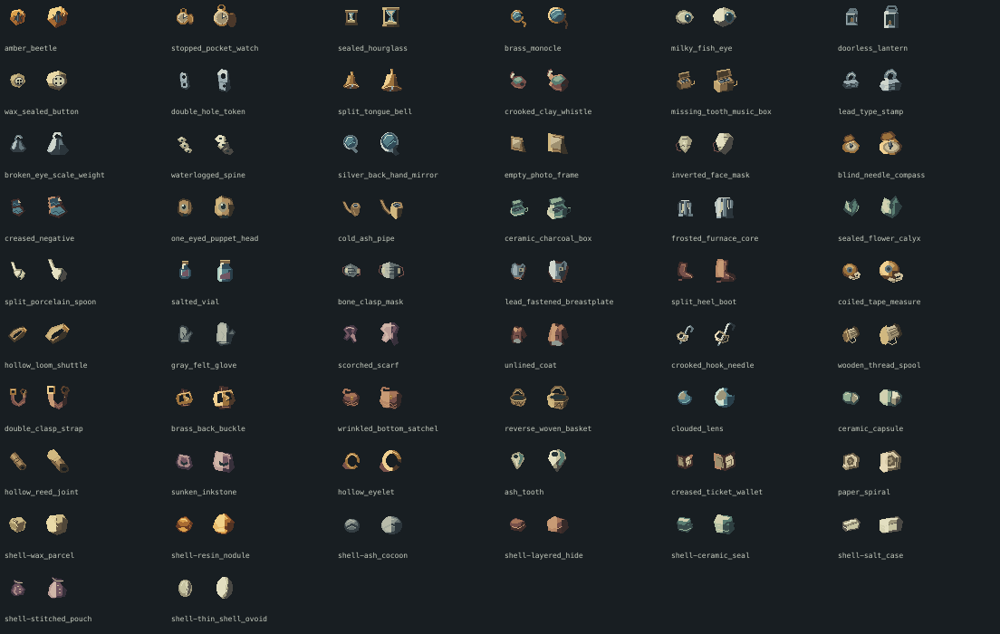

# 污染物内容目录

新出发正式2D Rift使用 `contaminant-v1`：36核心、8弱效、4无能力，12能力族。机制正文是[污染物能力设计](../design-notes/contaminant-ability-design.md)，身份/持久化正文是[统一库存](../specs/system-field-inventory.md)。本文件为正式CSV的可读索引；增改实体先编辑CSV并运行codegen，不在本文手写另一份数值。

功能级与品质分开：同族三件是不同对象且只改变一个主参数；普通/优良/精良/卓越在普通余次上增加0/1/2/3，不换图、不加词缀。未鉴定只显示外壳与供奉反应，已知作用不预告将来的身份。旧物件和旧在途局保留原13族协议与已知信息；`contaminants.csv`是legacy注册表，不再是新出发掉落池。

## 核心目录

### 凝滞 · 主动

- **琥珀甲虫**：停住一敌2.5秒；受伤解除。普通 5 次。
- **停摆怀表**：停住一敌4秒；受伤解除。普通 5 次。
- **封底沙漏**：停住一敌5.5秒；受伤解除。普通 5 次。

### 视距 · 整趟被动

- **铜框单镜**：本趟视距增加10%。普通 2 趟。
- **白膜鱼眼**：本趟视距增加20%。普通 2 趟。
- **缺门提灯**：本趟视距增加30%。普通 2 趟。

### 抗污 · 主动

- **盐封药瓶**：30秒内抗污增加20。普通 3 次。
- **骨扣面罩**：30秒内抗污增加30。普通 3 次。
- **铅扣护胸**：30秒内抗污增加40。普通 3 次。

### 短冲 · 主动

- **断跟短靴**：沿可走地面短冲48像素。普通 3 次。
- **回卷尺**：沿可走地面短冲72像素。普通 3 次。
- **空心梭**：沿可走地面短冲96像素。普通 3 次。

### 消声 · 主动

- **灰毡手套**：5秒内自身行动消声。普通 5 次。
- **焦边围巾**：8秒内自身行动消声。普通 5 次。
- **脱衬风衣**：11秒内自身行动消声。普通 5 次。

### 声诱 · 主动

- **裂舌铜铃**：抛出声诱饵持续4秒。普通 5 次。
- **弯颈陶哨**：抛出声诱饵持续6秒。普通 5 次。
- **缺齿八音盒**：抛出声诱饵持续8秒。普通 5 次。

### 绊线 · 主动

- **弯头钩针**：铺线绊停跨线敌人1秒。普通 4 次。
- **木芯线轴**：铺线绊停跨线敌人1.5秒。普通 4 次。
- **双扣束带**：铺线绊停跨线敌人2秒。普通 4 次。

### 重区 · 主动

- **铅字印章**：脚下重区使敌移速减30%。普通 4 次。
- **断耳秤砣**：脚下重区使敌移速减45%。普通 4 次。
- **沉水脊骨**：脚下重区使敌移速减60%。普通 4 次。

### 假身 · 主动

- **银背袖镜**：原地留下假身5秒。普通 4 次。
- **空白相框**：原地留下假身8秒。普通 4 次。
- **倒脸面具**：原地留下假身11秒。普通 4 次。

### 探查 · 主动

- **盲针罗盘**：探查4格内目标位置。普通 3 次。
- **折角底片**：探查5格内目标位置。普通 3 次。
- **独目偶首**：探查6格内目标位置。普通 3 次。

### 压制 · 主动

- **冷灰烟斗**：压住一处污染源3秒。普通 3 次。
- **陶壁炭盒**：压住一处污染源5秒。普通 3 次。
- **结霜炉芯**：压住一处污染源7秒。普通 3 次。

### 负重 · 整趟被动

- **黄铜背扣**：本趟负重上限增加4。普通 2 趟。
- **皱底挎包**：本趟负重上限增加6。普通 2 趟。
- **反编藤篮**：本趟负重上限增加8。普通 2 趟。

## 弱效与无能力物件

- **蜡封纽扣**：停住一敌1秒；受伤解除。
- **雾斑镜片**：本趟视距增加5%。
- **陶衣药丸**：30秒内抗污增加10。
- **空节苇管**：抛出声诱饵持续2秒。
- **凹心砚台**：脚下重区使敌移速减10%。
- **空眼铜环**：探查2格内目标位置。
- **灰釉齿**：压住一处污染源1秒。
- **折页票夹**：本趟负重上限增加2。
- **双孔票牌**：没有可用的裂隙能力。
- **封口花萼**：没有可用的裂隙能力。
- **分叉瓷匙**：没有可用的裂隙能力。
- **折纸螺**：没有可用的裂隙能力。

## 供给与扩展入口

- `contaminant-abilities.csv`：操作/目标/叠加合同；12个共享handler。
- `contaminant-items.csv`：实体名、唯一主参数、作用描述、普通余次、重量、图标身份、内容版本。族内同级可添加更多不同实体，不改变该族出现总概率；新增族需实现handler与资格/恢复/反馈测试。
- `contaminant-offerings.csv`：25/35/45%减伤、自身供奉积累×2、无供奉增益，独立于真实物件抽样。
- `contaminant-appearances.csv`：8壳，均与全目录兼容，未知统一重量；`contaminant-source-affinities.csv`：6种区域线索与全局混杂。
- `contaminant-loot-profiles.csv`：65/25/10原始类别比例、风险档只影响核心功能级；品质和供奉反应另抽。3节点以上图生成时至少1核心，绝不修改已经搜出的结果。
- `contaminant-qualities.csv`：四品质、余次偏移；旧族余次列为存档兼容保留。
- `contaminant-catalog-icons*`：24/32物件与壳、可组合残片、必要16世界代理。新装备必须有独立物件主语和实际尺寸稿，不靠同轮廓换色填行。

扩池检查：codegen引用/权重/单轴合同 → 新身份图与未知外壳反事实 → 库存/供奉/末次/恢复 → 至少两种地图资格与实际收益 → 小样本操作账本及实景。改变旧定义效能或删除已发布条目须保留旧版本解析；可新增权重不重抽已保存的plan。字段、机制、图像、版本缺任一则不设enabled。

[迭代28清单](../tasks/iteration-28.md)记录实际进度与证据，静态资产或测试通过不等于人终审通过。
