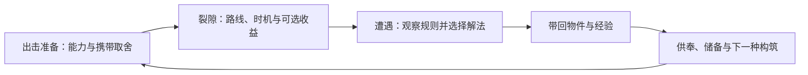

# 《那天之后》：让构筑与裂隙共同支撑内容扩展

**总体方向已获用户采纳（DEC-144，2026-09-10）。** 用户随后要求环境取景突破地球场所、人造空间的限制（DEC-145）；专项展开见[裂隙环境扩展](rift-environment-expansion.md)。该文已撤回原32场所目录及数量预算，按自然、生命、物质、尺度、空间/时间与非人文明重新展开，具体世界样本仍待审。

统一执行路线见[内容扩展推进计划](../progress/content-expansion-plan.md)。DEC-169（2026-09-16）终止三维关卡重构，正式主线回到俯视2D像素Rift；构筑、敌人与获取的总体目标保留，关卡制作与批次按2D重新评估。四A持续供给仍未开始，四B扩产仍锁定。

## 1. 我的判断

这个游戏可以依靠角色构筑和反复进入裂隙成立，但需要让两者互相提供内容：**污染物改变玩家解决问题的方式，裂隙创造值得用不同方式解决的问题，敌人赋予这些问题压力，获取与供奉让玩家愿意准备下一趟。**

当前异物设计有清晰用途，底层消费、受控与反馈也已经补齐。它们作为一套生存工具是成立的；作为长期构筑体系，还缺少能力之间的联系、能持续体现差别的遭遇，以及可预期的补给渠道。

因此，我建议扩充的基本单位改成一个可反复游玩的**内容包**：围绕一种可理解的污染现象，同时补齐空间、敌人行为、物件用途和收获动机。它是开发组织方式，不是要在游戏里增加一个“内容包”菜单。

我们要持续生产的是新的判断与行动方式。物品行数、随机种子数、模型排列组合数，只能辅助衡量工作量。

以下先记录现状，再说明已采纳的总体方向和建议实施顺序；具体新物件、行为参数、内容数量与验收目标仍需在实施设计中细化。

## 2. 现有基础与真正的缺口

### 已经有的内容底座

- **物品**：13 族非武器污染物、4 档品质；10 款撬棍共用一种挥击方式。非武器品质提高次数及侵蚀外形，不增加另一套能力。13×4 不代表 52 种打法。[物件目录](../content/contaminants.md)、[武器定义](../../data/weapons.csv)
- **构筑位置**：1 武器、2 主动、1 被动；成长后增加到 3 主动、1 被动。出击后不能换装，新收获必须带回供奉。装备也占裂隙负重，基地不计负重。[库存规格](../specs/system-field-inventory.md)
- **地图**：4 个生产环境身份、9 个活跃几何锚点，已有污染年龄与毁坏程度两个变化轴。空间生成具备连通性、角色净空及真正的绕路检查，值得保留。[环境表](../../data/rift-fragments.csv)、[生成配方](../../src/generation/recipes.ts)、[双路径保证](../../src/generation/dual-path.ts)
- **敌人**：13 个生产基底，分别为 6 占地、3 占漆、4 占空；已有独立模型、污染档次和共享动作反馈接口。六个地面家族的战斗仍主要围绕近战接触，感知、节律、体型与攻击参数造成差别。[基底表](../../data/contamination-substrates.csv)、[家族表](../../data/contamination-families.csv)、[生产模型注册](../../src/entities/form-renderers/d/production-models.ts)

### 扩张会先撞上的四处瓶颈

**第一，异物数量增长快于组合深度。** 当前多数物件单独解决一种问题。能力逻辑仍逐族实现；CSV 能扩数值、次数和描述，不能单靠新行产生可靠的新机制。四种被动也主要服务于生存、隐匿和信息，尚缺少主动塑造进攻、机动或携行方式的核心选择。[ToolSystem](../../src/systems/tool-system.ts)、[成长表](../../data/upgrades.csv)

**第二，随机空间的玩法安排仍相似。** 当前通常是 3–4 个地面部署位、1 个合法占空位，以及随污染年龄增长的占漆；同一趟占漆先抽一种形态再多次部署。远端进入、中段搜刮、出口巡游的结构比较固定。改变地形和敌人外形，未必改变玩家的行动顺序。[裂隙生成](../../src/generation/rift-layout.ts)、[敌人抽样](../../src/generation/contamination-draw.ts)

**第三，获取缺少方向。** 当前非武器物件在 13 族中均匀抽取，品质受节点风险影响，类型不关联环境或遭遇。如果一直向这个总池加物品，想补齐某种打法会越来越难。[品质与类型抽取](../../src/systems/contaminant-quality.ts)、[掉落表](../../data/contaminant-loot.csv)

**第四，可消耗装备会影响构筑的可用频率。** “掉落→成功带回→供奉成熟→有合适槽位→还有次数”全部满足，玩家才能用上组合。纸面协同再好，如果准备三趟只能完整体验半趟，就会变成囤积和舍不得用。

以上按当前实现核对。旧设计稿中“尚未接入年龄/毁坏轴”“只有两类敌人”“没有携带上限”等描述不应作为本轮规划依据。

## 3. 构筑：先形成不同的打法，再扩大物件库

### 3.1 本作的构筑应该改变什么

慢节奏、有限视野、有限负重和撤离压力，使构筑不必都围绕伤害翻倍。它至少可以改变四件事：**怎样接敌、怎样脱离、怎样穿过危险、愿意为收获付出什么。**

先用现有物件建立四种对照打法。这些是策划与测试用分类，不要求玩家选职业，也不强制套装。

1. **静默绕行**：回声空壳＋带缺口的石头＋消声的旧布。引开听觉调查，利用薄墙捷径换路线；视觉追击仍需断开，正面连续作战较弱。
2. **短窗近战**：打结的细线＋沉重的石块＋附着的空壳。控制敌人接近速度，安排撬棍出手与退步。止步不封攻击，抗性不减生命伤害，不能站着白打。
3. **污染区穿行**：冷却的余烬＋映出别处的珠子＋附着的空壳。先看位置，再压住关键污染源通过；仍须应对普通追兵。不能把所有污染都变成无害背景。
4. **勘察与带回**：映出别处的珠子＋凝滞的石块＋重影碎片，也可以主动空一个技能位。信息用于判断是否深入，凝滞用于争取翻找或脱离时间；伤害会解除凝滞，侦察不揭晓堆内物品。

每套都符合现有两主动一被动的位置限制。现阶段它们更接近不同的工具配置，需用后续遭遇和少量协同机制把差异放大。

### 3.2 一套构筑用两件形成核心，留一个位置应变

不建议起步就做五件套、复杂词缀链或多页技能树。现有槽位少、物件会损失，应该让两个合适物件形成主要打法，其余位置处理弱点。

接下来新增非武器物件时，优先补**被动核心**及其主动搭档。被动位只有一个，恰好能让“保命、隐匿、进攻、携行”成为真正取舍；无需马上增加装备槽数。

协同应通过玩家看得见的状态成立。例如，一个待验证的进攻被动可以奖励“抓住破绽的首次挥击”：普通情况下，攻击正在收势的敌人获得有限的额外伤害；搭配控制物件后，自身造成的减速或止步也能创造这个机会。每目标每段机会只结算一次，重叠条件不重复结算。它单带撬棍即可使用，也能搭配细线或石块，仍使用撬棍原有攻击，不增加溅射、穿刺，也不返还耐久。具体物件、数值和次数需另行设计，这里只说明扩展方式。

优先让“移动受限”“调查声音”“暂时失去视线”等通用状态连接能力，少写“装备指定 A 和 B 时才能触发”的配对规则。新物件应单独可用，组合后更有策略价值。

### 3.3 把三条成长轴分开

- **品质**继续负责同类物件的纵向价值：撬棍的伤害、耐久，技能物件的续航及对应外观。高品质不能偷偷换攻击或技能规则。
- **物件身份与武器种类**负责横向打法。未来新武器可以带来另一种接敌方式，同一种武器保持统一攻击模式；同品质的抗性、重量等小差异用于微调。
- **长期成长**优先增加知识与选择：理解异常、发现物件来源、建立储备和掌握更多打法。现有生命等成长可以保留，但不宜靠无限累积百分比来制造后期内容。

非武器同品质是否需要微差异，应在核心打法成立后再验证；第一步不必为每件物品同时随机出六七个属性。

## 4. 有限物件怎样支撑长期构筑

### 4.1 保留消耗的意义，降低“准备好了却不敢用”

保留已确定规则：供奉后可装备、技能有次数、武器按有效命中损耗耐久、死亡丢本趟全部携入与拾获物、裂隙内不能换装、整理拾获不停世界。现有基地无就绪武器时的基础白板替补继续承担防死锁作用，不扩成免费完整构筑。[生命周期规则](../specs/system-field-inventory.md)

真正需要管理的是**可用物件的周转**：库存有多少已供奉替补、每趟消耗多少、多久能补回一个核心。供奉应让玩家安排下一套准备，同时为基地提供防御价值；不能让维持一种常见打法长期占满全部供奉位、压垮基地或逼人反复空跑。

先记录“从获得到首次装备的出击数”“每趟实际消耗的次数与耐久”“核心耗尽或死亡全丢后重组所需出击数”。死亡样本还要计入未用完就损失的整套物件，不能只统计成功撤离。武器与技能核心竞争同一供奉槽，首发现一次性保底也不能当成稳定供给；需观察连续失败后依靠基础白板与常规掉落能否重新建立可用配置。再调整普通物件供给、成熟节奏或来源偏向。不要直接用击杀返次数、供奉补满或不损失装备来回避经济问题。

### 4.2 掉落池要能让玩家有方向地寻找

建议拆成三层：

- **通用来源**：所有环境都能出现常用基础物件，避免某种打法依赖随机碰到唯一地图。
- **环境与遭遇偏向**：某些异常场所更容易产生信息、误导、控制或防护用途的物件。是概率偏向，不是某张图只出某种职业装备。
- **可选风险奖励**：更危险的支路提高品质机会；风险线索在靠近前可判断，但翻找前仍不泄露具体物件和属性。

新增内容不能无限稀释通用池。每个来源只挂一个受控的候选集合；加物件时同时评估它挤占了谁的出现机会。若长期仍难以重组构筑，再研究跨趟的坏运气保护；不要未经验证同时加入商店、制作、兑换三套补给系统。

当前世界观规定裂隙去向不能由玩家精确选择。第一步通过入口可理解的粗线索、进入后的局部征兆和可选支路支持判断，**不直接增加地图选择菜单**。这些线索也属于新增设计，不能展示当前生成器尚未保证的内容；若未来允许干预去向，需单独决定其世界规则、代价与范围。[世界规则](../world.md)

### 4.3 利用已有的携带取舍

当前容量 16，标准撬棍加基础三个工具重 9，开始轻微减速；扩槽后满带四工具重 11，留给收获的空间更少。多带一种解法，本身就在牺牲速度和战利品空间。[生存属性](../../src/systems/survival-attributes.ts)、[物件重量规则](../specs/system-field-inventory.md)

这是比再加饥饿、精神负荷、装备体积三套资源更适合本作的构筑代价。后续携行能力可以缓解某一项压力，但不能同时取消容量与速度代价，使它成为所有构筑必选。

## 5. 裂隙：从随机空间扩展到有变化的行动题目

### 5.1 在现有生成器中加入“遭遇与路线合同”

保留外轮廓、结构、掩体、年龄/毁坏轴和双路径检查。在几何与最终落点之间增加一层编排：为某个局部空间指定玩法意图，再寻找符合条件的地形与角色位置。

一份合同至少声明：普通入口与退路、观察位置、遮挡关系、敌人职责、活动范围、危险阶段、可选收益、允许的变化，以及不能同时出现的压力。

它不必是一间完整手绘房间。旧图书馆的书架转角、地铁的柱间空地，可以承接同一种“观察巡逻后越过短路”的题目；但尺度、路径、材质和组合对象要服从各自环境。

手工设计局部关系、程序组合整体的思路有成熟先例。Dead Cells 的主设计师介绍过其手工片段与程序布局混合、并对敌人放置施加限制的方法；这里借鉴其生产结构，不照搬动作节奏或画风。[Sébastien Bénard：The Level Design of Dead Cells](https://deepnight.net/tutorial/the-level-design-of-dead-cells-a-hybrid-approach/)

### 5.2 首批三个题目

**被观察的捷径。** 短路经过视线覆盖，长路有遮挡；旁侧有可选翻找点。普通解法是观察转向、等待或绕行；投声、留影、侦察分别降低不同成本。薄墙捷径若存在，另一边必须真的有安全落脚点。

**有间歇的污染通道。** 一处周期危险覆盖短路，存在持续可通行的绕路。首包明确选气团、雾团或尘絮群，保留可观察的前兆、无遮挡的工具触达点，以及足以实际通过的释放间隙与恢复窗口；不能随机替换成砂砾无法延迟的占漆或余响。普通解法是等候窗口或走远路；不落的砂砾争取释放前时间，冷却的余烬压住危险。不能把两件工具的作用写成完全一样，也不能让等待窗口只够裸身角色、满负重必受伤。

**有退路的争夺点。** 收益附近有地面威胁，但留有断视转角或环路。玩家可诱开、控制后翻找、逐个交战或放弃。收益的吸引力来自可选风险，不能用关门清怪强迫慢节奏生存游戏变成竞技场。

每个题目都先证明基础装备、指定工具耗尽时仍有可执行方案，再加入更有利的构筑解法。基础解法可以更慢、更少收获，不能只是“理论上不会死”。

### 5.3 三层变化各司其职

1. **环境身份**提供空间与材料规律。图书馆、医院、地铁、户外的差别要影响可观察距离、遮挡、通道与异常落点；配色变化不能包办身份。
2. **本趟主要异常**改变一个核心判断，例如危险窗口、声音线索或路线压力。初期每趟只突出一种，少量次要变化从兼容列表抽取。
3. **局部遭遇与收益位置**决定玩家如何临场处理。改变巡逻入口、观察侧、风险支路或节律关系，应比单纯提高怪物密度更常用。

一张地图要有辨认环境、做出承诺、承受压力、重新观察的间隔。Valve 对 Left 4 Dead 的公开设计也强调强度起伏，并区分节奏调整与难度调整。本作可以先在生成时编排间隔，无须马上做运行时读玩家表现的导演系统。[Michael Booth：The AI Systems of Left 4 Dead，节奏设计部分](https://cdn.akamai.steamstatic.com/apps/valve/2009/ai_systems_of_l4d_mike_booth.pdf)

第一轮保持搜刮与单口撤离，不并行加入护送、解谜链、多出口和新任务资源。随后再让“搜得更多”“穿过更深的异常”“带回新构筑核心”成为不同的出击意图。

## 6. 敌人：扩充战术职责，保留可理解的污染形象

### 6.1 把四个问题分开

- **基底**回答它借什么残留存在：虫、人形残余、菌毯、气团等。
- **污染程度**回答原有结构被改写到什么程度。高污染可以更难认出基底，不能更难认出危险发生在哪里。
- **战术职责**回答它迫使玩家改变什么：路线、暴露、时机、站位或资源消耗。
- **遭遇位置**保证它有条件发挥职责，同时玩家有条件应对。

当前原语系统继续负责合法组合；随机抽样应在审核过的行为配方之间发生。不要放开感知、移动、攻击、器官和污染档的任意组合，也不把所有合法配置都宣传成独立敌人。

### 6.2 优先拓展的职责

先深化现有的**巡察、听辨、定点守望、周期领域**。它们与路线题目配合，已经能让投声、留影、消声和环境压制产生不同价值。

首个值得新增的攻击职责，可以是**明确蓄势后短距迫近**：准备时锁定方向，出手受墙体阻挡，结束后有稳定收势，玩家能够侧移或利用转角应对。它为近身站位增加新问题；由哪个基底承担，应在行为样板成立后决定。

现有模型不能只换一个行为 ID 就声称完成。新职责需要相应的身体蓄势、运动、攻击范围和收势，也要响应受击、减速、止步及打断。

暂不优先做无限召唤、治疗链、全类型免疫或强制封禁玩家技能的精英。这类设计很容易让组合退化成唯一击杀顺序，抹掉玩家付出装备消耗换来的优势。

### 6.3 外观扩张遵守世界因果

同一种污染异常可以同时改写空间、敌人的运动和物件的用途，这能建立世界关联；不需要长段剧情解释。但每个新形象仍需独立设计，不能靠旧模型加亮边和随机凸起交付。

低、中、高污染应逐步失去基底相似度，同时保持威胁指向、实际占位、可击部位、前兆和恢复的可读性。美术反馈读取真实状态：敌人确实承受了压力才表现沉重，确实止步才表现受牵制。

新家族的成本包含三档污染、必要方向、完整动作、受击受控、死亡/消散以及正式迷雾下的辨识。检视室里有一张漂亮静态图只是开始。

## 7. 可持续的内容制作方式

### 7.1 每包围绕一个清楚的问题

策划首先写一句玩家会遇到的情况，例如：“通往收益的近路被持续观察，但附近的声音能使观察者离开。”随后明确普通解法、工具优势、失败原因和退路。

一个常规小包可以包含：两三个遭遇配方、若干合法部署变体、一处值得探索的收益支路、与之相关的物件来源；按需要加入一个新能力或一个新敌人职责。**不要求每包都增加新地图、新模型和新技能。**

分开安排三档投入：复用资产的新编排成本最低；新增行为并补动作属中高成本；新环境、新基底或改变寻路规则的机制必须独立预算。具体工期等第一包跑通后，按真实耗时估算。

### 7.2 污染物从逐件特判，逐步变成有限的规则组合

推荐统一执行顺序：**触发事件 → 校验条件与合法目标 → 持久化消费成功 → 释放效果及反馈 → 持续、结束与恢复。** 效果定义同时声明身体、场景与界面怎样反映实际状态；保存失败不能先产生伤害或控制。

优先抽取已有的可信事件与状态：真实命中、开始怀疑、失去视线、跨线、污染危险被压制、一次翻找完成；以及移动限制、感知变化、声音/影像诱饵、危险延迟和抗性。

这不是先造一个无所不能的技能编辑器。先实现并验证一个完整样板，出现第二、第三个真实复用需求，再提取共享能力。复杂新行为仍由代码实现；策划在明确允许的组合里填表。

共享合同必须包括来源实例、目标类型、叠加规则、触发次数边界、无效时是否消费、末次效果与恢复规则。衍生效果不能递归触发自身奖励；反复进出边界不能无限重置；新的强化不叠出永久控制或无限抗性。沿用现有 InventoryStore 的唯一归属和持久化消费，不另造技能专用物品副本。

### 7.3 策划表应能表达关系，而不只是填数字

CSV 继续作为唯一内容来源。逐步整理以下几组数据：

- 物件身份：描述性名称、物理异常、图标、供奉用途、裂隙能力、品质与来源。
- 能力规则：允许的触发、目标、状态、参数、消费与反馈引用。
- 敌人配方：合法基底、职责、行为参数、污染档表现、动作与部署限制。
- 遭遇配方：空间条件、角色组合、普通解法、压力互斥、收益及验证种子。
- 裂隙编排与来源池：可用遭遇、主要异常、节奏、风险档与候选掉落集合。

现有品质表“每增加一族就新增一列”的形式，随扩容宜改成“物件族＋品质＋次数”的逐行记录；新物件不应每次修改表结构。具体拆表在实施时原地更新对应系统规格，避免复制出第二套数值真相。

开发用策划工具应直接读写这些表，提供中文字段说明、筛选、图标预览、引用检查和一键进入实际测试场景。Excel 导出可以服务阅读，但不能变成与 CSV 独立维护的数据库。

游戏中的说明保持精炼描述；触发标签、状态 ID、组合权重留在开发工具里。名称使用玩家能理解的物件或短语，不创造“返刻”“凝序”式缩略术语。

## 8. 我建议的第一个验证包

**范围：旧图书馆，同一套现有资产，验证两种明显不同的行动节奏。**

这是检验构筑与遭遇关系的复用样板，不定义未来环境取景范围，也不意味着异质世界必须排在人类场所扩产之后。环境方向另按DEC-145推进设计。

- 三个题目：被观察的捷径、有间歇的污染通道、有退路的争夺点。
- 两种编排：一种让观察、误导和选择支路占主要价值；另一种让危险窗口与近身进退占主要价值。它们只提高某类工具的优势，不封死其他打法。
- 初批使用现有敌人和物件，保持总资源预算可比较，避免靠单纯增减奖励制造“不同”。
- 为信息/误导与控制/防护设置小范围来源偏向；通用产出保留，品质仍随可选风险变化。具体权重需结合供奉和消耗数据调节。
- 对照配置：白板撬棍、静默绕行、短窗近战；再加少带一件工具的轻装配置，观察携带空间是否真的值得取舍。
- 周期通道另做单槽对照：相同种子与其余装备，只替换不落的砂砾、冷却的余烬或空槽，验证释放前延迟、危险压制和普通等候三种方式的差别；不以其他配置通过代替这项验证。

一个具体场景：书架转角能先观察到通道巡逻，较近的残骸堆处于巡逻覆盖内，侧面有更长的安全绕路。静默配置把声音投到支路，趁敌人实际前去调查时翻找；近战配置在合适位置布线，拉开距离安排攻击；轻装配置可以放弃这堆，利用更好的携带余量继续搜寻。若它们最后都只需要径直冲过去，这个场景就没有实现设计目标。

上述对照也是后续新进攻被动核心与迫近行为样板的验证基线。两项在统一推进计划第三阶段分别接入、分别验收；若首个新世界证明确有需要，可提前其中一项，不用同时重做玩家、地图和敌人全库。

## 9. 怎样判断扩展真的成功

### 硬性正确性

- 引用、CSV 生成、存档兼容、消费和装备生命周期正确；出生、交互净空、撤离及绕路满足合同。
- 所有新增效果都有合法无目标处理、来源退出与末次效果；组合不会无限返还、反复重置或保存失败后先产生收益。
- 敌人职责与实际动作、感知、伤害几何一致；警告、危险和恢复阶段在真实场景可辨。
- 遭遇配方无法落地时，有限重试后退回已验证的兼容编排；不能悄悄塞满敌人、删掉退路，或生成与已显示线索不符的内容。
- 涉及预告与稳定复现时，种子、配方版本及内容选择必须一致。当前退出/刷新/崩溃的恢复政策仍未定，扩容不能把它暗自解释成死亡，也不能宣称已有完整恢复。

### 可玩性的证据

固定种子用于公平对照，未参与调参的种子用于检查是否只对样板有效。先跑生成与组合约束，再真实操作一组代表场景；不用要求穷举所有笛卡尔组合。

记录路线、等待、暴露、近身交战、技能消耗、带回收益及撤离情况。连同录像解释玩家为何这样选择，不只收集通过率。

第一包至少应证明：

1. 同一遭遇有两种普通可行应对，有限工具耗尽也能选择撤退。
2. 两种编排使至少两套配置的相对优势发生变化；不存在一套在速度、消耗、安全、携回量上始终全胜。
3. 更好的构筑能节省时间、减少损耗或多拿收获；基础配置能完成基础目标，不被固定装备门槛拦住。
4. 玩家能说明观察到的规则和失败原因；多出来的危险不依赖读说明书才懂。
5. 连续出击中，普通核心的补给与供奉能维持实际使用；覆盖正常耗尽、整套死亡损失与连续失败，剔除一次性保底后仍能重组。高品质带来珍贵感，但不成为体验一种打法的前提。

公平性必须按实际状态验证。比如现有窄视敌人追击视距、满负重玩家相对兽类的速度，已不能简单沿用旧文档“玩家永远看得更远、跑得更快”的假设。应验证真实断视、绕路、丢弃收获或消耗工具的脱离办法，且不让必经路同时封死这些选择。[敌人参数转换](../../src/entities/enemy-factory.ts)、[负重与速度](../../src/systems/survival-attributes.ts)

测试可以证明触发、几何和退路成立；节奏是否有趣、形象是否契合世界，还要在连续游玩中判断。组合数不是验收结论。

## 10. 推进次序与边界

以下按用户已锁定的[统一推进计划](../progress/content-expansion-plan.md)执行（DEC-146），不另维护一套排期。持续游玩的供给验证是扩产前置条件，不得在长工作或阶段交接中省略。

**第一步：世界方向与玩法验证并行。** 三个有跨度的异时空方向做成世界意象与正常游戏镜头的场景概念图；同时用旧图书馆完成构筑与遭遇对照，记录消耗基线。旧图不是新世界取景的限制。若路线与配置选择没有变化，先改场景。

**第二步：一个新世界完成整趟循环。** 从真实角色可操作的局部环境关系出发，补齐本地实体、遭遇、翻找、撤离、供奉和再装配。先实现这个世界确实需要的能力，用既有物件证明新环境会改变选择。

**第三步：第二个世界检验复用，并补构筑深度。** 第二世界的存在方式应与首个明显不同；迁入一个遭遇合同，补一个本地独有的问题。从实际重复提取能力合同、遭遇/来源表和开发编辑入口。一个新进攻被动核心、一个新攻击职责作为明确子任务跟进，不能由两张地图代替。

**第四步：验证周转，再按内容包扩产。** 覆盖正常耗尽、整套死亡和连续失败后的重新准备。每包都有玩法意图、资产/行为范围、表格、实验室、正式地图、来源与经济评估、固定种子和回归证据。以真实制作与返工数据估算规模，淘汰无法形成新选择的变体。

随着扩产，分别统计独立物件能力、独立敌人职责、已验收遭遇、环境规则及实际有价值的构筑。不要把品质档、颜色、种子或合法排列组合算成同一类“内容量”。

本提案不要求新增开放世界或长剧情，不扩大装备槽，不改变供奉、死亡及耐久规则，也不以自由拼装模型或无约束词缀来追求数量。首先要完成的，是让玩家面对具有可观察局部规律的陌生世界，能够准备、尝试，并作出不同的决定。
