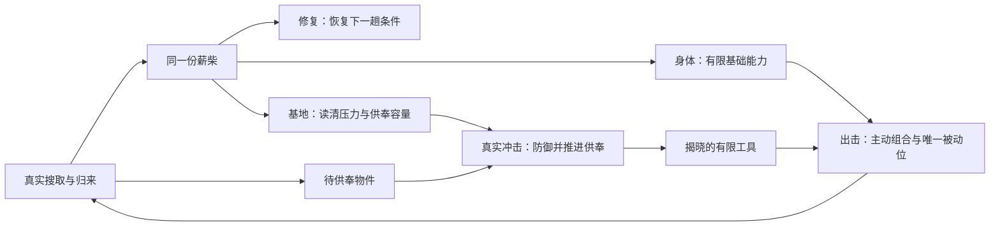

# 迭代 29：净化点与成长更新

## 1. 成长共同骨架

本轮新增功能核心是**逐层读清下一次冲击**。出击扩容、供奉扩容是与它同测的两个已有功能转折；其价值来自实际工具组合和供奉吞吐，不因增加发现条件便成为新机制。保留六条成长轴、现有等级上限、单一薪柴及三档加厚；不追加长技能树、货币、永久视距或永久负重上限。

依据：[评审 §4–5](../qa/purification-growth-review-2026-09-20.md)、[世界观](../world.md)、[愿景](../vision.md)、[成长与潮汐](../specs/system-growth-tide.md)、[净化点与冲击](../specs/system-purification-impact.md)、[库存](../specs/system-field-inventory.md)、[生存属性](../specs/system-survival-attributes.md)。机制仍是异源抵抗本时空覆盖；改造不能治愈外部世界、扩大安全区域或让裂隙变为可选目的地。

### 三种成长职责

- **身体适应**：渗透抗性、生命强化、薪柴亲和提供有限的基础能力。效果接现有真实属性与拾取公式，不再增加一套技能操作。薪柴亲和属于提取效率，不能伪称污染免疫。
- **基地工作能力**：预兆洞察让玩家读清压力；供奉扩容增加同一冲击内可培养、可参与防御的物件；加厚保留更多完整度余量。基地投入不直接赠送物件、补满供奉进度或增加玩家视距。
- **出击装备**：出击扩容增加一个主动位置；可遗失、有限使用的物件承担具体战术。视距和容量仍争用唯一被动位。视野仍受混乱、墙和空洞约束，负重仍影响移动，装配物仍计重。

### 阶段是玩家问题，经历是展开依据

1. **尚未承受冲击**：先学会搜取、带回和维持。三条身体基础轴与加厚可以投入；预兆能力暂未展开，说明缺少一次真实冲击经历。不能把教学首归免冲击算作经历。
2. **开始供奉与鉴定**：玩家已有具体物件，决定本趟携带哪些能力、下一次冲击用几个供奉位置，以及修复要照顾哪个模块。扩槽此时有对象可以作用。
3. **经历第一段潮峰后**：玩家开始按明确压力预算保留模块、安排供奉。完整三层信息只支持这一准备问题；本轮不承诺无限内容或终局。

阶段不绑定第几趟，也不要求无伤、高混乱、濒死、故意损坏模块或凑物件收藏率。阶段不是互斥职业：满足事实即可展开对应项；回到早期样式的环境不会撤销经历。

## 2. 可持久的经历事实与展开合同

建议在现有 `GrowthState` 增加可选 `progression`，内部 `version: 1`，四个布尔事实缺省为 `false`。名称为实现建议，语义为合同：

- `impactExperienced`：一次 `ImpactResult.skipped === false` 的基地结算已成功持久化。角色本趟撤离、死亡或明确放弃均可实际经历冲击；这不是“成功撤离”事实。
- `offeringCompleted`：真实 `finishOfferingImpact` 回执中至少一个物件完成供奉；武器、可用工具或无出击能力的鉴定结果均可。开局赠予已供奉白板不算。
- `toolRevealed`：真实供奉后揭晓至少一件有主动或被动能力的污染物。任何品质或功能级均可；不要求某个稀有族或不同族数量。
- `crestExperienced`：真实结算使有限潮汐从 `crest` 离开。模块曾归零也可以获得此事实；不借用稳定度的“完整潮峰”奖励条件。

事实在已有基地归来事务内与冲击、供奉、潮汐及 `baseSettled` 一起提交；归来普通拒写保留同一整帧候选并封锁交互，重试不重放结算或发奖；成长购买拒写才恢复购买前快照。事实只决定展开，不给薪柴、稳定度或额外属性。不保存无用途的成功撤离计数，不从趟数、稳定度或余额推断成功搜撤。

### 各项前置

- 渗透抗性、生命强化、薪柴亲和、加厚：沿用当前费用、上限和资格，不额外设经历门槛。
- 预兆洞察第 1 层：`impactExperienced`；第 2 层：第 1 层已刻入且 `offeringCompleted`；第 3 层：第 2 层已刻入且 `crestExperienced`。
- 供奉扩容：`offeringCompleted`。不要求现有三个槽全满或因拥挤错过一次冲击。
- 出击扩容：`toolRevealed`。不要求刻意用光、丢失、装满工具或携带超重。
- **已刻入等级始终生效和可见**，资格只控制尚未购得的下一层。老档迁移不能因缺失经历字段把已购等级锁回。

同一事实可由一次自然流程同时触发；不按固定顺序强迫玩家反复出击。本轮展示只突出当前层和下一层；“尚未展开”的原因可查看，但不能用问号剪影和未来总数营造不存在的庞大内容池。

## 3. 样板 A：预兆洞察的三层真实信息

沿用 `growth_forecast_clarity`、3 层与 10 / 20 / 30 薪柴费用。废除本轴“每级减少 5% 强度抽错”的效果，改用层级能力枚举；CSV 必须同步实际承诺，`effect_per_level` 不可继续作为 0.05 概率给旧逻辑消费。基础 L0 仍是带误差的目标与强度预告。

### 第 1 层：强度

一句话效果：**下次冲击的强度不再模糊。**

显示真实强度档，不更换已确定目标；目标仍有误差并明确与确定强度区分。玩家因此可以在一档不明的预告下决定提前填供奉槽或保留薪柴。对已熟记潮汐的玩家，收益可能很低，这是待验证假设，不能用更炫目的文本冒充额外价值。

### 第 2 层：对象

一句话效果：**下次冲击的重点模块不再模糊。**

保留第 1 层；公开真实重点模块，玩家能把有限修复优先给真正受压处。反例：模块都很健康、供奉防御已足够或主要瓶颈在出击生存时，应允许先买身体或修复而不吃亏。

### 第 3 层：承压

一句话效果：**读出下次冲击中三个模块在供奉防御前承受的压力。**

保留前两层；展示每个模块各自的防御前压力值，逐项分开标签和数字，统一注解“供奉作用前”。不叫“实际损失”，不预演供奉副作用，不揭未鉴定物的真实能力。由当前待兑现的强度、真实重点及现行取整规则计算；装填或取下供奉物不会改变该组原始压力。

明确有用的测试局势：原始总压力 90 时，重点承压 59，其余按现有模块顺序分为 16 和 15。重点模块完整度为 58、没有供奉减伤时，注入 1 薪柴恢复 4 点足以避免该次归零；重点完整度 100 时不应因展示压力而制造必须维修的提示。实际修复仍受上限及既有一次修复额度影响。数字在既有模块读取或报告内按需展开，不加第三套常驻 HUD。

### 冲击事实必须先确定，购买只改变读取

现有 `forecastTargetId` 同时承担播报目标和后续抽签参照；不能以“买到第 2 层就把该目标强制命中”实现信息成长，否则购买实际改变受压对象。

新预告建立时，按当前 L0 的目标分布和 80% 命中规则一次确定隐藏 `actualPrimaryId`，同时保留原来的模糊播报。强度真值来自同一待兑现强度。随后购买、读取、装填、取下、读档均只投影同一事实，不能重抽。正式冲击消费这一事实；本轮不改伤害预算、65% 重点比例、潮汐或防御规则。

- `ImpactForecastState` 应区分真实目标、模糊播报及公开层级；公开查询不能把隐藏真值顺便放进低等级 DOM / ARIA。
- 已有 `retrograde` 通过真实供奉挣得的准确预告及 `queuedTargets` 承诺优先保持；不得被成长覆盖为更模糊，也不把该旧供奉能力免费转成永久第 3 层。
- 第 3 层只调用与真实冲击共享的纯压力分配函数。禁止调用 `run()` 或 `applyDefenseEffects()` 作预览：它们会扣模块、发资源、改充能或消耗运行态。
- 首次教学归来明确免冲击，不展示非零压力假装会结算。
- 购买事务应同时保存新等级及随之展开的公开读取；拒写恢复成长、薪柴、稳定度与预告快照，不向玩家先播报未持久的真值。

信息第 2 / 3 层带来的不同维修行为为本轮核心验收。第 1 层单独付费价值、三层费用和展开节奏仍为样板初值；无法观察到新决定时，应回到该层机制调整，不用更多说明、提示或评分补救。

## 4. 样板 B：出击扩容仍要付携带代价

一句话效果：**多携带一个主动工具，被动仍只能选一个。**

沿用 40 薪柴、从两主动加一被动到三主动加一被动。购买后旧第 3 位的被动迁到新第 4 位，原 ID、品质、耐久 / 余次不变，新主动位为空；迁移与扣款、等级、稳定度同一持久事务。

新增准备决定的完整链：首次揭晓可用工具 → 在培养藏读出扩容用途 → 花薪柴扩容 → 在裂隙入口备行把第三件主动放入新位置 → 下一趟获得控制、诱导、脱离等第三种可用手段。槽数增加不会赠送第三件物品，也不能在裂隙临时装上刚拾获的未知物。

**有收益的情况**：库存有三件用途不同且有余次的主动工具，希望同时覆盖常规敌人与场域危险。

**不值得优先的反例**：只有一两件主动；下一趟只做安全短撤；多带第三件会挤走要带回的物件；基地濒危时 40 薪柴优先修复。保留空槽是一种合理选择。

以 3.0 重撬棍、2.0 重的普通主动 / 被动物件说明边界：两主动一被动的携入重量为 9.0；三主动一被动为 11.0。在基础 16.0 容量下，可装更多技能，但留给新物的空间从 7.0 降到 5.0，且沿原曲线产生更高移动代价。视距被动与 +4 / +6 / +8 容量被动仍互斥；扩主动位不能顺便加第二被动位、减轻装备重量或抵销负重曲线。特殊重量物件按真实 CSV 计。

供给限制：需自然获得、携回并供奉足够的主动工具；死亡和耗尽会降低扩容的当期收益。固定完整示例能验证槽位行为，不能证明自然掉落已经能持续支持三主动。此长线供给问题维持原挂起边界。

## 5. 样板 C：供奉扩容改变吞吐而非赠送成熟

一句话效果：**同一次冲击可以再供奉一个物件。**

沿用 35 薪柴与第 4 供奉槽。首次完成一次真实供奉后展开；武器和污染物继续共用槽位、最后一轮先参与防御再转化、成熟回库清槽。加槽不补过去错过的充能，不增加当轮强度，不提前揭晓，也不增加物件本身次数。

新增准备决定的完整链：物件完成供奉 → 看到同时有武器与未知污染物等待 → 在培养藏扩容 → 供奉台把第四件放入 → 实际冲击后四件分别按真实反应推进，符合阈值者一次回库。

**有收益的情况**：三槽已有培养中的物件，第四件武器可保证下一趟补给，或第四件已知供奉反应能帮助渡过眼前压力。玩家在“修复现有模块”和“增加此后的吞吐与防御组合”之间分配同一份薪柴。

**不值得优先的反例**：只有一两件待供奉物；现有槽很快同时成熟且库存无后续物；下一次压力已可靠承受、但出击缺少生命余量。第四件是武器或沉默反应时只增加培养吞吐，不能显示额外减伤。

新增槽上的减伤继续按各槽乘剩余伤害叠加，收益递减；不要用“第四槽=再减固定百分比总伤害”的错误预览。供给不足时空槽是事实，不主动补物来让扩容看起来值钱。

## 6. 亲和：受控路线精算与当轮边界

本节是公式算例，**未测自然路线成功率、自然搜堆数或长期毕业时间**。使用现有 `max(1, floor((node.value + affinity) × storageModifier))`，安全 / 争夺 / 深层基值 1 / 2 / 4；不增加经济货币，暂保留亲和效果与 8 / 12 / 18 费用。

三条控制路线分别为安全短撤（3 安全）、标准搜撤（3 安全 + 2 争夺）、冒险深搜（3 安全 + 3 争夺 + 2 深层）。每条均假定指定节点都已搜到并成功带回，不含武器或物件价值。以下四个数依次为亲和 0 / 1 / 2 / 3 级的毛薪柴：

- 储藏完整度 100：安全短撤 **3 / 9 / 12 / 18**；标准搜撤 **9 / 17 / 24 / 32**；冒险深搜 **24 / 35 / 48 / 59**。
- 储藏完整度 50：安全短撤 **3 / 6 / 9 / 15**；标准搜撤 **7 / 12 / 19 / 27**；冒险深搜 **19 / 27 / 38 / 49**。
- 储藏完整度 0：安全短撤 **3 / 6 / 9 / 12**；标准搜撤 **7 / 12 / 17 / 22**；冒险深搜 **17 / 25 / 33 / 41**。

在储藏满完整度、路线与成功率不变时，每个新增等级各自收回本级费用所需的成功路线数：安全短撤 **2 / 4 / 3**，标准搜撤 **1 / 2 / 3**，冒险深搜 **1 / 1 / 2**。这是逐级边际回本，不是总 38 薪柴的累计回本，更不等于经过这么多自然出击就毕业。

### 与相同 8 薪柴的替代投入比较

- 第一层亲和改变节点结算。满储藏三路线各多 6 / 8 / 11 薪柴；死亡结算为 0，不把地上发现过的薪柴算收益。
- 第一层生命强化提供 +15 生命上限；是否跨过一次可存活伤害、从而避免本趟收获和携出装备全丢，需同路线实际伤害证据。无法直接假设它固定提高某个撤离概率。
- 第一层渗透抗性提供当前规则的 4 个百分点收益，经既有统一通道应用；是否容许多搜一堆或绕更安全的路，要记录时间、混乱与路径，不能按薪柴给它拍一个兑换率。
- 8 薪柴最多修 32 模块完整度（另有已有修复额度则按真实规则）。例如核心从 0 修至 32，时间混乱倍率从 1 降至 0.904；净化器从 0 修至 32、上限 100 时，起始混乱从 50 降至 34。修复接近归零模块还能避免下次冲击损失；这些价值不能只按下一趟直接收入衡量。

只比较下一趟毛收入时，同价的容错购买优于一级亲和的条件为 `p容错 × Y0 > p亲和 × Y1`；此处 p 必须来自同一代表局势的观察，而非设计者假填。完整比较还需减去预计携出装备损失、维护缺口，并记录剩余资源能否支持下一趟。强经济风险确实存在；这组公式仍不足以宣告任何路线的策略统治已证实。

**当轮处理**：完成三路线算例与受控对照入口，修正文案，暂不改亲和数值。后续若亲和在安全、压力与供给紧张样本中仍普遍优先，再比较提价、调整平加收益或改变获取时机；不能同时改三者而失去归因。自然长线实验保持原挂起。

## 7. R01 / R02 与旧档合同

### 加厚选择仍保留真实代价

本轮采用完整预览路径，不免费回血，也不借机重写净化器功效分母。选择加厚时逐项显示三个模块的当前完整度与上限前后、下次起始混乱前后、当前薪柴支出，以及另行补足至新上限的真实注入费用。修复额度共享，不能给每个模块重复计入同一份免费额度；合计可由纯函数精确求出这份额度合理分配后的最少支出，界面标明“至少”，且不得低于真实可执行注入顺序能达到的费用。该读数只是预览，购买加厚不会自动维修；单项注入仍由玩家在各模块执行。

满 100 / 100 第一档加厚后为 100 / 115，起始混乱 0 → 7，当前完整度不变。这是短期代价预览，不把有益的血池增大误写为全方面即时增强。核心 / 储藏继续按基准 100 封顶。

### 历史经历的可信恢复

- 新字段缺失可以合法读取，起始为未知 / false。已购升级、加厚档位、薪柴、工具 ID、次数、位置和发现记录全部保留。
- `offeringReceipts` 中非空转化结果可证明完成供奉；`discoveredCatalogIds` 中至少一个可用能力定义可证明揭晓工具并完成供奉。已经丢失该实例也不撤销发现。
- 已有成熟旧污染物可证明当前可用工具，不用伪造新目录发现 ID；用兼容的旧已知工具事实补 `toolRevealed`。开局白板不能证明完成过供奉。
- 当前合法账本为 `settled && baseSettled` 且 cycle ≥ 2，可证明至少一次真实冲击已结算；active 的 cycle 数本身不行。
- 既有合法潮汐已处于 `ebb` 或 `tideNumber > 1`，可证明曾离开有限潮峰；不能由此推导当时成功撤离、无模块归零或获得过完整潮峰奖励。
- 无法证明的历史经历保持未记录，之后由真实事件获得。不得凭“老档大概已经玩很久”全部解锁，也不从稳定度 100 反推成功次数。
- 迁移是可重复的纯补足，不发资源、不补工具次数、不追加稳定度。合法已购等级忽略缺失前置，始终可用；尚未购得的后续层照新事实资格判断。

### 预告版本与在途记录

新结构需显式版本 / 支持分支。已出发的旧在途记录保持旧预告、随机规则、成长快照和已承诺 lookahead，直到这一次归来消费完成；新信息合同从下一份预告开始。不得改在途生命、亲和、负重、消耗次数或地图。

基地已有旧预告时，可在合法基地保存事务中补一次隐藏真值并留持久凭据；已经承诺命中的预告保持原目标，未承诺者沿原 80% 条件分布确定真值。迁移不重抽已经保存的值，拒写不发布更高清晰度。若实现无法保证此合同，应保留这份旧预告至消费完成并显示“下一份预告生效”，不能显示已确定而实际仍会抽错。

### 扩槽事务

`purchaseGrowth` 原子快照应包含库存状态。原三槽 `[主动A, 主动B, 被动P]` 成功扩容为 `[主动A, 主动B, 空, 被动P]`。没有被动时扩一个空槽；已有不合法引用不能靠扩容静默丢物。失败恢复库存和全部成长状态。老档已买扩容但被动停留旧末槽的情况，在基地合法迁移中按身份识别修正；在途旧排列由原快照继续，不移动当前技能绑定。

## 8. 交互结构：沿已认可的培养藏展开

### 概述与约束来源

使用 `.cursor/skills/in-game-ux/SKILL.md`，已对照评审的[现行蜕变实景](../qa/artifacts/purification-growth-review-2026-09-20/runtime/funded-full/03-growth.png)。视觉基线为 [UI Kit A 节](ui-art-overhaul.md)、[美术方向](../art-direction.md)与[架构 overlay 根](../architecture.md)。当前七项单列、单项详情、场景实体为主的构图保留。

### 载体决策

培养藏是**世界内装置**；读数从玩家正在操作的装置旁展开。载体 A 不要求把屏幕文字画进 Phaser 世界层；屏幕读数继续挂 `#dom-ui-root`，装置本体才使用世界层。不会因增加阶段就虚构科技终端或现代研究树。

### 参考锚点

- 沿项目已锁 **Darkwood**：学习黑暗、世界优先和紧张下的快速读取，不引入其物品栏外壳。
- 沿项目已锁 **Signalis**：学习有限色调和克制的功能读数，不复制另一套工业屏幕边框。
- 直接样板为本作迭代 11 培养藏交互：实体在左、读数邻接、单一选中项决定右侧内容；保持同一世界。

### 屏幕流

走近培养藏 → E 打开蜕变 → 上下或指针选择现有成长项 → 读取当前效果、下一层、缺少经历或薪柴 → Enter 刻入 / 加厚 → 成功持久化后更新装置与读数 → Esc 返回世界。预告和扩槽结果分别在既有预告读取、供奉台、入口备行中兑现，不新增二次菜单或额外确认链。

### 信息层级

- P0：世界里保持既有轻量薪柴 / 潮汐 / 下一次预告；本轮不加阶段进度条或完整成长树。
- P1：选择项的职责、当前能力 → 下一层一句话效果、单次消耗、完成后剩余薪柴；未展开时给真实经历原因，且保留退出。当前等级和数字分开展示，不把“预兆洞察 2 供奉完成”粘成复合名称。
- P2：存续报告的已刻入能力与已发生事实；防御前各模块压力供主动检视。没有已记录的成功撤离时不写“已成功归来”。

### 画面占用与禁止区

固定 960 × 640；保持现有实体接地点及 x344 / y124 的场景交互区，具体视觉间距归 Kit。禁止把新增说明铺到培养藏、玩家及其周围可视区域；关闭后世界中心与活动区恢复。七项无需因类别标题被挤到滚动区；职责可以放选中详情，不为分组三职责重复占三屏。

### 交互模式与状态

上下键与指针使用同一选中项 ID；Enter 只执行屏上刻入 / 加厚动作，Esc 返回。未经历、薪柴不足、已刻入、已达上限分别写实际原因，不能只降灰。读取预告不能推进时间、消耗供奉或重抽。购买后保持焦点，键盘与鼠标均可检视刚生效效果；保存失败不播放成功响应。

状态展开不会假装提供互斥选择。若两种分配在同一局势下没有实质差别，记录为机制样板的结构风险，不能用“谨慎选择”等文案制造犹豫。

### 视觉规格

**视觉规格部分由 Art agent 补充并核对当前 UI Kit。** 本笔记只定义结构；本轮场景的持久投入应读实际已购状态，不以可购买或余额足够提前生长。身体适应与基地扩容的外显应可区分，但不得添加玩家从未购得的功能暗示。

结构自审：U1 载体成立；U5 单焦点与完整退出；U6 不靠悬停提供资格；U7 / U8 按键和真实事务一致；U9 名称 / 值 / 状态分立；U12 延续具名参考。当前为文档自审，未据此签署画面、交互或用户审美通过。

## 9. 接口、实现规模与验收

### 现有接口与拟变动边界

- 数据：`data/upgrades.csv` 及其生成器负责阶段前置、职责和预兆层级效果。可扩现表或增加与 upgrade ID 关联的 CSV；禁止在显示配置硬写另一套费用 / 效果表。
- `growthSystem.getState/loadState/getLevel/getCost/getModifiers`：增加经历持久字段及资格查询；继续提供生命 / 抗性 / 亲和读数。预兆能力改按级读取，不能仍冒充连续概率加成。
- `purchaseGrowth`：检查领域资格，与库存扩槽迁移、预告读取提升、薪柴、等级、稳定度一起提交并回滚。UI 只消费结果。
- `inventoryStore.getDiscoveredCatalogIds/getState/finishOfferingImpact`：提供真实揭晓及回执证据；供奉和装配依旧拥有唯一实例。新阶段不另建物品集合。
- `impactSystem.getForecastState/loadForecastState/generateForecast/getForecastDisplay/run`：冻结隐藏冲击事实，按成长层级公开；新增纯防御前压力投影。低层公开结果不得包含高层信息。
- 净化点归来事务：从 `ImpactResult`、供奉转化结果与潮汐前后状态记录事实。旧 `baseSettled` 幂等链不拆。
- `growth-panel`、`growth-upgrade-display`、既有报告 / HUD 预告：呈现对应层信息、真实前置和 R01 预览；沿用既有打开方式和 Art 核对。正式 spec 原位更新 `system-growth-tide`、`system-purification-impact`、`system-field-inventory` 的接口与兼容段。

规模为一个中等系统变更：一个预告事实与投影改造、四个事实布尔值、两项已有扩槽完整链、一次库存原子迁移、一组加厚预览和局部 UI 更新。没有新地图、污染物目录扩量或新战斗能力。

### 必需验证

1. 新档：首归免冲击不解锁冲击事实；第二次真实冲击后只写一次。死亡 / 放弃可证明真实冲击，但绝不被记录成成功撤离。
2. 供奉：未成熟、最后一轮成熟、沉默结果、武器成熟分别校验事实；开局白板不触发，空回执不触发完成；物件后来遗失不锁回。
3. 信息：同一冻结目标下 L0 / L1 / L2 / L3 逐层公开；买升级与不买升级的真实重点和原始伤害完全相同；旧挣得预告不被弱化。
4. 纯读取：反复打开 / 关闭 / 槽位调整不消耗随机序列，不改 HP、余额、物件、供奉积累和副作用；L3 压力按正式取整与模块顺序逐项兑现，最终伤害允许被真实供奉改变。
5. 扩槽：已有 / 空被动、末次被动、拒写、已有错位旧档、重复迁移、读档后备行均保持 ID / 余次 / 品质；至少真实进入下一趟一次。
6. 加厚：100 / 100 → 100 / 115、0 → 7 及真实补足支出在购买前可读；拒写恢复上限、薪柴、档位和预告，不能给免费生命。
7. 旧档：无事实字段、部分事实、满成长、旧 active、已承诺 lookahead 各自读入；有证据才补事实，已有能力不锁回，已承诺结果不重抽。
8. 受控决策对照：同一代表存档分别“修复 / 信息”“第三主动 / 轻装回收”“第四供奉 / 当期身体容错”，每组记录行动与下一趟结果，也给另一方案更好的反例。无实际差别则标失败信号，不用测试全绿替代。

### 状态与未证实项

- **已锁定的上位约束**：用户已授权按评审推进；六轴、单一薪柴、简单一句话效果、原角色 / 2D / 原潮汐、视距与容量唯一被动位、长线与终局挂起边界保留。
- **本轮实施样板**：本笔记三层信息、经历资格、两扩槽链及兼容初值，交 Director 整合入本轮任务；它们属于授权内可审查样板，不写成玩家已认可的最终深度。
- **未证实**：三层售价和节奏是否有意义；新玩家能否自然理解信息并改变修复；自然供给能否支撑三主动和四供奉；亲和是否普遍压倒容错投入；持久外显是否清楚且好看。
- **保持挂起**：自然长期采样、最终潮长期平衡、终局 / 后续供给扩产、完整世界条件空间。公开此设计和机械通过均不解冻这些工作。

本轮索引检查为静态：`game-state check` 提示既有 CLAUDE.md 来源漂移及历史证据提醒；`impact --feature COH-F029` 已列出循环、属性、装备、界面、存档等下游。设计 agent 仅写本笔记；公共索引、决策与状态由 Director 汇总，不在此处替别人的实现或验证签字。
