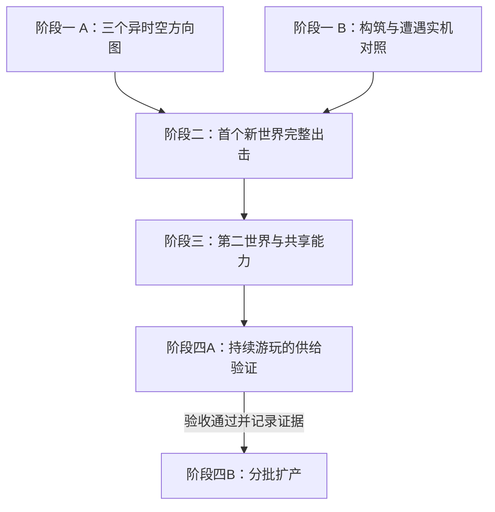

# 内容扩展推进计划

## 0. 已锁定的目标与续接入口（DEC-146）

**本文件是本项内容扩展工程的唯一执行总台账。** 用户于2026-09-11明确锁定本计划，尤其强调“验证持续游玩的供给，再分批扩产”。长期目标是让陌生世界、敌人和构筑共同形成可持续扩充、可反复游玩的内容。

四阶段的交付目标、依赖与防遗漏检查点继续有效。具体参数、制作方法和子任务拆分可按验证结果细化；不得因会话中断、换Agent或完成了画面/地图而省略后续阶段。取消或跳过锁定环节须有用户明确的新决定并记录影响，不能由“暂缓”悄悄变成删除。

**续接时先读本节、第6节及第8节，再读当前迭代合同和QA证据。** 开迭代、阶段交付、暂停或交接时，更新这里的状态和下一步；[当前迭代](current-iteration.md)与[路线入口](roadmap.md)保留本文件链接及供给验证状态。

- 阶段一：世界方向与玩法样板——迭代21进行中（DEC-147）；[执行合同](../tasks/iteration-21.md)。三个方向的六张展示图已交，等待用户选择世界方向；正式RiftScene构筑对照场已实现，代表实玩与隔离验收AGENT-VERIFIED，见[QA报告](../qa/iteration-21.md)。阶段一整体尚未通过。
- 阶段二：首个完整新世界——未开始，依赖阶段一。
- 阶段三：第二世界、构筑深度与共享能力——未开始，依赖阶段二。
- **阶段四A：持续游玩的供给验证——未开始，必须交付，验收负责人为QA，设计负责周转模型与调节，Director负责检查证据和解锁扩产。**
- **阶段四B：分批扩产——尚不具备进入条件；阶段四A通过前不得开始批量扩产，也不得宣布本计划完成。** 前三个阶段所需的样板制作不属于批量扩产。

当前执行迭代21，已开始阶段一；图像见[世界概念目录](../art/iteration-21-worlds/README.md)。后续阶段、四A供给验证与四B扩产状态保持未开始/前置未满足。

**执行记录（2026-09-11）：** 用户授权开始（DEC-147），以`2d9725f`为实现基线建立迭代21。[世界取景](http://127.0.0.1:3000/world-study.html)交付三个世界意象与三个俯视场景概念；[构筑对照场](http://127.0.0.1:3000/build-lab.html)交付三遭遇、七配置及JSON记录。22次实际操作尝试和9组专项检查已完成，报告保留7次失败探索；普通解法、工具耗次、轻装取舍和近战击杀均有真实证据，静默短路的高代价未被美化。用户已授权阶段提交，本批纳入Git保存且未推送；下一步为用户世界方向选择，随后进入所选局部的动态样板。

## 1. 第一件要做的事

迭代21按**「世界方向与玩法样板」**组织，首批已交两类可审查成果：三个有跨度的世界方向图，以及正式裂隙中的构筑实机对照。下一步在图像审查后选定首个世界及局部关系。

[内容扩展战略](../design-notes/content-expansion-strategy.md)决定构筑、敌人、地图和获取怎样互相支持；[异时空环境提案](../design-notes/rift-environment-expansion.md)决定取景范围。两者共同导向一个完整新世界的可玩样板，随后用第二个世界检验复用能力。

总体战略与本推进计划已采纳。三个方向作为首轮概念探索范围，具体首包世界仍待视觉审查选定；计划锁定不代替成果验收；阶段一现由迭代21执行。

## 2. 路线与依赖

第一阶段两条线可并行。后面各阶段以实际通过的成果为输入；遇到问题只回到负责该问题的部分，不把整个项目推倒重来。

进入实施时先记录可回退基线，核对现有待审项与本次范围。迭代20的Agent自验不自动变成人审通过，旧迭代未决事项也不因新计划被关闭。已有文档索引与测试工具可沿用。

## 3. 阶段一：世界方向与玩法样板

### A. 世界线：让想象成为可见、可讨论的场景

首轮概念探索做三个方向：**悬在头顶的海、彼此托举的生命大陆、被撑出厚度的世界**。它们分别检验自然与尺度、生命与地貌、空间与身体，避免把所有方案收敛为同一种表面换色。

每个方向交付：

- 一张完整世界意象图，说明尺度、主体结构与原生秩序怎样被改写。
- 一张按正常游戏镜头和玩家尺度组织的像素场景概念图，标出可活动区域、观察位置、危险与收益。明确它是概念图，不冒充实机截图。
- 一页以内的局部规则说明：玩家观察什么、变化怎样发生、普通应对和工具优势是什么；必要时用关键状态图说明运动。

先由我和美术/设计协作完成内部检查，再给用户看整组方向。选择依据同时包含想象力、场景整体美感、活动表面与世界的关系，以及能否形成清楚的操作判断。实现成本列出来，但不先用旧引擎筛掉陌生世界。

**通过条件：** 至少一个方向获视觉认可，并明确首个局部要真实实现的环境关系。此次选择决定首包，不取消其他世界进入后续扩充的机会。

**回退条件：** 只有远景奇观、脚下仍是通用走廊，或三个方案仍像一套素材，应重做场景关系；不能仅增加说明文字。

### B. 玩法线：用现成内容验证决策差别

在旧图书馆测试场景中编排三个短遭遇：被观察的捷径、有间歇的污染通道、有退路的争夺点。复用正式角色、敌人、工具、翻找与结算能力，不另写一套只供演示的技能。

统一用普通品质，比较：

- 白板撬棍，技能位留空，验证基础可行性。
- 静默绕行：回声空壳、带缺口的石头、消声的旧布。
- 短窗近战：打结的细线、沉重的石块、附着的空壳。
- 从一套完整配置中少带一件工具，验证携带余量与机动是否值得取舍。

周期通道使用可被工具作用的气团、雾团或尘絮群；另以相同种子、相同其余装备比较空槽、不落的砂砾、冷却的余烬。延迟释放与压制危险的不同机会要实际走出来。

记录路线、等待、暴露、交战、次数/耐久与收获，用连续操作录像解释差别。这一步保留原供奉和物件数值作为基线；若配置仍趋同，先检查遭遇是否提供了不同价值。

**通过条件：** 普通配置有可执行解法；至少两种配置出现不同的行动和成本优势。工具耗尽可选择撤退，世界不停的拾获整理照常成立。

**回退条件：** 全部配置都以同一方式冲过去，回到遭遇设计；不要通过新加几十件物品掩盖问题。

两线在玩家尺度、危险前兆、观察信息和退路上保持一致。玩法线的旧地图只是对照场，不决定新世界必须使用旧地形与旧外观。

## 4. 阶段二：一个新世界完成整趟循环

选定方向后，先做**带真实角色的局部动态样板**：让主导环境关系在正常镜头、迷雾和操作中成立。随后将它扩成一次范围有限但完整的出击。

首包范围控制在：

- 一个来源世界、一个可活动局部、一种主要环境关系。
- 两种布局编排，以少量固定种子验证，再加入未参与调参的种子。
- 至少一种属于当地的实体或危险源，具有实际行动/释放、受击或受控、恢复、死亡或消散的适用反馈。可以复用现有战术职责，外观与运动必须与新世界有关。
- 正式翻找物、一组来源合理的既有物件掉落，以及安全观察、可选收益与撤离关系。
- 完整流程：入口整备→进入→观察/遭遇→翻找与携带取舍→撤离→供奉成熟→再次装配使用。

至少一个关键决策必须依赖这个世界的真实环境关系。既有技能能否作用于新危险源，要在目标、效果、消费与反馈合同中明确接入；不得仅更改外观后假定余烬、砂砾或控制技能已经支持它。

首包优先使用现有13族物件检验构筑。新的进攻被动与敌人攻击职责有明确后续位置，只有样板证明确实需要时才提前加入其中一项。武器仍用撬棍，不在同一包扩武器种类和成长树。

若新实体先验证一个代表污染档，必须标明可抽取范围；正式随机池启用前，补齐它实际允许出现的全部档位、动作与恢复反馈。不能让未做完的组合进入生产。

### 本阶段的最少工程

先补首包会用到的注册与校验：环境、空间配方、材质、翻找物、敌人来源、音景和测试样本必须对应完整。缺项在生成/检查时失败，不能进入地图后才报错或退回户外外观。

跨水观察、可变支撑面、曲面展开分别有不同前置能力，只实现所选样板需要的部分，并保持与实际画面的承诺一致。完整流体模拟、通用维度引擎和全工具重写不作为默认前置任务。

库存、供奉、消费和结算继续使用同一套正式系统。测试可用隔离记录初始化装备；正式获取验证必须从真实揭晓、带回和供奉开始，不把预先填好的测试库存当成经济闭环。

### 验收与回退

首轮可用四种配置各跑两个种子，共八趟对照，作为诊断样本而非统计平衡证明。再补针对性的满负重返程、丢弃、工具末次、无效目标与敌人恢复场景。

真实走完至少一次携回→供奉→再装配；另做一次携入装备且已获得收获后的死亡，检查全部随身丢失、基地储备保留。保存失败、重复揭晓及账本一致性走自动化回归。

世界关系不可读则回局部表现；有路但无法合理脱离则回遭遇与几何；库存或供奉出错则阻断正式接入。用户看到的是可玩的完整一趟和已知限制，不承担事务正确性的排查。

## 5. 阶段三：第二世界检验复用，并补构筑深度

第二个世界选择与首个存在方式明显不同、又有一部分接口可以共用的方向。例如自然与重力关系之后，转向生命承重或曲面生命；不把第二世界做成首个世界的材质替换。

迁入一个已通过的遭遇合同，再加入一个本地独有的空间问题。保留各自活动表面、节律与实体，重新走通带回、供奉和装配。

同时从真实重复中提取共享能力：

- 环境与来源的完整注册关系，以及危险阶段、目标资格、反馈和退出合同。
- 事件、条件、目标、效果与持久化消费的有限组合，先服务已有需求。
- 物件品质从逐族加列转为可扩展的数据关系；来源池加入受控的环境/遭遇偏向，避免新增类型稀释整个总池。
- 开发用策划入口直接读写CSV，提供中文字段、图标、引用检查与进入实际场景的入口。

**构筑与敌人后续任务必须显式跟进：** 分别验证一个进攻被动核心和一个新攻击职责。可以串行分成独立小任务，不能因已完成两张地图就宣布第一份提案全部完成。它们要在已有对照场与新世界中体现用途，并保留正确消费和身体反馈。

记录哪些部分直接复用、哪些适配、哪些完全新做，以及验证和返工的耗时。第二世界若处处需要追加专属分支，先修共享接口；若过度复用抹掉世界差别，则补回专属设计。两者都过，才有扩产依据。

## 6. 阶段四：周转验证与分批扩产

### 四A：持续游玩的供给验证——扩产前必过

**本项不得被单次撤离成功、物品可以掉落、自动化消费测试通过或两个世界制作完成代替。** 前期从阶段一就采集消耗基线，阶段二/三记录实际带回与供奉过程，阶段四A汇总连续出击证据并完成周转验收。

从第一次获得构筑核心、核心正常耗尽、死亡丢掉整套配置、连续失败四类情境观察持续补给。验证对象包含普通品质的代表构筑及其武器，不要求死亡后无损取回同品质同一物件；要证明玩家能通过正常玩法重新组织可用配置。

必须留下以下证据，归入实际承担本项的迭代QA报告并从本节链接：

- **连续过程：** 使用正式掉落、撤离、供奉、耐久/次数及死亡规则；记录种子序列、代码/策划表版本、起始库存、供奉进度、永久成长、装备与每趟结果。连续测试期间不靠调试补物或清空失败记录重置成本。
- **收支与恢复成本：** 逐趟记录获取、实际携回、消耗、损坏、丢弃、死亡损失、可用库存和未成熟库存；统计重新形成可用构筑所需的出击、等待与资源，以及中间采用的替代打法。不能只报平均收益，需保留低收益、连续失败和未恢复样本。
- **供奉实际吞吐：** 覆盖技能物件与武器竞争供奉槽位、成熟所需冲击、潮汐阶段、基地承伤/修复支出，以及物件尚未成熟期间如何继续出击；“已经捡到”不能记成“已经补给成功”。
- **常规来源可持续：** 首次发现、一次性奖励和测试赠品单独标记；剔除它们后重复验证代表构筑的常规补给。既有持续生效的白板武器防卡死保障按正式规则计入并单列，不能把它当成整套技能构筑可周转的证据。
- **通过与失败判断：** 在连续测试开始前写清样本安排、代表构筑、失败序列、普通核心的目标使用频率和恢复成本；用实际操作和收支记录解释是否达标。若出现只能靠测试库存维持、普通来源长期不足、供奉堵塞或失败后无正常恢复路径，保留未通过状态并修正后复验。

QA负责形成结论，设计负责解释和调整来源、普通供给、成熟吞吐；Director检查代表情境与证据是否齐全，再更新`supply-validation`和四B进入条件。没有证据链接不能记为通过；存在影响持续游玩的未决问题时，不能把本项移到扩产之后补做。

若常见打法只能靠预先塞满库存维持，先调来源、普通供给或成熟吞吐。有限次数、武器耐久、死亡全丢等规则不作为掩盖供给问题的可随意取消项。

### 四B：验收通过后分批扩产

四A通过且证据已登记后，按小批内容包扩产。每包明确增加的是来源世界、独立局部环境、敌人职责还是构筑选择；新内容附带资产、机制、CSV、实验室、正式生成与回归样本。新增内容若改变来源池、消耗或供奉成本，复验受影响构筑的周转，不能只沿用扩产前的一次结论。

资源按需加载、近期环境重复控制、首次接触的学习安排、跨版本兼容与全部生产环境自动枚举，在规模增长前完成。数量和工期根据前两世界的真实制作数据重估；不沿用已撤回的32场所目录与16–24预算假设。

## 7. 贯穿各阶段的管理方式

**统一台账。** 本文件只管理阶段、依赖和待验事项。实施时，每个实际开启的迭代使用一份任务合同；机制细节原地更新对应spec，QA证据归该迭代报告。两份设计提案继续承担方向说明，不各自维护一套冲突的排期。

**明确负责边界。** 设计负责世界关系、遭遇、构筑与经济；美术负责场景、当地实体、像素表现与音景；代码负责生成、状态、资产接入与工具；QA负责固定种子、真实操作及自动回归；Director负责跨系统合同、依赖、范围与交付核对。具体文件所有权在派发时指定；共享CSV生成及注册文件变更串行整合。

**持续交付。** 每个工作包写清范围、负责人、依赖、状态、证据位置和下一步；完成独立可验证成果就记录进度与版本，不等到整个工程结束才发现遗漏。未开、制作中、Agent已验、用户已验分开记录。每次交接必须写出当前阶段、未完成检查点、供给验证状态与下一步；无论最近任务是美术还是代码，四A未过时都保留其扩产前置标记。

**审查集中在成果。** 用户主要看三个节点：世界方向图、首个完整可玩世界、第二世界与构筑差异。代码正确性、数据核对和重复测试由Agent完成。这里是约定的反馈节奏，不追加每个小动作都要确认的流程。阶段四A的供给结论单独随验收证据汇报，不能因用户已看过三个视觉/试玩节点而省略。

**不让旧审美约束取景。** 用户禁止引用的审美skills、旧形象经验与既有材料目录不作为新世界的创作依据。实际场景、世界关系和已确认的交互可读性继续共同约束交付。

### 中断恢复的处理位置

退出、刷新与崩溃政策仍未确定。概念图、局部动态样板与隔离记录下的玩法测试可先推进，它不阻塞第一阶段。

接入玩家长期记录前，要形成具体的中断处理方案并解决未定政策；不能暗自判为死亡，也不能宣称已经能恢复。出击身份、种子、配方版本、已揭晓物品以及可变地形/危险状态的保存边界，应随新世界真实能力一起定义，不能留到几十个环境完成后补救。阶段二可先交隔离测试闭环，面向长期存档的正式发布必须单独满足该项。

## 8. 防遗漏检查点

- [x] 三个有跨度的世界方向图与俯视场景概念图已制作（迭代21，图像待用户方向审查，不代称实机资产或阶段一通过）。
- [x] 三种遭遇、代表构筑及周期工具的真实对照（迭代21，见[QA](../qa/iteration-21.md)；包含失败与负面战术结果，不代称整体平衡通过）。
- [ ] 一个局部环境动态与操作关系成立。
- [ ] 首个世界的本地实体、翻找物、音景与正式注册完整。
- [ ] 搜刮、撤离、供奉、再装配、死亡和消费闭环。
- [ ] 一个新的构筑核心、一个新的敌人职责及其交互验证。
- [ ] 第二个存在方式不同的世界与实际复用记录。
- [ ] 可扩展的能力/品质/来源表及开发用策划入口。
- [ ] **阶段四A必交：** 首次获得、正常耗尽、死亡与连续失败后的构筑周转验证，含逐趟账本、武器/技能供奉竞争、剔除一次性供给和验收结论。
- [ ] **阶段四B进入条件：** 四A通过且证据已链接，之后才按小批内容包扩产；供给关系变化后复验。
- [ ] 正式存档的中断政策与实现、资源加载、全目录回归和抽样体验。

当前图像制作与代表实机对照已交，阶段一尚待用户选择世界方向；其余检查点保持未完成。后续交接不得遗漏四A，四A未过则不进入四B，也不将本计划标为完成。
