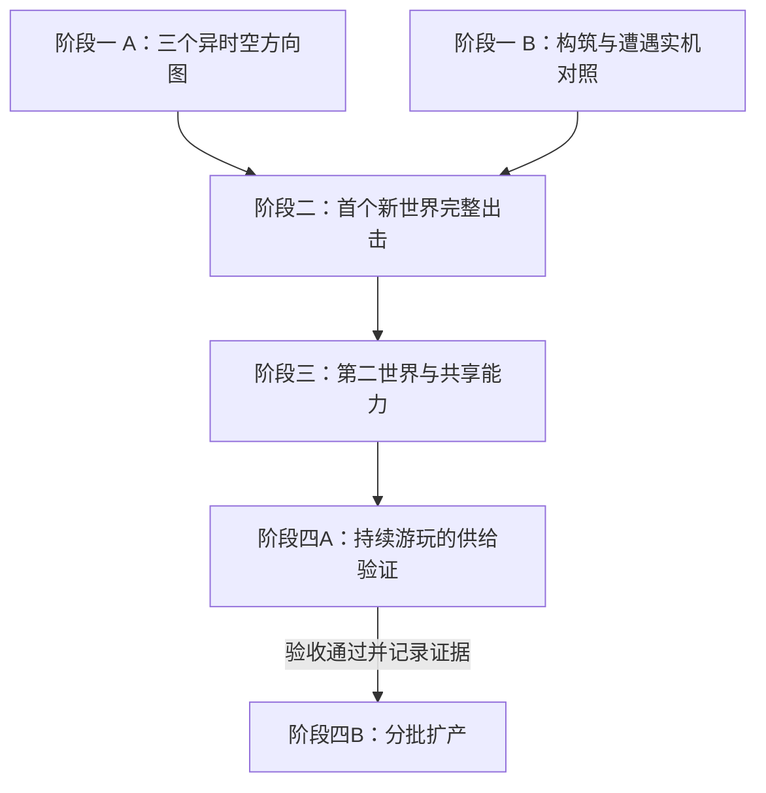

# 内容扩展推进计划

## 0. 已锁定的目标与续接入口（DEC-146）

**本文件是本项内容扩展工程的唯一执行总台账。** 用户于2026-09-11明确锁定本计划，尤其强调“验证持续游玩的供给，再分批扩产”。长期目标是让陌生世界、敌人和构筑共同形成可持续扩充、可反复游玩的内容。

四阶段的交付目标、依赖与防遗漏检查点继续有效。具体参数、制作方法和子任务拆分可按验证结果细化；不得因会话中断、换Agent或完成了画面/地图而省略后续阶段。取消或跳过锁定环节须有用户明确的新决定并记录影响，不能由“暂缓”悄悄变成删除。

**续接时先读本节、第6节及第8节，再读当前迭代合同和QA证据。** 开迭代、阶段交付、暂停或交接时，更新这里的状态和下一步；[当前迭代](current-iteration.md)与[路线入口](roadmap.md)保留本文件链接及供给验证状态。

- 阶段一：世界方向与玩法样板——迭代21进行中（DEC-147–156）；用户认可R4三维并选择该方向继续，正俯视冻结在fab67e2/R4。J/K/L局部修正已提交`a96fed3`，R7暂予接受，未推送。DEC-156用户授权近期三批，以悬海为首包实施方向；M批长路线与首包技能反馈已交并完成Agent验收，用户观感待审；完整首个世界与生产接入尚未交付，阶段一未结案。
- 阶段二：首个完整新世界——未开始，依赖阶段一。
- 阶段三：第二世界、构筑深度与共享能力——未开始，依赖阶段二。
- **阶段四A：持续游玩的供给验证——未开始，必须交付，验收负责人为QA，设计负责周转模型与调节，Director负责检查证据和解锁扩产。**
- **阶段四B：分批扩产——尚不具备进入条件；阶段四A通过前不得开始批量扩产，也不得宣布本计划完成。** 前三个阶段所需的样板制作不属于批量扩产。

当前执行迭代21，已开始阶段一；图像见[世界概念目录](../art/iteration-21-worlds/README.md)。后续阶段、四A供给验证与四B扩产状态保持未开始/前置未满足。

**执行记录（2026-09-11）：** 用户授权开始（DEC-147），以`2d9725f`为实现基线建立迭代21。[世界取景](http://127.0.0.1:3000/world-study.html)交付三个世界意象与三个俯视场景概念；[构筑对照场](http://127.0.0.1:3000/build-lab.html)交付三遭遇、七配置及JSON记录。22次实际操作尝试和9组专项检查已完成，报告保留7次失败探索；普通解法、工具耗次、轻装取舍和近战击杀均有真实证据，静默短路的高代价未被美化。用户已授权阶段提交，本批纳入Git保存且未推送；下一步为用户世界方向选择，随后进入所选局部的动态样板。

**后续反馈（DEC-148，分析时点）：** 上述首批已提交`3c1bc7c`。用户认可概念想法，要求解决俯视镜头下的悬顶、托举和厚度表现，并允许考虑调整镜头；不能直接放弃世界。当时提出先以悬海比较现有二维分层与固定斜俯视，验证上层遮挡，并讨论空间建立镜头，见[环境提案第5.5节](../design-notes/rift-environment-expansion.md#spatial-presentation)。该分析随后获DEC-149实施授权；当前可操作样板状态见本文件末尾记录，不再停留于几何示意。

## 1. 第一件要做的事

迭代21按**「世界方向与玩法样板」**组织，世界方向图、正式构筑对照与三维空间局部已交。用户已选择固定机位三维像素舞台，R7局部暂予接受。DEC-156用户“开工”接受近期三批计划，以悬海作为首包实施方向；M批正常游玩呈现与长路线已完成Agent验收，后续阶段二负责完整世界及基地闭环。

[内容扩展战略](../design-notes/content-expansion-strategy.md)决定构筑、敌人、地图和获取怎样互相支持；[异时空环境提案](../design-notes/rift-environment-expansion.md)决定取景范围。两者共同导向一个完整新世界的可玩样板，随后用第二个世界检验复用能力。

总体战略与本推进计划已采纳，悬海为首包实施方向；计划锁定不代替成果验收，阶段一现由迭代21执行。

### 1.1 近期三个工作包（2026-09-12，DEC-156已授权，第一批Agent已验）

用户已回复“开工”。[迭代21 M](../tasks/iteration-21.md)已交较长路线、固定尺度平移取景与三种代表配置的正式技能反馈；两趟完整搜撤和声音/听觉、生命周期、最终海层消隐及实际结算冻结专项通过，详见[QA](../qa/iteration-21-gameplay.md)。当前为AGENT-VERIFIED / 用户观感待审，尚未提交/推送。第二/三批保持依赖顺序，尚未交付；四A未开始。以下范围与验收继续有效。

短期交付目标：第一张能够从净化点整备出发、完成搜撤、供奉收获并再次使用的三维Rift。以下是既定阶段一收口与阶段二的细化，不改变四阶段依赖，不新开独立总台账。

1. **三维游玩基础收口。** 由code/art盘点首包实际需要的呈现接线，design确认环境判断和技能目标合同，QA验证。重点为比当前单屏局部更长路线的取景、首包玩家/敌人的攻击受击与技能反馈，以及地面、空洞、海体共同出现时的辨识。保持已选固定机位的空间语言，长路线如何取景在本批明确，不通过不断缩小人物塞进整张地图。复用当前正式模拟，只补首包必需能力。交付一段可连续行走、交战、观察并撤回的完整局部及支持/缺口清单；通过条件是正常操作中能判断可走边界、实际危险与目标，未补齐的对象不得进入首包抽取池。问题按实际复现收口，局部评价“还凑合”不扩大成全部角色、技能和三维显示已验收。

2. **悬海成为完整关卡。** 在阶段一局部关系获确认后进入阶段二，由design/art/code制作两种布局编排，围绕汇流、落水周期与安全间隙组织观察点、可选收益、绕路和返程。补齐至少一种当地实体或可交互危险源、符合来源的翻找物与音景，并制作简短入场空间建立。既有物件能否压制、延迟或影响危险，逐项明确真实资格、效果、耗次与反馈，不假定所有环境都能受控。验收以正式普通配置可通过、至少两种配置有不同的行动/成本优势为准；四配置×两种子作为首轮诊断，再补未参与调参的种子。先保证首包完整，不在本批增加武器种类或扩全敌人目录。

3. **净化点往返与长期记录接入。** code串联既有库存、供奉、消费与出击结算，QA完成真实获得→携回→供奉→再装配使用，并检验携入装备及途中收获一起死亡全损、基地库存保留、满载返程、末次消费和保存异常。design/code同步提出退出、刷新与崩溃的具体恢复方案；涉及损失规则的政策经用户确定后再接长期存档，不能默认为死亡或无损重置。该政策讨论不妨碍前面的隔离闭环制作。交付从净化点开始并返回的完整可玩一趟、再使用证据与存档边界；开始逐趟记录消耗和收获，但单趟闭环不记为四A通过。

Director负责三批范围、依赖和收尾；实现与重复测试由Agent完成，用户主要审查完整游玩成果。每批拆入对应迭代合同，开工、交付和验收分别记录。

紧随其后仍是阶段三：用存在方式明显不同的第二世界检验复用，同时跟进一个构筑核心、一个敌人职责及策划数据入口。然后执行四A的连续出击、耗尽、死亡/连续失败后的重组和武器/技能供奉竞争验证；只有证据通过后才进入四B批量扩产。

## 2. 路线与依赖

第一阶段两条线可并行。后面各阶段以实际通过的成果为输入；遇到问题只回到负责该问题的部分，不把整个项目推倒重来。

进入实施时先记录可回退基线，核对现有待审项与本次范围。迭代20的Agent自验不自动变成人审通过，旧迭代未决事项也不因新计划被关闭。已有文档索引与测试工具可沿用。

## 3. 阶段一：世界方向与玩法样板

### A. 世界线：让想象成为可见、可讨论的场景

首轮概念探索做三个方向：**悬在头顶的海、彼此托举的生命大陆、被撑出厚度的世界**。它们分别检验自然与尺度、生命与地貌、空间与身体，避免把所有方案收敛为同一种表面换色。

每个方向交付：

- 一张完整世界意象图，说明尺度、主体结构与原生秩序怎样被改写。
- 一张按正常游戏镜头和玩家尺度组织的像素场景概念图，标出可活动区域、观察位置、危险与收益。明确它是概念图，不冒充实机截图。
- 一页以内的局部规则说明：玩家观察什么、变化怎样发生、普通应对和工具优势是什么；必要时用关键状态图说明运动。

先由我和美术/设计协作完成内部检查，再给用户看整组方向。选择依据同时包含想象力、场景整体美感、活动表面与世界的关系，以及能否形成清楚的操作判断。实现成本列出来，但不先用旧引擎筛掉陌生世界。

**通过条件：** 至少一个方向获视觉认可，并明确首个局部要真实实现的环境关系。此次选择决定首包，不取消其他世界进入后续扩充的机会。

**回退条件：** 只有远景奇观、脚下仍是通用走廊，或三个方案仍像一套素材，应重做场景关系；不能仅增加说明文字。

**DEC-148/149追加的验证问题：** 用户已认可概念想法，但要求保留这些世界并寻找适合的镜头/画面。先以同一悬海局部验证垂直关系、上层遮挡与控制可读性，再锁定世界和表现形式。固定斜俯视与局部遮挡处理已进入可操作A/B对照，尚未被记成用户选择或生产默认。短暂空间建立镜头留给选定世界的完整入场，本批没有实现。该小样用于完成阶段一的可呈现性判断，阶段二仍负责所选世界的完整动态局部与出击闭环。

### B. 玩法线：用现成内容验证决策差别

在旧图书馆测试场景中编排三个短遭遇：被观察的捷径、有间歇的污染通道、有退路的争夺点。复用正式角色、敌人、工具、翻找与结算能力，不另写一套只供演示的技能。

统一用普通品质，比较：

- 白板撬棍，技能位留空，验证基础可行性。
- 静默绕行：回声空壳、带缺口的石头、消声的旧布。
- 短窗近战：打结的细线、沉重的石块、附着的空壳。
- 从一套完整配置中少带一件工具，验证携带余量与机动是否值得取舍。

周期通道使用可被工具作用的气团、雾团或尘絮群；另以相同种子、相同其余装备比较空槽、不落的砂砾、冷却的余烬。延迟释放与压制危险的不同机会要实际走出来。

记录路线、等待、暴露、交战、次数/耐久与收获，用连续操作录像解释差别。这一步保留原供奉和物件数值作为基线；若配置仍趋同，先检查遭遇是否提供了不同价值。

**通过条件：** 普通配置有可执行解法；至少两种配置出现不同的行动和成本优势。工具耗尽可选择撤退，世界不停的拾获整理照常成立。

**回退条件：** 全部配置都以同一方式冲过去，回到遭遇设计；不要通过新加几十件物品掩盖问题。

两线在玩家尺度、危险前兆、观察信息和退路上保持一致。玩法线的旧地图只是对照场，不决定新世界必须使用旧地形与旧外观。

## 4. 阶段二：一个新世界完成整趟循环

选定方向后，先做**带真实角色的局部动态样板**：让主导环境关系在正常镜头、迷雾和操作中成立。随后将它扩成一次范围有限但完整的出击。

首包范围控制在：

- 一个来源世界、一个可活动局部、一种主要环境关系。
- 两种布局编排，以少量固定种子验证，再加入未参与调参的种子。
- 至少一种属于当地的实体或危险源，具有实际行动/释放、受击或受控、恢复、死亡或消散的适用反馈。可以复用现有战术职责，外观与运动必须与新世界有关。
- 正式翻找物、一组来源合理的既有物件掉落，以及安全观察、可选收益与撤离关系。
- 完整流程：入口整备→进入→观察/遭遇→翻找与携带取舍→撤离→供奉成熟→再次装配使用。

至少一个关键决策必须依赖这个世界的真实环境关系。既有技能能否作用于新危险源，要在目标、效果、消费与反馈合同中明确接入；不得仅更改外观后假定余烬、砂砾或控制技能已经支持它。

首包优先使用现有13族物件检验构筑。新的进攻被动与敌人攻击职责有明确后续位置，只有样板证明确实需要时才提前加入其中一项。武器仍用撬棍，不在同一包扩武器种类和成长树。

若新实体先验证一个代表污染档，必须标明可抽取范围；正式随机池启用前，补齐它实际允许出现的全部档位、动作与恢复反馈。不能让未做完的组合进入生产。

### 本阶段的最少工程

先补首包会用到的注册与校验：环境、空间配方、材质、翻找物、敌人来源、音景和测试样本必须对应完整。缺项在生成/检查时失败，不能进入地图后才报错或退回户外外观。

跨水观察、可变支撑面、曲面展开分别有不同前置能力，只实现所选样板需要的部分，并保持与实际画面的承诺一致。完整流体模拟、通用维度引擎和全工具重写不作为默认前置任务。

库存、供奉、消费和结算继续使用同一套正式系统。测试可用隔离记录初始化装备；正式获取验证必须从真实揭晓、带回和供奉开始，不把预先填好的测试库存当成经济闭环。

### 验收与回退

首轮可用四种配置各跑两个种子，共八趟对照，作为诊断样本而非统计平衡证明。再补针对性的满负重返程、丢弃、工具末次、无效目标与敌人恢复场景。

真实走完至少一次携回→供奉→再装配；另做一次携入装备且已获得收获后的死亡，检查全部随身丢失、基地储备保留。保存失败、重复揭晓及账本一致性走自动化回归。

世界关系不可读则回局部表现；有路但无法合理脱离则回遭遇与几何；库存或供奉出错则阻断正式接入。用户看到的是可玩的完整一趟和已知限制，不承担事务正确性的排查。

## 5. 阶段三：第二世界检验复用，并补构筑深度

第二个世界选择与首个存在方式明显不同、又有一部分接口可以共用的方向。例如自然与重力关系之后，转向生命承重或曲面生命；不把第二世界做成首个世界的材质替换。

迁入一个已通过的遭遇合同，再加入一个本地独有的空间问题。保留各自活动表面、节律与实体，重新走通带回、供奉和装配。

同时从真实重复中提取共享能力：

- 环境与来源的完整注册关系，以及危险阶段、目标资格、反馈和退出合同。
- 事件、条件、目标、效果与持久化消费的有限组合，先服务已有需求。
- 物件品质从逐族加列转为可扩展的数据关系；来源池加入受控的环境/遭遇偏向，避免新增类型稀释整个总池。
- 开发用策划入口直接读写CSV，提供中文字段、图标、引用检查与进入实际场景的入口。

**构筑与敌人后续任务必须显式跟进：** 分别验证一个进攻被动核心和一个新攻击职责。可以串行分成独立小任务，不能因已完成两张地图就宣布第一份提案全部完成。它们要在已有对照场与新世界中体现用途，并保留正确消费和身体反馈。

记录哪些部分直接复用、哪些适配、哪些完全新做，以及验证和返工的耗时。第二世界若处处需要追加专属分支，先修共享接口；若过度复用抹掉世界差别，则补回专属设计。两者都过，才有扩产依据。

## 6. 阶段四：周转验证与分批扩产

### 四A：持续游玩的供给验证——扩产前必过

**本项不得被单次撤离成功、物品可以掉落、自动化消费测试通过或两个世界制作完成代替。** 前期从阶段一就采集消耗基线，阶段二/三记录实际带回与供奉过程，阶段四A汇总连续出击证据并完成周转验收。

从第一次获得构筑核心、核心正常耗尽、死亡丢掉整套配置、连续失败四类情境观察持续补给。验证对象包含普通品质的代表构筑及其武器，不要求死亡后无损取回同品质同一物件；要证明玩家能通过正常玩法重新组织可用配置。

必须留下以下证据，归入实际承担本项的迭代QA报告并从本节链接：

- **连续过程：** 使用正式掉落、撤离、供奉、耐久/次数及死亡规则；记录种子序列、代码/策划表版本、起始库存、供奉进度、永久成长、装备与每趟结果。连续测试期间不靠调试补物或清空失败记录重置成本。
- **收支与恢复成本：** 逐趟记录获取、实际携回、消耗、损坏、丢弃、死亡损失、可用库存和未成熟库存；统计重新形成可用构筑所需的出击、等待与资源，以及中间采用的替代打法。不能只报平均收益，需保留低收益、连续失败和未恢复样本。
- **供奉实际吞吐：** 覆盖技能物件与武器竞争供奉槽位、成熟所需冲击、潮汐阶段、基地承伤/修复支出，以及物件尚未成熟期间如何继续出击；“已经捡到”不能记成“已经补给成功”。
- **常规来源可持续：** 首次发现、一次性奖励和测试赠品单独标记；剔除它们后重复验证代表构筑的常规补给。既有持续生效的白板武器防卡死保障按正式规则计入并单列，不能把它当成整套技能构筑可周转的证据。
- **通过与失败判断：** 在连续测试开始前写清样本安排、代表构筑、失败序列、普通核心的目标使用频率和恢复成本；用实际操作和收支记录解释是否达标。若出现只能靠测试库存维持、普通来源长期不足、供奉堵塞或失败后无正常恢复路径，保留未通过状态并修正后复验。

QA负责形成结论，设计负责解释和调整来源、普通供给、成熟吞吐；Director检查代表情境与证据是否齐全，再更新`supply-validation`和四B进入条件。没有证据链接不能记为通过；存在影响持续游玩的未决问题时，不能把本项移到扩产之后补做。

若常见打法只能靠预先塞满库存维持，先调来源、普通供给或成熟吞吐。有限次数、武器耐久、死亡全丢等规则不作为掩盖供给问题的可随意取消项。

### 四B：验收通过后分批扩产

四A通过且证据已登记后，按小批内容包扩产。每包明确增加的是来源世界、独立局部环境、敌人职责还是构筑选择；新内容附带资产、机制、CSV、实验室、正式生成与回归样本。新增内容若改变来源池、消耗或供奉成本，复验受影响构筑的周转，不能只沿用扩产前的一次结论。

资源按需加载、近期环境重复控制、首次接触的学习安排、跨版本兼容与全部生产环境自动枚举，在规模增长前完成。数量和工期根据前两世界的真实制作数据重估；不沿用已撤回的32场所目录与16–24预算假设。

## 7. 贯穿各阶段的管理方式

**统一台账。** 本文件只管理阶段、依赖和待验事项。实施时，每个实际开启的迭代使用一份任务合同；机制细节原地更新对应spec，QA证据归该迭代报告。两份设计提案继续承担方向说明，不各自维护一套冲突的排期。

**明确负责边界。** 设计负责世界关系、遭遇、构筑与经济；美术负责场景、当地实体、像素表现与音景；代码负责生成、状态、资产接入与工具；QA负责固定种子、真实操作及自动回归；Director负责跨系统合同、依赖、范围与交付核对。具体文件所有权在派发时指定；共享CSV生成及注册文件变更串行整合。

**持续交付。** 每个工作包写清范围、负责人、依赖、状态、证据位置和下一步；完成独立可验证成果就记录进度与版本，不等到整个工程结束才发现遗漏。未开、制作中、Agent已验、用户已验分开记录。每次交接必须写出当前阶段、未完成检查点、供给验证状态与下一步；无论最近任务是美术还是代码，四A未过时都保留其扩产前置标记。

**审查集中在成果。** 用户主要看三个节点：世界方向图、首个完整可玩世界、第二世界与构筑差异。代码正确性、数据核对和重复测试由Agent完成。这里是约定的反馈节奏，不追加每个小动作都要确认的流程。阶段四A的供给结论单独随验收证据汇报，不能因用户已看过三个视觉/试玩节点而省略。

**不让旧审美约束取景。** 用户禁止引用的审美skills、旧形象经验与既有材料目录不作为新世界的创作依据。实际场景、世界关系和已确认的交互可读性继续共同约束交付。

### 中断恢复的处理位置

退出、刷新与崩溃政策仍未确定。概念图、局部动态样板与隔离记录下的玩法测试可先推进，它不阻塞第一阶段。

接入玩家长期记录前，要形成具体的中断处理方案并解决未定政策；不能暗自判为死亡，也不能宣称已经能恢复。出击身份、种子、配方版本、已揭晓物品以及可变地形/危险状态的保存边界，应随新世界真实能力一起定义，不能留到几十个环境完成后补救。阶段二可先交隔离测试闭环，面向长期存档的正式发布必须单独满足该项。

## 8. 防遗漏检查点

- [x] 三个有跨度的世界方向图与俯视场景概念图已制作（迭代21，概念想法获正面反馈，不代称实机资产或阶段一通过）。
- [ ] **DEC-148追加：** 在可操作局部验证纵向空间、上层遮挡和游玩镜头，随后锁定表现形式与首个世界。
- [x] 三种遭遇、代表构筑及周期工具的真实对照（迭代21，见[QA](../qa/iteration-21.md)；包含失败与负面战术结果，不代称整体平衡通过）。
- [ ] 一个局部环境动态与操作关系成立。
- [ ] 首个世界的本地实体、翻找物、音景与正式注册完整。
- [ ] 搜刮、撤离、供奉、再装配、死亡和消费闭环。
- [ ] 一个新的构筑核心、一个新的敌人职责及其交互验证。
- [ ] 第二个存在方式不同的世界与实际复用记录。
- [ ] 可扩展的能力/品质/来源表及开发用策划入口。
- [ ] **阶段四A必交：** 首次获得、正常耗尽、死亡与连续失败后的构筑周转验证，含逐趟账本、武器/技能供奉竞争、剔除一次性供给和验收结论。
- [ ] **阶段四B进入条件：** 四A通过且证据已链接，之后才按小批内容包扩产；供给关系变化后复验。
- [ ] 正式存档的中断政策与实现、资源加载、全目录回归和抽样体验。

图像与构筑对照已交；早期R1/R2已由后续三维局部取代，Stage方向获选、Vista冻结R4。K/L修正已验并提交a96fed3，R7局部暂予接受。DEC-156启动第1.1节近期三批，M游玩基础已交且Agent验收通过，用户观感待审；悬海为首包方向，完整世界与基地闭环尚未交付，其余检查点保持未完成。后续交接不得遗漏四A，四A未过则不进入四B，也不将本计划标为完成。

### 阶段一空间样板实施与交付（DEC-149，2026-09-11）

用户批准继续；基线`3c1bc7c`。现已交付[悬海空间样板](http://127.0.0.1:3000/spatial-study.html?view=b&seed=7)：二维分层与固定斜俯视共用路线、正式玩家／敌人／拾获／消耗、种子和危险时序。Agent完成两条路线×A/B真实携回、实际水幕死亡及暂停／切换／重开／刷新验证，失败尝试与连续录像保留，见[空间QA](../qa/iteration-21-spatial.md)。工程类型、构建、5组专项检查与既有9组构筑回归通过；本批未提交。

**以下为DEC-149的R1历史状态，已被DEC-150用户否决取代**。当时为SPATIAL-SAMPLE-REVIEW-PENDING：Agent技术与实玩验证完成，用户视觉审查待完成。Director倾向B的高度表达，但世界与生产镜头未锁；入场空间建立镜头留给选定世界的完整入场。下一步审查可玩样板的高度感、遮挡与操作观感，据其结果进入阶段二。后续阶段二／三、四A持续供给验证、四B条件均保持原合同；**四A仍NOT-STARTED**。训练授予与单趟携回不属于持续供给证据。

### 悬海R1否决与R2重做（DEC-150）

用户视觉审查30/100，否决平面贴图式海体、同构相机对照与边缘瀑布。R1正常/死亡结算及隔离证据保留，但空间表达不成立。当前重做可变厚度的动态体积、前腹卷沿的真实空气开口、内侧源囊与高度参照；先做一个场面，再复核镜头选择。R2已实现并完成新的真实功能/死亡/隔离复验，当前SPATIAL-R2-REVIEW-PENDING，内源纵深与海下压迫感仍待用户判断。没有因此转入阶段二或删掉世界构想；四A仍NOT-STARTED，四B继续等待四A。

### 双路线设计记录（2026-09-11，DEC-151）

R2用户反馈已到：斜俯视角色与海体角度不统一，正俯视有潜力但海量覆盖/动态镂空/不规则落水待改。用户要求两条方向都给具体方案，不二选一。当前交付为[环境提案第5.5–5.10节](../design-notes/rift-environment-expansion.md#spatial-presentation)：进入奇观的完整空间，以及地图边界/空洞里的巨大世界；八个世界分别给出两种落点。建议后续两线各交一个完整局部，不将新研究变成全量重构或八世界扩产。

本轮仅设计与进度记录。新样板尚未实施，生产镜头/首个世界未选择，阶段二/三未开始。**四A持续供给NOT-STARTED，正常耗尽、死亡全损、连续失败与供奉竞争均仍必须验证；四B不解锁。** 上方R2待重审措辞是交付时记录，最新状态以本节及第0节为准。

### H批历史续接（2026-09-11，DEC-152）

用户批准两线各交完整可操作局部：固定机位三维像素舞台，以及正俯视下的边界、内部裂口和巨大运动三种构图组合。实施与实玩验证住在[迭代21 H](../tasks/iteration-21.md)、[开发合同](../dev/spatial-study.md)。两线共用CSV世界和正式玩法，独立呈现；本批不做全量引擎迁移、不启用新生产世界、不扩产。两个局部已实现并完成新的完整搜撤、真实战斗/耐久、水伤死亡、菜单/存档隔离验证，入口和证据已登记；材质仍属试作，当前无新用户空间/视觉验收。本批未提交/推送，阶段二/三未开始，**四A持续供给仍NOT-STARTED，四B不得越过四A。**

### I批历史续接（2026-09-11，DEC-153）

用户要求双线进一步精修，撤销内部黑区的可见下层世界。迭代21 I / R4实施像素角色和水材质、同源坡面高度及下落/断流因果；正俯视内部保持不可探知，景观只在外缘。R4已交新实图、41组专项、构建和两线完整实玩证据，用户视觉待审；不以先前功能测试替代本轮呈现。阶段二/三未开始，**四A持续供给仍NOT-STARTED，四B不解锁。**

**2026-09-12（DEC-154）：** 用户选定三维像素舞台，正俯视冻结于R4，要求先提交当前成果再完善三项视觉反馈。阶段二/三未开启，四A供给仍NOT-STARTED，四B不解锁。

J批精修交付（2026-09-12）：海面大块、已知地层下沉与独立配色均已实施，首次压黑岸壁的问题经真实场景深度显露和壁面漫反射补正，最终沿岸实图与GPU已核。精修尚未提交/推送，用户视觉待审；阶段二/三/四A状态不变，四B继续等待供给验证。

### K/L历史续接（2026-09-12，DEC-155；最新见下方M）

K批已完成空洞通视、真实空气参与上方海体显露、空气不积累地貌记忆及岸壁材质连续。8点真实视线专项、切回Vista规则、完整搜撤、AI物理绕路/推退专项与构建已验证，最新记录见[迭代21](../tasks/iteration-21.md)和[QA](../qa/iteration-21-spatial.md)。用户画面待审，J/K未提交/推送。此局部修复不等于首个完整生产世界，也不计作持续供给测试；阶段二/三未开始，**四A仍NOT-STARTED，四B仍不得开始**。

L/R7跟进（2026-09-12）：北沿侧面误读已完成有界材质修正与正常沿岸复核；只补相关构建、感知记忆和短实机，不将K的用户反馈忽略为已通过。仍在阶段一，J/K/L未提交/推送，完整生产世界未开始，四A持续供给NOT-STARTED，四B继续等待四A。

2026-09-12检查点：用户对R7反馈“还凑合，提交吧”，当前局部暂予接受，J/K/L累计成果纳入本次本地提交。前文各批未提交/待审为历史时点；未推送。该认可不等于完整世界或阶段一全部完成，四A仍NOT-STARTED，四B仍不得启动。

### 当前续接：M游玩基础已交（2026-09-12，DEC-156）

57×35长路线、固定35°/1060尺度平移镜头、三配置五类技能反馈及真实物件呈现已交。白板/近战两趟完整搜撤与轻装声音/听觉、活跃实例暂停/重开、最终海层/视野显隐、真实撤离冻结均通过；正常帧及范围见[QA](../qa/iteration-21-gameplay.md)与[代表原图](../qa/iteration-21-gameplay-review/README.md)。用户长路线观感待审，未提交/推送，阶段一仍ACTIVE。

接续第二工作包：两种悬海布局、至少一类本地实体或可交互危险源、来源明确的拾获、音景和短入场；分别验证普通解法与两种配置的实际优势。随后第三工作包接净化点获得→供奉→再装配，长期记录接入前落实中断政策。再完成第二世界/构筑与共享能力，进入四A连续供给验证。**四A仍NOT-STARTED，四B保持锁定；训练授予、这一趟撤离或当前画面完成均不能替代连续供给证据。**
