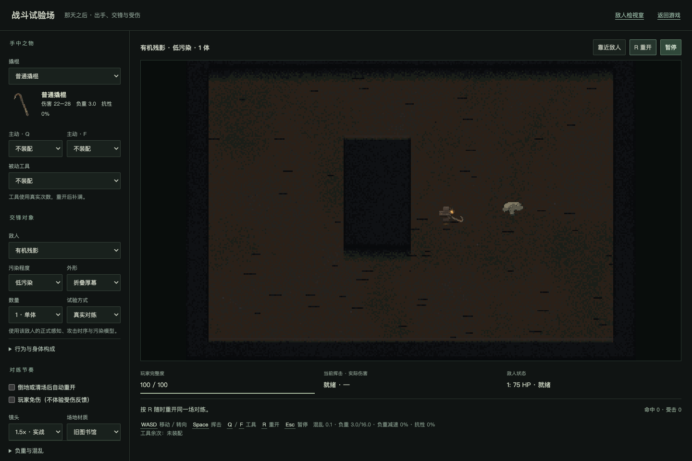

# 迭代19 W7：战斗试验场内部验收

日期：2026-09-09。状态：CODE-COMPLETE / USER-REVIEW-PENDING。入口：[战斗试验场](http://127.0.0.1:3000/combat-lab.html)。内部检查不代替攻击手感、受击可读性及画面的人审。

提交状态补记（2026-09-11）：本批实现与本报告已随`5759579`提交，原“尚未提交”仅为验收当日状态。本次仅核对提交历史，未重跑下述验证或核对GitHub实时状态。

## 已执行验证

- `npm run build`：TypeScript与Vite多页生产构建通过，包含combat-lab.html。共享大块体积警告仍存在。
- `npm run typecheck`、`check:crowbar-combat`、`check:inventory-tools`、`check:environment-runtime`：通过。
- `tools/inventory/check-combat-lab.mjs`：Chrome无头浏览器独立上下文，八组断言全部通过，无pageerror。

浏览器覆盖：

1. 真实场景启动、十款武器和生产敌人目录齐全。
2. 装备切换改变真实伤害/抗性/负重；配置暂停时状态不推进；按钮焦点下Esc能恢复。
3. 十款武器逐一切换、重建场景并以Space实际挥击。
4. 普通撬棍实际命中敌人；敌人真实AI攻击使玩家扣血，未直接调用模拟伤害。
5. Q使用主动工具，真实剩余次数减一。
6. 全部生产敌人家族的低/中/高污染档均能合法生成；普通敌人三体配置成立。
7. 玩家被真实AI打倒后保留结果，短期战斗特效正常消退；R恢复满血新回合。
8. 连续六次重开纹理数量差不超过2，无浏览器错误；正式存档键字节与初始哨兵完全相同。

复跑：设置`PLAYWRIGHT_MODULE`（本机Playwright模块路径），可选`CHROME_PATH`（Chrome可执行文件），运行`node tools/inventory/check-combat-lab.mjs`。默认连接127.0.0.1:3000，可用`GAME_URL`覆盖。测试使用独立上下文，未操作用户浏览器存档。

## 审查修复

独立代码审查与实测发现并修复：回合结束后表现计时被提前返回冻结；暂停按钮焦点下Esc失效；仅负重速度读数文案误称总速度。靠近辅助也改为优先选择合法且面向正确的近距离位置，以便迅速体验接触。辅助不会直接造成命中。

## 边界与待人体验

场内配置暂停只属于开发试验工具，不修改正式裂隙背包不停规则。可选免伤不用于评价玩家受击，默认关闭。环境宿主按合法席位单体部署；不可杀的场域明确标注。探索/经济工具没有完整搜撤目标，不伪造其完整用途。

当前自动化覆盖回合结束与手动重开，未单独覆盖自动续场的完整计时，也未逐一攻击全部环境核心。全部污染档的部署检查不等于所有攻击模式和美术效果已获人审。既有出击中断恢复政策仍待确认，与训练场独立。

## 实景

