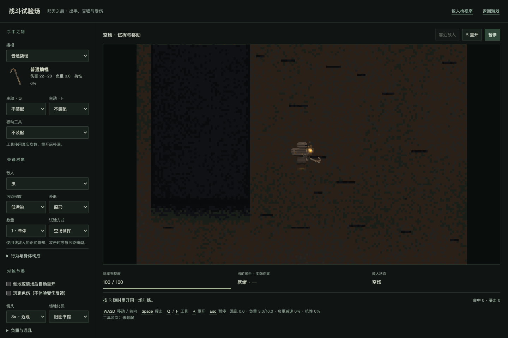
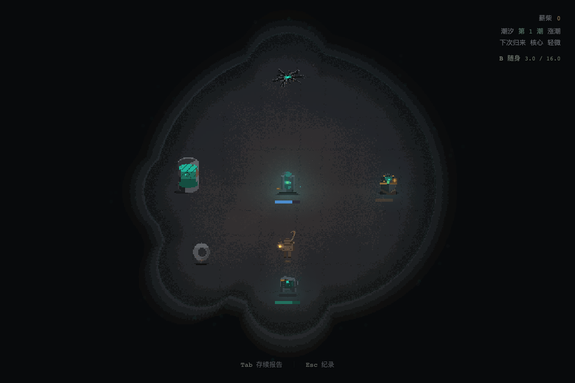
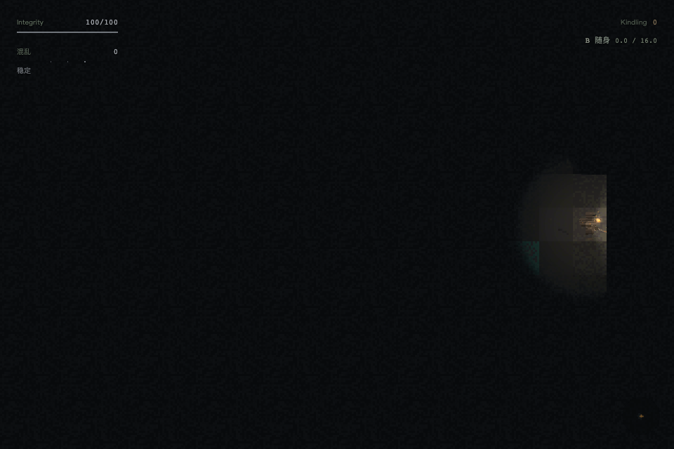
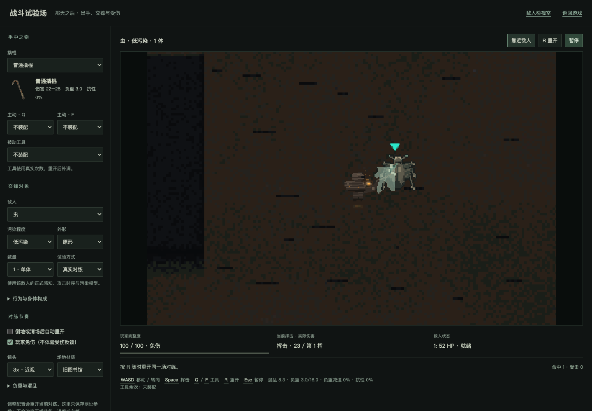
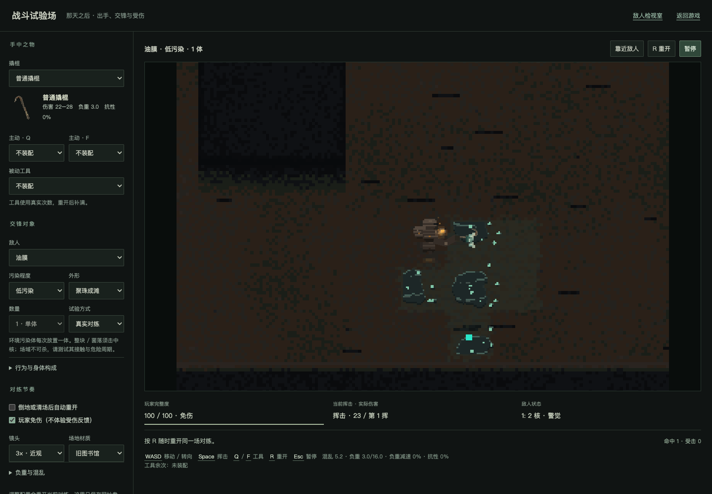

# 迭代19 W8：首次体验反馈

2026-09-09。用户明确认可玩家攻击动画；受击可读性、武器持握体量与背包入口在本批修正，修正后体验待用户审查。

## 持握比例

32px源图以0.68倍显示，绕原握点缩小到约18px实体长度；保留攻击姿态曲线与品质轮廓，库存图标及伤害判定不变。真实战斗试验场四向截图已查看，普通与卓越的钩头/杆身均可辨；不以静态截图替代完整动画人审。

## 随身入口（历史W8，已由W9替代）

以下记录W8当时结果；现行Tab报告/拾获及供奉合同见[W9统一物件](iteration-19-unified-equipment.md)，旧B/布卷已下线。

两场景右上同一小字按钮语言：B 随身及实际负重，26px点击热区；与键盘B共用流程。已有面板显示时隐藏入口。净化点Tab仍为存续报告；裂隙开包不停，WASD交还移动。Esc菜单补控制说明。布卷库存结构沿用已接受方案。

`tools/inventory/check-inventory-entry.mjs`真实浏览器通过：净化点鼠标/B开包、B/Esc关包、Tab报告、暂停帮助、面板互斥；装备变化后入口DOM节点与关闭回焦稳定。实际备行进入裂隙，验证鼠标/B开包、开包场景时钟继续、移动关包及无双重面板/浏览器异常。测试在独立上下文中运行。

Art已查看两张入口截图：字级、无底板表现与现有HUD一致，没有需要返工的静态问题；用户尚未审查本批改动。

## 真实受击反馈

身体模型共享220ms纯表现定向压缩/退让回弹；实际body位置、AI和攻击时钟不受影响。接触侧出现70ms局部破口与240ms少量灰青碎屑。环境核仅6px局部暗凹/裂边180ms内收回弹，场体根锚不移动。不可杀场不触发伤害反馈，致死短尾由Combat池接管。

运行时实测普通撬棍对虫造成23伤害（75→52），反馈位移约2.58px、受力轴缩至约90%，AI仍可正常前摇；卓越两挥击杀，550ms后命中/死亡池全部归零。真实油膜核命中23，根锚不变。重开纹理数量稳定，无浏览器错误。根已查看身体20/140ms及核20ms截图。

通过：`check-hit-reaction.ts`、`npm run check:crowbar-combat`、`check:combat-visual-state`、`check:environment-runtime`、`typecheck`及最终`npm run build`。系统回归包括共享伤害/目标预算、墙挡与空挥不产生反应、回弹归零与监听解绑。没有lint脚本。构建仍有既有共享大chunk提示。

最终代码另完整复跑`check-combat-lab.mjs`，八组真实浏览器断言全部通过：十武器挥击、实际双向受伤、工具消费、全部家族三档合法部署、死亡手动重开、连续重开资源有界和正式存档字节不变。
