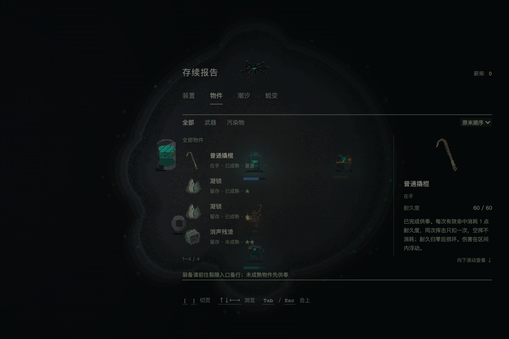
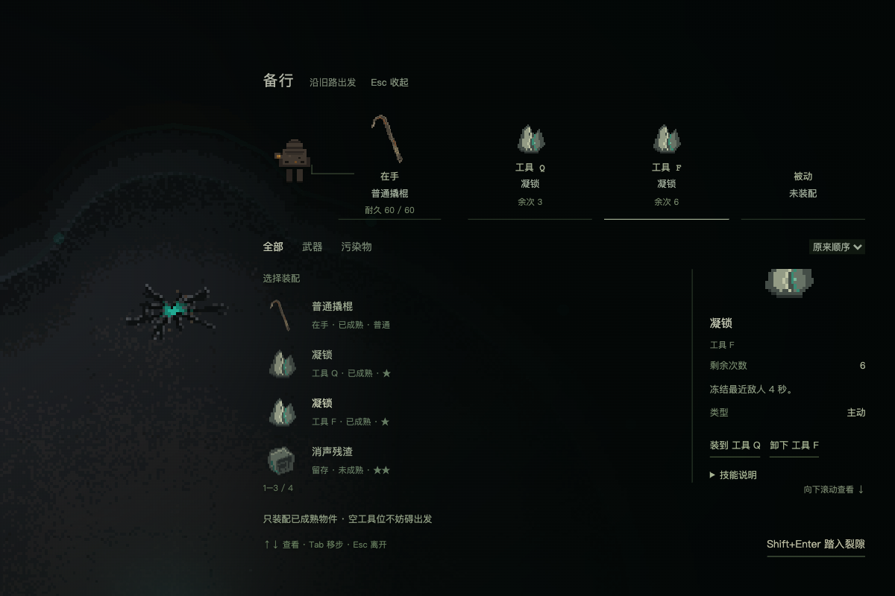
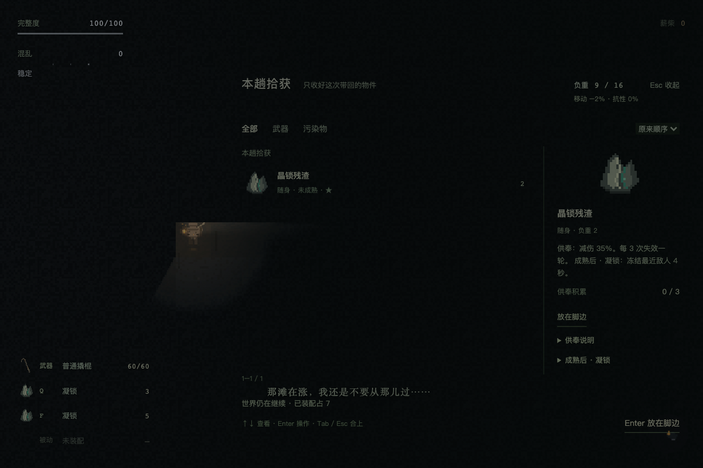
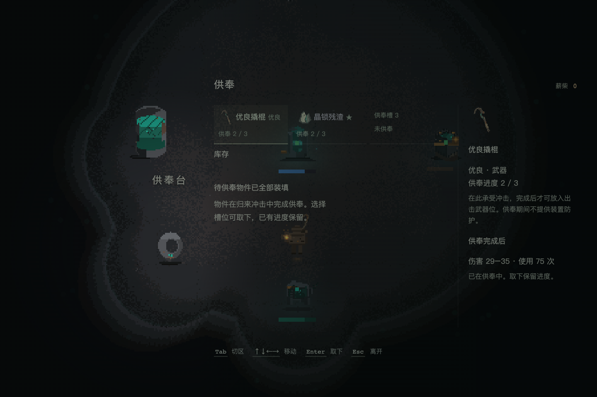

# W9：统一物件、供奉、有限使用与报告

当前合同见[统一库存](../specs/system-field-inventory.md)。本轮采用用户明确的「开局已供奉白板」「按命中、次数更多」；B独立库存与旧布卷视觉下线。本文记录内部验证，不代替用户的最终体验评价。未提交或推送本批。

## 真实生产流程

- `tools/inventory/check-offering-flow.mjs`：独立浏览器启动真实净化点，加入未供奉武器/晶锁fixture；通过真实供奉面板投入两类物件。原物件未成熟时不能装备；真实入口出击、真实RunController撤离与基地结算。最后冲击的晶锁防御披露存在，随后两件成熟回库、槽清空，武器75次/晶锁5次。世界供奉环按全部物件统计装填档。测试控制出发/撤离时机，不声称手动走完整地图。
- `check-weapon-uses-browser.mjs`：隔离战斗试验场，真实按键空挥仍余1，真实命中25伤害、敌75→50后武器删除清槽；后续Space挥击序号不变，R重开恢复60次和完整敌人。正式存档字节不变，浏览器异常0。
- `check-inventory-report.mjs`：净化点Tab/鼠标同一物件库、无基地负重/装配按钮，供奉导航只开一个面板；备行真实人物、武器加动态技能槽；裂隙Tab/鼠标仅拾获，B无入口、W关包、场景时钟继续。同型两件技能分别显示3与5次，实例不串位。报告四件均完全位于列表视窗内。技能实际摘要与完整说明读取CSV；展开说明不误触装配，武器余次首屏可见，供奉阈值随定义而非固定文案。
- `check-scene-inventory.mjs`：实际翻堆→取得→撤离入库→供奉完成后备行→再出击→死亡；两类同一归属，死亡不遗留本趟装备与拾获，基地物品保留。
- `check-inventory-view.mjs`：60件列表选择/滚动保留、保存失败原状、Enter单次提交、长按弃置取消/失败/成功、交换草稿与移动交还、供奉导航只触发一次。旧 `check-inventory-entry.mjs` 已转到报告新流程，旧base/B断言不再冒充现行合同。

以上浏览器均为新隔离上下文；训练实例与QA fixture不写入用户正在玩的存档。运行时服务 `http://127.0.0.1:3000/`，Playwright与Chrome路径通过 `PLAYWRIGHT_MODULE` / `CHROME_PATH` 显式传入。

## 领域、迁移与构建

通过 `check-equipment-lifecycle.ts`、`check-inventory.ts`、`check-tool-consumption.ts`、`check-save-migration.ts`、`check-field-loot.ts`、`check-survival-weapons.ts`、`check-crowbar-combat.ts`。脚本以 `TSX_TSCONFIG_PATH=tools/contam-preview/tsconfig.json node --import tsx tools/inventory/<文件>` 运行。

覆盖：共用槽位、末轮防御/跨槽充能、未成熟禁装、按合法命中每挥一次（两目标共用）、空挥零次、最后一挥动作/第二目标完整、保存失败无伤害/不重复重试；基地不限制重量但出发验证容量；旧内部v1武器一次迁就绪，已消费不回满，v2缺字段/畸形null行拒绝。只在真实事务成功后发布效果与UI状态。

`npm run typecheck` / `npm run build` 通过；构建235模块，沿用共享Phaser大chunk提示，未出现构建错误。项目没有lint脚本。

## 视觉核与资产

`export-contaminant-icons.ts`导出并核验18类全部CSV类型、唯一轮廓、硬边alpha、8色色板及透明边界。Root与art实际查看contact sheet和真实报告、备行、供奉、Rift拾获/HUD截图；不把图标数据校验当审美批准。

发现并修正：报告第四行被裁切但页数错误显示1–4/4；备行人物与在手物关联弱。现在完整显示四行，人物手侧以单根低对比细折线连接在手位。补入技能说明后额外发现共享flex样式导致详情挤走备行底栏，已明确内容区可收缩并内部滚动；折叠前后主出发动作必须完整可见，已加入浏览器几何断言。现有无框场景展开、字号和密度保留。技能详情读取CSV实际能力；武器余次前置，不埋在属性末尾。

## 尚未由本批决定

最终审美、余次经济与游玩手感等用户体验。普通60/优良75/精良90/卓越110为初始校准值；既有基地无可用武器补新白板保留，裂隙内不补。主动退出/刷新/崩溃的损失与续玩政策仍未定，活动账本保护不等于完整快照恢复。没有擅自扩充死亡处罚。

### 武器耐久呈现补充

用户要求将武器次数包装为耐久度。详情、备行与供奉预览显示当前／最大耐久，Rift HUD紧凑显示60/60等值并以耐久度说明；技能仍显示次数。训练页显示实时武器耐久。仅改变显示，存档字段、品质数值、命中损耗与空挥规则不变。真实报告→备行→裂隙浏览器回归与构建通过，截图已刷新。
