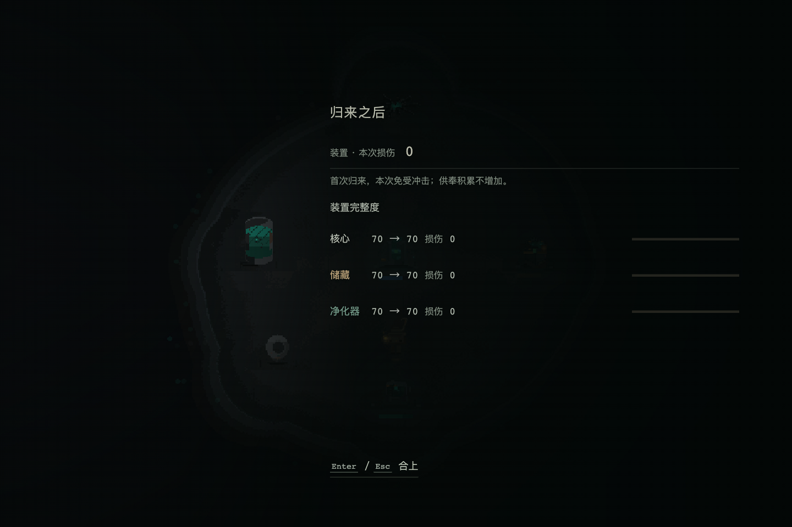

# 首次归来结算报告回归

只覆盖本次两个问题中的**首次归来缺少报告**。地图接线、长期抽样、能力平衡与动态美术验收不属于本报告；不据此宣告迭代28完整验收。

## 原因与修复

`ImpactSystem.run()` 按既定规则在 `cycle <= 1` 返回 `skipped: true`。净化点原先使用 `!skipped` 决定是否展示报告，导致首次出击免冲击时连报告一起省略。

改为依据实际归来身份展示，并在首次免冲击时使用同一生产报告的免伤分支：标题「归来之后」、装置本次损伤0、三个装置完整度同值前后对照，以及供奉积累不增加的说明。免伤、供奉、潮汐、稳定度和预告机制未变；该分支不播放冲击音效或震屏，不显示不存在的冲击强度。

报告仍在同笔世界结算保存成功后发布。重复保存回调不重复发布；Enter/Esc/鼠标合上走同一出口，清除按键边缘，避免Esc同时打开暂停。重复关闭不重放回调，销毁释放键监听与旧回调。

相关实现：

- `src/scenes/purification-scene.ts`：只调整归来报告发布与关闭段。
- `src/ui/dom/impact-result-panel.ts`：首次豁免读数及关闭/销毁生命周期。
- `tools/qa/check-first-return.mjs`：本次隔离回归入口。
- 规则正文：`docs/specs/system-purification-impact.md` 规则19/20。

## 方法与边界

每组测试创建全新临时 Chromium 上下文；不读取现有浏览器配置或用户存档。用正式净化点场景及真实 GameState、InventoryStore、ImpactSystem、SaveManager、TideSystem、StabilityTracker 与生产 DOM 报告。

测试以**合成的已结束出击账本**驱动真实 `PurificationScene.create()`：通过真实库存/出击接口准备首归、投入一件目录供奉物，再结算撤离/死亡/放弃。7薪柴为测试输入；供奉物也是测试夹具。这是场景集成测试，**不是从正式2D裂隙实际行走、翻找、撤离的端到端证据**。保存失败只在临时浏览器的 Storage 写入边界注入。

## 已通过

- 首次空手撤离、死亡、放弃均显示一次免冲击报告；放弃场景同时覆盖来自菜单恢复的未完成归来。
- 新档初次基地入场不显示报告；首归三个模块HP不变，供奉实例/充能不变，预告不被消费；潮汐正常推进。
- 首归带回7薪柴只入账一次；第二次归来仍实际扣装置HP并增加供奉积累，显示正常冲击报告。
- 保存失败时不展示报告且锁输入；再次失败仍不展示；成功重试仅发布一次，不重复冲击、收益、供奉与潮汐。
- 已结算账本重复进入及正常菜单继续读档不再弹出，也不重复入账。
- Enter、Esc、鼠标合上后恢复输入并清除暗场；Esc不顺带打开暂停；按键repeat不关闭；销毁后旧键监听/回调不生效。
- 当前固定画布中关闭按钮位于视口内；页面异常为0。

结果：[六组回归记录](artifacts/iteration-28/first-return-results.json)。

其他相关检查：`npm run typecheck`、9项预告合同检查、11项真实 SaveManager 迁移/事务检查、`node --check` 与 `git diff --check` 均通过。项目没有独立 lint 脚本。保存回归原 npm/tsx CLI 遇到沙箱IPC限制，改用等价 `node --import tsx` 执行后通过。未运行长期抽样或动态美术回归。

## 稳定画面

截图在生产报告220ms淡入动画结束后取得，1440×960窗口对应现有960×640逻辑画布。保留场景视角、无框排字与原底部关闭动作，没有新CSS或视觉体系。



静态图用于检查文字、明细与底栏无截断，不代替用户审美终审。

独立最短 art/UI 合规核对已通过：稳定帧中的标题、损伤0、免冲击/不积累整句、三装置明细与Enter/Esc底栏均完整，明暗层级沿用已认可R6。该结论不属于用户审美PASS，也不属于自然通关证据。

## 复现

先运行本仓库开发服务器。浏览器依赖由当前环境提供，不在项目新增依赖：

```sh
GAME_URL=http://127.0.0.1:3021 \
PLAYWRIGHT_MODULE=/absolute/path/to/playwright/index.mjs \
CHROME_PATH=/absolute/path/to/chrome \
node tools/qa/check-first-return.mjs

TSX_TSCONFIG_PATH=tools/contam-preview/tsconfig.json node --import tsx tools/inventory/check-impact-forecast.ts
TSX_TSCONFIG_PATH=tools/contam-preview/tsconfig.json node --import tsx tools/inventory/check-save-migration.ts
```

可用 `QA_OUTPUT_DIR` 指定证据目录，默认写入临时目录 `/tmp/coh-first-return-check`。

## 后续正式流程补证

同日另用全新临时浏览器从正式首页新游戏，经实际WASD入口、正常出发、刷新续局、真实E翻找一堆、行走至出口E撤离、R返回，确认首次免冲击报告出现并可Esc关闭。成功趟带回1薪柴，三模块仍70/100，页面异常0。该流程使用只读全地图诊断导航，不使用传送或强制结算；此前一趟导航受击偏轴卡墙的失败也完整保留。

这份正式流程证据独立于上述六组fixture检查，方法、成功/失败边界及截图见[正式浏览器链路](artifacts/iteration-28/production-browser/README.md)。
