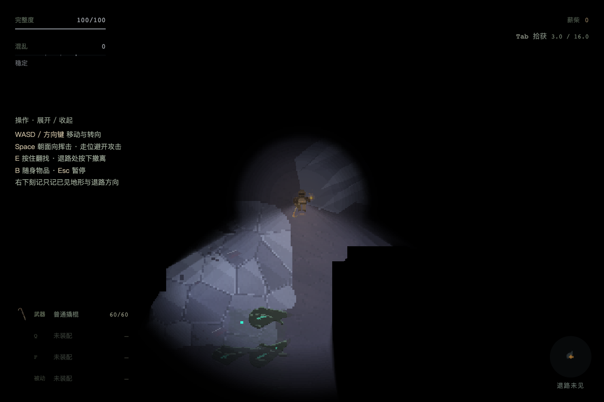
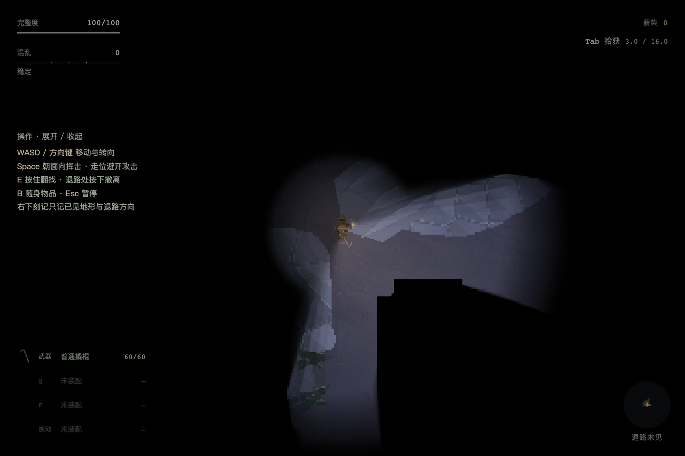
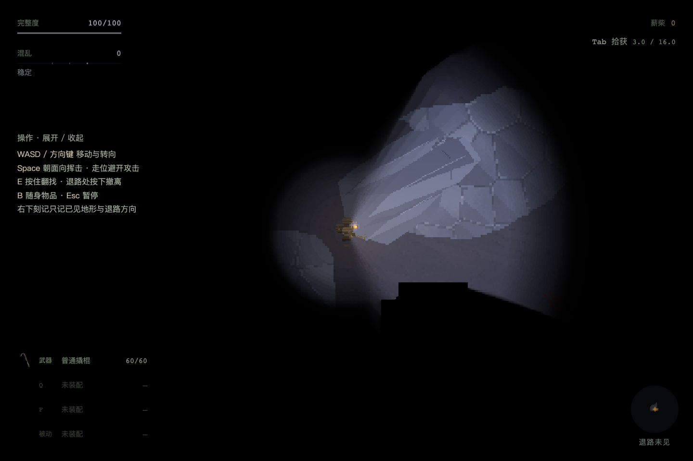
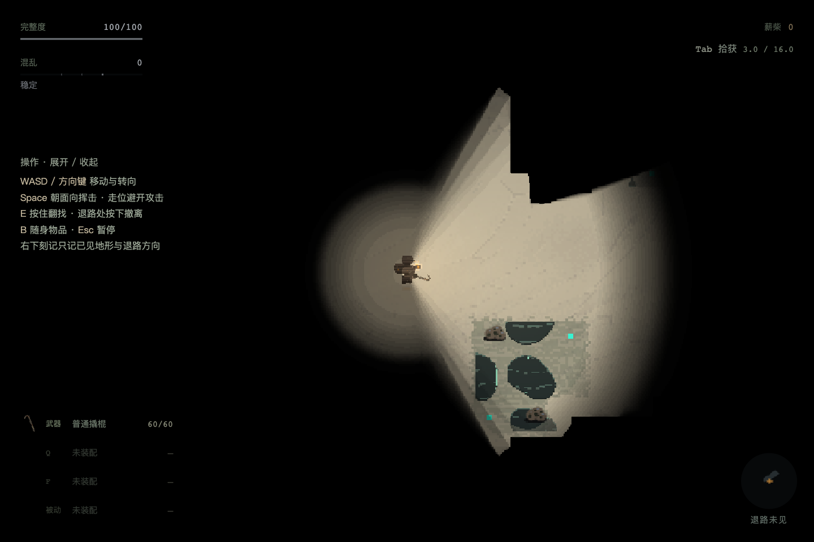
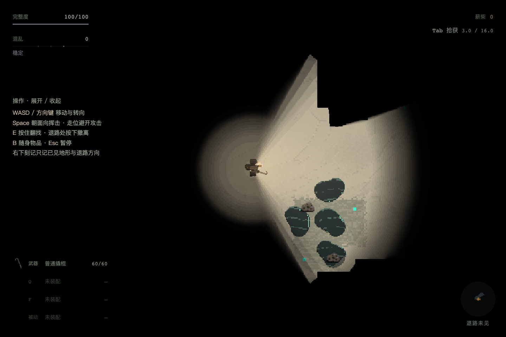
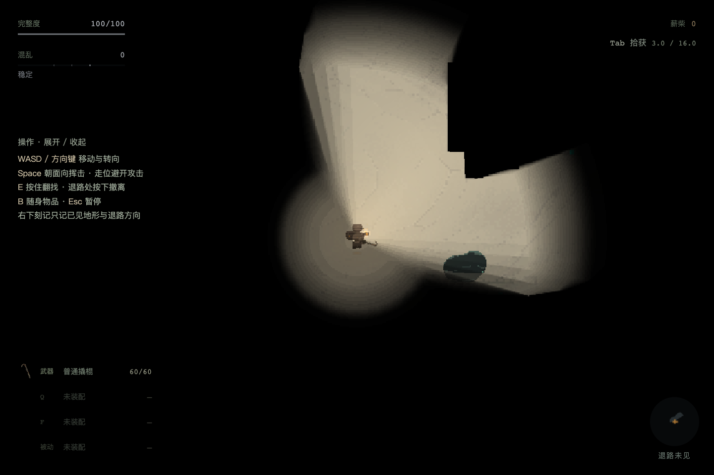

# 漆面群落两项修复

## 根因与实现

- **矩形截断**：原88/144画布同时定义生成尺度和存储边界。菌落卫星中心距边缘仅数像素，半径却超出画布；材质最后清掉边缘透明像素，又让旧“画布边缘无alpha”检查漏报。现保留原逻辑尺度，在独立大画布生成完整形体，再按实际范围及呼吸余量紧致裁回。投放先验证整团含动画包络的地面支撑，不把VOID填上或裁形凑配额。
- **斜向整群消失**：原渲染以簇核单点的visibility给整团设alpha。现材质像素与危险沉积读取正式VisibilitySystem同一查询，照到外围就显示外围；核、黑暗和VOID仍各按原规则。没有改变灯光范围、色彩、八向转向或步价。
- **性能**：视野输入未变时缓存像素查询；整团范围超出最大视距直接跳过。裁回紧致画布减少空区扫描，不能通过缩小模型换性能。微基准只反映CPU专项，不代替长期游戏帧率验收。

## 像素修复 HOW

对象仍是“地在呼吸”的地表群落；沿用已锁三种油膜及菌毯/灰幕生产形体，不新画角色、不换色表。沿用现有地表参考，按平面贴地、出生地表锚定位、玩家下方深度和整数像素构图；本次修复存储边界与视野消费。完整轮廓可跨多个32px Host格，实际物理/光线仍读8px支撑；不以地格方框作为生物轮廓。机器验收定位为完整性、遮挡与旧档兼容，未代签人类审美PASS。

## 存档与机制边界

新出击的配方保存`paintGeometryVersion:2`，生成、危险登记与恢复清单共用该版本。旧在途配方没有版本时按1还原原位置、危险格及核顺序。**所有入口的可视形体均使用完整版本2，旧局不必等待下一趟。** 旧版本1只单独生成原接触格，保护已保存的玩法数据，不再保留错误画布。局部受光修复对两版立即生效，无需删档。

`terrainFootprintField`只预留含呼吸范围的地面，`field`仍定义原危险登记。原核生灭与命中逻辑不改。为容纳完整外形，新图落点可离开原候选钉；优先最近合法落点、保持出生和撤离安全区、薪柴格与群落危险区不重叠。不足额时仍按有界候选重试，不能无声丢敌人。

### 二次反馈：旧局仍截断

用户确认视野已好，但同一团仍有上、左、下三处直切。上轮只在新v2出击验证画面，错误地将旧图的裁切外观也当成兼容合同，未覆盖实际旧局；此验收遗漏由本次补齐。

- 实际地图为`seed=1644663053 / ivory-basin / open-scars`，截图对象`ENM_BING_02`，原锚`1296,976`。上/左切线来自旧88px画布；完整重烘后，底部179像素还会触到真实VOID，因此仅换大画布不足以修复。
- 旧局完整形体连同最大呼吸包络，在原锚96px内按最短位移寻找实际地面支撑。只平移可视像素和生长轴，不缩小或删叶，不改原核、危险格、生命值、敌人ID顺序、世界签名及存档。截图对象向上16px即完整适配；同图7团均可适配。
- `surfaceFloorAt`读取实际8px或历史32px物理支撑；保守32px Host格继续用于危险登记，不再误裁仍有实际地面的外沿。越出旧危险格的完整轮廓不扩大伤害；危险沉积、退役区域与死亡残留仍读原active格。
- 极窄历史地形若96px内无完整位置，报告明确失败并保留真实VOID遮挡，不改世界或拒绝旧档；这一历史兼容限制不能宣称普遍消除。新地图仍须通过完整占地准入，不使用该回退。

## 自动化验证

- `npm run check:paint-surface`：90模型与324呼吸帧；独立扩大参考画布验证无漏形，68例恢复旧边界外形体。81组旧版完整字节指纹不变。48个八向部分可见帧，346978材质像素逐点校验，17160遮挡像素不泄漏；缓存失效、极小视距能力及远处整群剔除有独立断言。
- `check:paint-genome-topology`：144组合，形态区分阈值不变，尺寸不同的模型按世界中心对齐比较。
- `npm run check:world-production`：原4个片龄/空间样本加5世界×2空间的定向占地检查，14张投放全部验证完整动画包络支撑、原配额与身体路线。匿名配方仍走共享算法。不是扩大体验/长期平衡采样。
- `npm run check:rift-recovery`：18组。新增测试读取两份实际旧世界存档及含六群落的旧图存档，核坐标/数量/顺序和Host恢复导出逐值相同；新v2清缓存重建与版本篡改拒绝通过。
- TypeScript与Vite构建通过，保留既有大包提示。
- 环境运行时回归：112次构造/销毁、原危险面/地形约束、344次退役危险格、零纹理泄漏通过。沙箱不允许tsx CLI的IPC监听，因此使用等价的`TSX_TSCONFIG_PATH=tools/contam-preview/tsconfig.json node --import tsx tools/contamination-lexicon/check-r3-environment.ts`执行。
- 二次反馈新增`check-paint-legacy-presentation.ts`并接入`check:paint-surface`：用户同图7团、84个静息/膨胀呼吸帧，完整形体逐帧像素数量与无裁切参考一致，共恢复8398个旧画布外像素；原危险格逐值相同，存活延伸、死亡残留与真实VOID规则通过。重跑表面、18组恢复、环境运行时与完整构建通过。原14张新图生成闸门来自前轮，本轮未改生成/烘焙算法，不冒充重复采样。

## 新出击浏览器画面

`tools/contamination-lexicon/check-paint-browser.mjs`在独立Chrome上下文执行；新游戏后固定seed1进入真实v2 RiftScene。暂停模拟并设置同一观察站位、八向朝向，保留正式地形、Host、灯光、光罩和深度。该受控复现用于隔离两个缺陷，不冒充自然搜撤或新玩家体验。

同一油膜群落的画布166×152，占13个Host格，静帧接触画布边缘0、无支撑像素0。正视可见材质2644像素、核可见性1；转至斜向后1574像素、核可见性0；再转开为0像素并隐藏。三帧视野外泄漏及VOID像素均0，浏览器错误为空。[机器记录](artifacts/iteration-28/paint-fixes/report.json)。根代理已逐图查看完整与部分视角，确认正常光罩合成下仍能看到受光部分。

夹具初次运行未安装正式恢复验证器，出现记录重试提示；另受控瞬移须先刷新camera.worldView再绘制光罩。两处只修测试入口，未改变生产恢复校验、灯光或视距。最终重新运行通过并重取截图，最终目录不混入失败帧。

## 用户同图旧局复现

独立浏览器固定上述实际地图、原站位与朝向，使用真实RiftScene/Host/光罩。修前图为测试夹具切回旧版显示烘焙的**历史行为重现**，不是用户浏览器的原始截屏；修后和斜向图使用当前生产渲染。根代理逐图核对四个油膜叶片的闭合轮廓及斜向遮挡。

截图对象完整画布128×164、展示偏移`0,-16`；最终帧3635个材质像素可见，其中1126个在旧88px画布外，VOID及视野外泄漏均0。原8危险格、3个核的坐标/生命值/ID顺序、无版本旧世界签名`755c985b`不变。斜向核可见性0时仍有1114个受光像素。[修前记录](artifacts/iteration-28/paint-fixes/legacy-before.json)与[修后记录](artifacts/iteration-28/paint-fixes/legacy-after.json)均为PASS，浏览器错误为空。

另验证旧`#rift=0`入口的6团完整画布及真实地面遮挡，全部无VOID越界。[入口记录](artifacts/iteration-28/paint-fixes/entry-rift0.json)限定为真实场景CREATE后暂停、单独刷新正式渲染的几何验收；该DEV直入在运行完整首帧时仍有独立的`incomplete checkpoint`问题，本轮未修复或宣称通过其持久化流程，不影响上述正式旧局恢复验证。

独立代码复核未发现生产投放/版本链问题。最终TypeScript、构建和`git diff --check`通过。2026-09-20用户授权保存本次提交检查点，未推送；独立CLAUDE框架修改未触碰。本次不恢复扩大体验采样、长期平衡或动态审美验收；I28挂起项保持。
