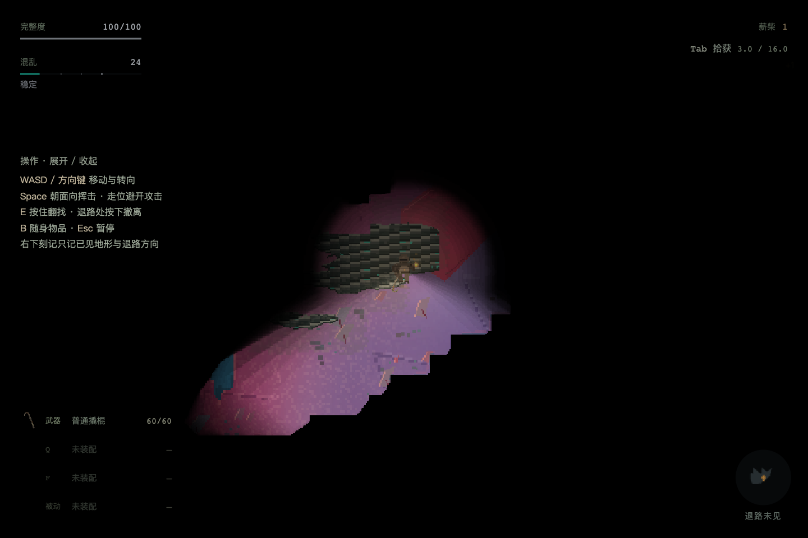
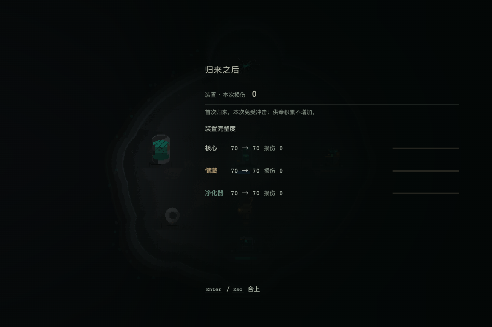

# 首归报告与新版地图接线

用户挂起扩大体验采样、长期平衡及剩余动态美术验收，优先修复这两项实际问题。目录/静态图标USER-PASS保留；本报告不把整轮迭代28改为COMPLETE。

## 根因与处理

1. **首归没有报告**：既有 `cycle<=1` 免冲击被界面误当成无需报告。保留免伤、供奉不积累，但真实归来成功持久化后显示同款报告的0损伤分支。销毁/重复关闭/Esc穿透一并收口。[专项回归](iteration-28-first-return.md)。
2. **五次出击仍是旧环境**：迭代26当时只接入隔离DEV体验，正式 `createProceduralDeparture` 仍调用旧地图生成器。这不是抽样概率偏低。现正式新出击从CSV选5种世界×2种空间，再由共享世界生成与地表渲染进入原RiftScene。

正式内容继续使用原投放规则：8薪柴、3污染物翻堆、3–4个地面敌人、按片龄3–12占漆、恰好1个听觉目标及适用的其他Host。世界身份与内容方言分开；当前10条候选显式使用已上线的旧图书馆方言，不虚构新的环境敌人能力。空间空洞不新增实体墙语义，旧以墙为前提的能力没有被改成穿越空洞。

8px支撑供物理/AI/灯光/探索，Host保留32px既有作用单位。审查发现并修正Host识别坐标与小地图显示范围的单位串用；小地图仍为66px画布/约1056世界像素，160/192px工具快照正常落入显示。地表渲染由正式和DEV共用，不按case补图。

## 续局边界

新出发身份保存完整世界与空间配方快照、内容方言及requestedSeed，签名含实际布局和Host图。当前CSV修改不重抽在途地图、掉落或来源区域。失败有界拒绝，不回退旧池。

旧identity没有generation时保留旧生成器/原地面。旧在途玩家先继续该趟，返回后下一次出击才采用新池；无需删除旧存档。原可选recipe提示仍可缺省，按原签名校验。

## 针对性验证

- `npm run check:rift-recovery`：17组通过，含原在途布局、真实Host顺序、跨系统完整帧、坏包保留、掉落方案权威及结算幂等。
- `check-procedural-identity.ts`追加旧recipe可缺省回归通过。
- `npm run check:world-production`：CSV引用检查；4个固定投放样本覆盖三档片龄与两种空间；8px支撑、20px身体、静态敌人绕行、Host核、巡逻、不同路线及重建一致。256个纯选择seed覆盖全部10条候选；5次正式出发身份经缓存清空/JSON重建，拒绝配方/空间/seed损坏。这是接线覆盖，不是长期平衡抽样。
- 小地图新尺度检查与旧回归通过：旧32px绘图指令/存档哈希相同，8px不读取未见邻格，VOID不填地面，160/192px快照可见，保存/到期与局部扫描有界。
- 首归6组隔离场景检查通过：空手/死亡/放弃、正常次归、保存失败重试、重复进入、键盘/鼠标/销毁；测试夹具边界见专项。
- `npm run build`（含TypeScript）通过；保留项目已有的大包体积提示。`git diff --check`通过。

## 实际键盘链路

[完整证据索引](artifacts/iteration-28/production-browser/README.md)保留两趟尝试：

- 首趟无彩层原，正常新游戏、出击、刷新续局、翻找均通过；测试导航受击偏轴后顶墙终止，失败记录保留。只修测试导航横轴校正，没有传送或改生产地形。
- 第二趟随机进入猩釉层原/断裂荒野，seed2505122715。首页新游戏→WASD入口→备行出发→刷新继续同图同位置→按住E翻找1薪柴→行走到出口E撤离→R返回→首归报告→Esc关闭，完整通过。HP100归来、cycle1、三模块70/100、baseSettled=true；页面错误0。

导航只读完整地图做身体安全BFS，动作均是真实键盘。不能据此评价新玩家找路体验。两张地图纹理、20×20身体、反射随位置更新均在真实Scene只读采样；瞬时FPS49.75–60.70不能替代性能验收。活动存档约106KB。

## 正式构建

`tools/qa/check-world-production-build.mjs` 对实际Vite生产包执行隔离浏览器检查：载入上述首趟真实游玩产生的未经修改记录；不存在 `window.__game`。菜单继续→实际键盘移动→保存→刷新→继续，同一身份、位置及dropPlan恢复，页面错误0。[结果](artifacts/iteration-28/production-build/report.json)、[续局实帧](artifacts/iteration-28/production-build/02-production-resumed.png)。测试最初误用DOM文字定位Canvas菜单而超时，记录保留；修正测试等待后通过，无游戏代码补丁。

扩大采样、长期平衡与动态审美验收仍ON-HOLD；没有代签用户美术PASS。2026-09-20用户授权提交本轮修复、挂起状态与验证记录；未推送。

## 追加：进入裂隙前裸净化点闪帧（2026-09-20，本次提交检查点）

**根因：** 500ms文字过场结束先移除黑幕并主动清理角色/装置/HUD，随后调用的`scene.start`只把切换排入下一帧。当前帧仍绘制留在显示列表中的净化点地表，与用户截图一致。修复在移除黑幕和资源清理前立即`sys.setVisible(false)`；当前帧只清为既有画布底色，下帧正常进入裂隙。Phaser的`Systems.start`会恢复可见性。原300/500ms节奏、外观、存档及出击事务不变。

按`in-game-ux`核对：保持原场景入口与黑幕文字的注意力中心；没有新增面板或额外操作；沿用同一世界的现有色彩、字体和overlay根。本次只修中间帧生命周期，不代签新审美结果。

`node tools/qa/check-rift-entry-transition.mjs`在独立空白浏览器执行新游戏、WASD到入口、E与Shift+Enter，观察每次真实`postrender`，不只比较最终截图。基线`--expect-flash`捕获到1帧已清理、仍可见、无遮罩的净化点；根代理查看截帧确认与反馈相同。修后正常出击、重复出发输入、一次明确注入的清理异常回主菜单三条路径均无裸地面帧，交接画布逐像素均为底色，过渡DOM无残留；重复输入只增加一次cycle，异常保留已保存的出行记录。正常/重复路径页面错误0，异常路径仅有预期注入错误。

同一净化点实例另做隔离场景重启，验证`visible=true`与角色重建；这不是完整搜撤返程，其存档事务和HUD验收不计入本次结论。TypeScript及Vite构建通过，保留既有大包提示。未操作用户浏览器或正式存档。

[基线记录](artifacts/iteration-28/rift-entry-transition/before-report.json) · [修后记录](artifacts/iteration-28/rift-entry-transition/report.json) · [基线异常帧](artifacts/iteration-28/rift-entry-transition/before/uncovered-cleaned-base.png) · [修后交接帧](artifacts/iteration-28/rift-entry-transition/normal/handoff-dark-frame.png)。长期挂起项不变；用户已授权将此追加修复保存为提交检查点，未推送。
