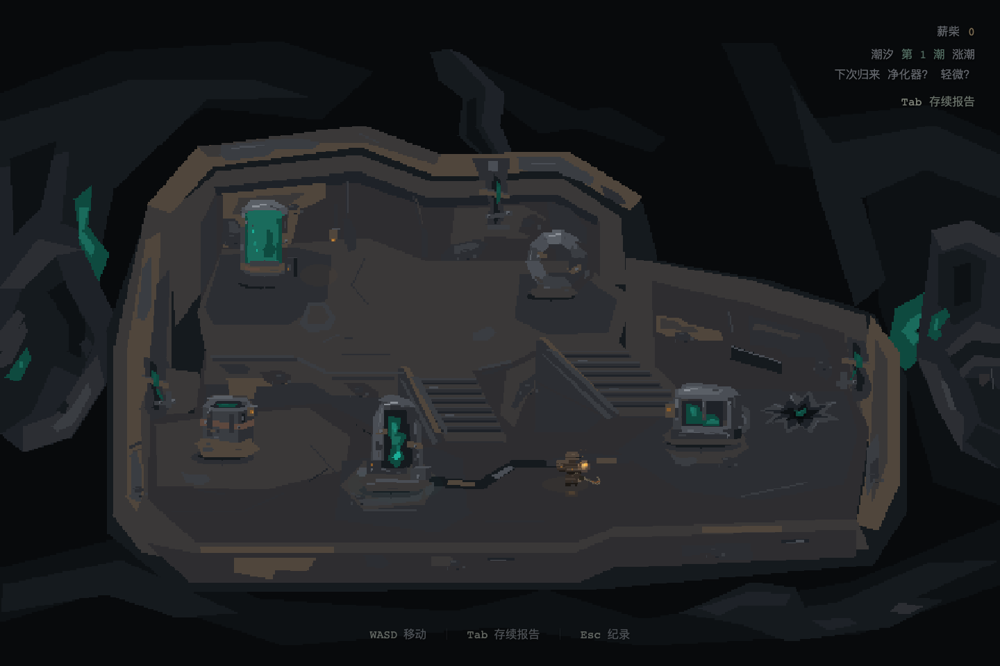
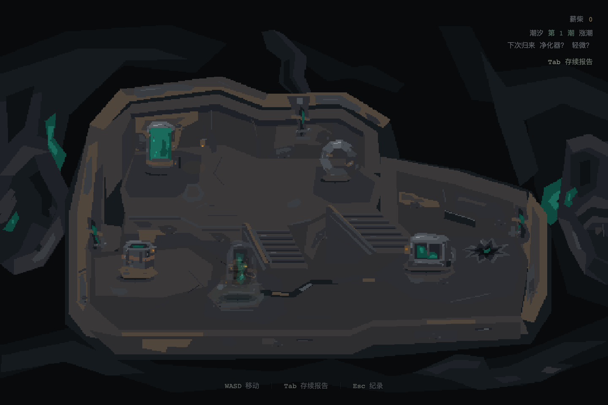

# I30 R2 · 错层净化点重做与限定验证

日期2026-09-22；版本为c3b1d9f上的R2工作区。用户已否决该基线的美术、陈列结构、轨道手感和模型身份；本轮重新实施，未替用户签收。具体文件指纹在本轮source-hashes.json，历史R1证据未覆盖。

## 对照与整改

知情art/design代理对照R1与I29图集/实帧：确认灰钢折板语法把建筑和物件抹成同类，双对称阶梯/两排设备取代功能邻接，设备身份从液缸/立环退化成椅架/夹床；1D轨道与画面纵深冲突。恢复六种职责剪影，重排为不规则两层实际面内空间与中央/东宽坡道。

R2首次实帧另交未参与制作的专家静帧复核：抓出薄平台断面、楼梯贴纹、棕板假门、墙缝假终端、外部纸片感。首帧保留在artifacts/iteration-30-r2/review/，不当最终交付。人物绕到核心后全遮挡及完整度条误用操作点也被根代理/代码审查看到并修正。音频/自然学习不是本轮静帧证据。

## 当前验证台账

- 运动纯合同：8024检查通过（不同帧率双坡循环、横移/停/反向、扫掠/滑动、完整圆足、六操作点/同层直线资格、冻结与随机输入）。原Rift Player320项比较通过；额外原人物四向/冻结调用已核查。
- 六点实走：隔离新档，经真实WASD/E/Esc访问六设备、面板冻结和返回、核心前后绕行/底座阻挡、中央坡横移停止反向、东坡下行与正式出击；无传送、注入资源或改时钟。最终绘制冻结后重新通过，0页面错误。追加断言：绕到核心后，仅核心淡出至≤0.5，人物alpha保持1；绕回前方核心恢复1。
- 出击过渡：正常、重复按键、刻意清理故障3组逐帧通过，裸露旧场景帧/遗留蒙层0。故障分支保留保存的run并回菜单，不冒充正常出击。
- 首归：原脚本6组通过，errors[]；使用明确的合成结束账本验证免伤报告、二次实际冲击、保存拒写重试/重载与重复输入，不写成6趟自然搜撤。
- 修复/成长/重载：隔离上下文在启动前写入受控fixture，100薪柴、核心70完整度、零成长；真实按键修复1点消费得到74/99，首项生命成长消费8后Level 1/薪柴91，重载保留。另检查读数不覆盖人物。这不是自然赚取资源的长期流程。
- 受损/满成长：受控8/24/0模块状态与满成长快照分别捕获上下层及成长面板；仅证明这些状态的运行与有限静态表现，不证明成长节奏或完整供奉周期。
- `npm run build`、`npm run typecheck`、`git diff --check`通过。Vite保留既有大chunk警告，仓库未定义lint脚本，不宣称lint通过。

## 实际入口、版本与复现

正式入口 `http://127.0.0.1:3025/`；测试使用隔离浏览器存储，不写用户当前档。

- `node --import tsx tools/qa/check-i30-chamber-movement.ts`：8024项运动检查。
- `node tools/qa/check-i30-chamber-runtime.mjs`：[最终运行清单](artifacts/iteration-30-r2/runtime/manifest.json)、[六点与移动记录](artifacts/iteration-30-r2/runtime/journey.jsonl)。导航已知布局，不能当初见可发现性研究。
- `node tools/qa/check-i30-chamber-investment.mjs`：[受控投入与状态清单](artifacts/iteration-30-r2/investment/manifest.json)。捕获在最后一轮液缸亮度、上层地面补片及局部阴影微调之前；经济/保存逻辑没有后续变化，不把旧快照称为最终画面。
- 出击过渡与首归使用原回归工具，路由适配后分别通过3组和6组；[过渡证据](artifacts/iteration-30-r2/transition/report.json)、[首归证据](artifacts/iteration-30-r2/first-return/results.json)。发生在后续局部画面打磨前，生命周期逻辑未再改动。
- [最终代码与工具指纹](artifacts/iteration-30-r2/source-hashes.json)记录归档时文件；不是声称所有早期截图都由这些最终字节生成。

### 最终实景

上层及操作：[蜕变](artifacts/iteration-30-r2/runtime/09-growth.png)、[供奉](artifacts/iteration-30-r2/runtime/10-offering.png)、[上层全景](artifacts/iteration-30-r2/runtime/11-upper.png)。独立首轮复核图保留于 `review/first-pass-*.png`，不用修后图片改写当时问题。

## 限度

当前几何/技术通过与用户对R2的认可分开；未进行新手研究、长期路线偏好或专门听感验收。既有价格/成长/供奉/权益不改，I28长期采样挂起不解除。移动路径与估算秒数不替代长期使用成本；旧5.9秒供奉绕行事实留在R1，不按旧版测试给新版背书。

根代理查看最终正常镜头和核心后遮挡实帧：大面材质与外部残构依然偏简化，精致度、空间故事感和侵蚀/抵抗的说服力未达到可自行宣布最终艺术验收的程度。记录为 **R2已实施 / 限定验证完成 / 用户复审待定**，不写整轮品质PASS。

## 后续用户评分（2026-09-22）

评分对象为已提交实现 `f9eb02d`：交互物建模80/100、场景结构75/100、场景模型与渲染50/100。用户反馈现已到达；上文“待复审”保留为取证时点，当前为 **已评分 / 场景表现仍需打磨 / 未获整体PASS**。不把前两项分数自动记为最终通过，不用三项平均值掩盖场景表现缺口。下一轮优先级及未实施清单见[I30任务](../tasks/iteration-30.md)。本次未重跑游戏或产生新运行证据。
