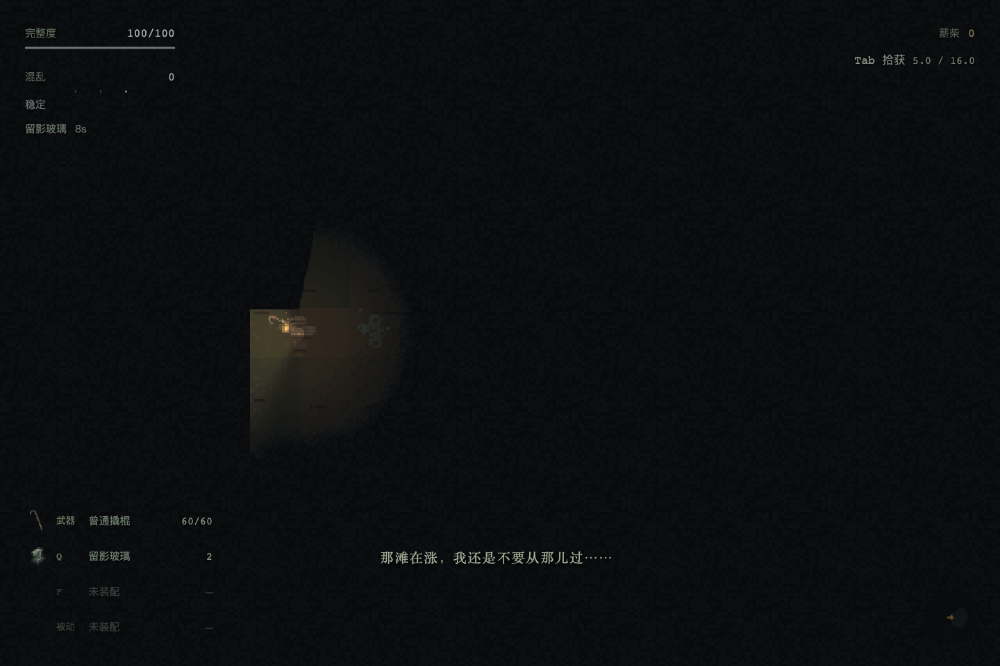
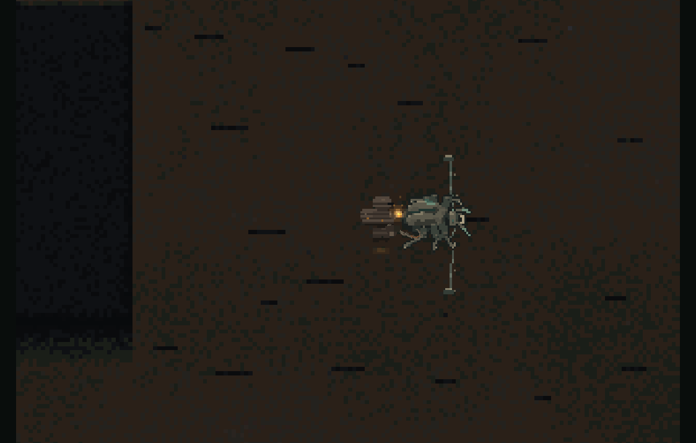
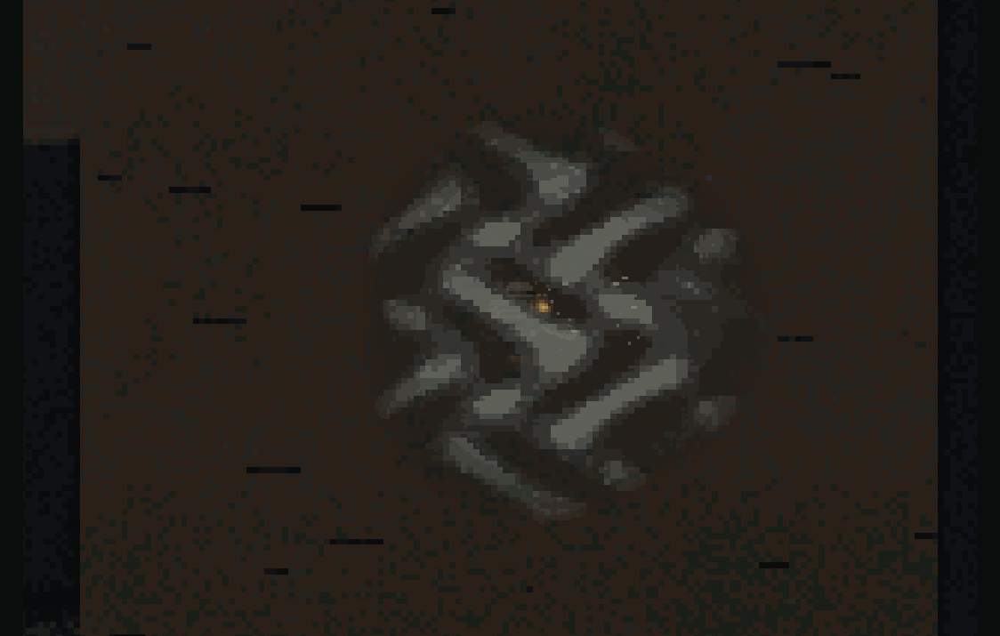
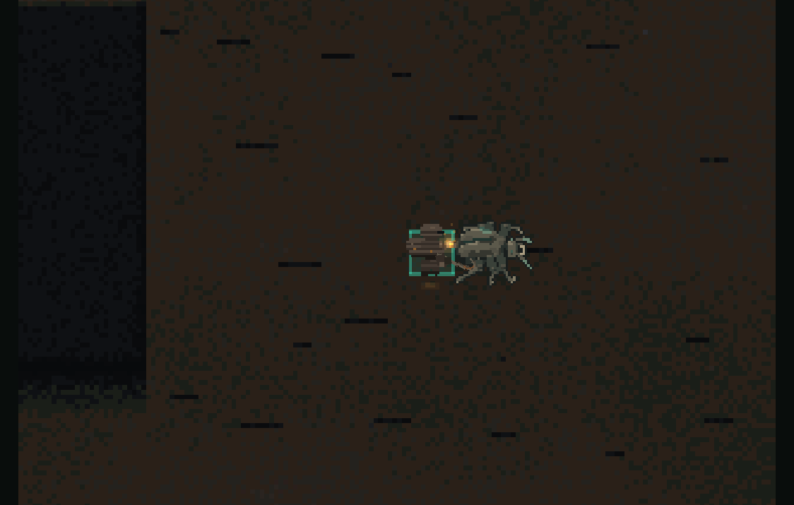
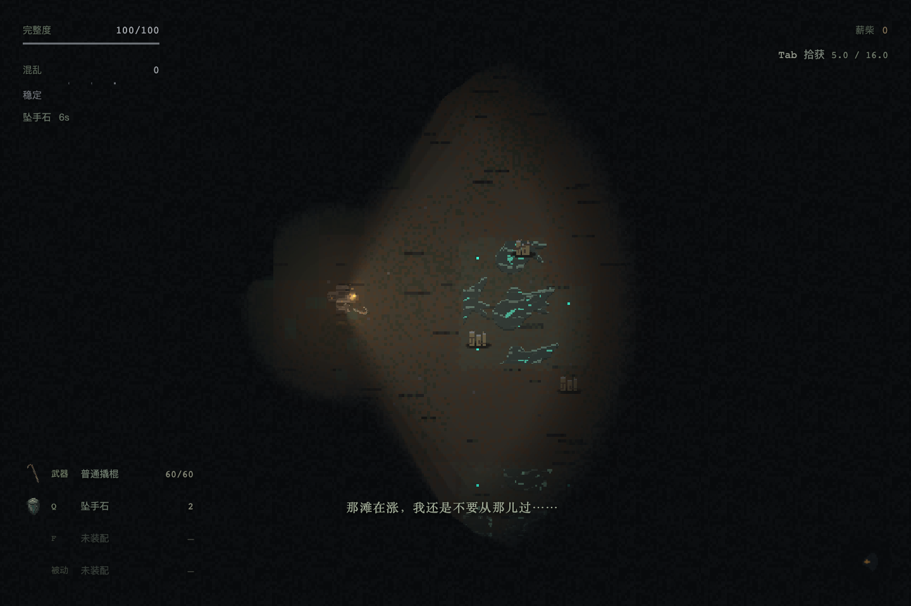

# 迭代20 · 十三族技能触发与视觉体验复审

基线：e820588。用户实际体验后要求扫描全部已上线非武器污染物，核对能否触发、是否需要/如何提供技能反馈，以及美术是否属于本游戏。初次复审只读；其后用户确认发现并授权实施，下方“修复与验证”记录已完成的生产改动。原始发现与截图作为修复前证据保留。

## 当前复验：敌人承受反馈、可用性与命名 · 2026-09-10

**当前结论：本轮实施与Agent专项验收通过。** 该结论覆盖本节的明确检查项，不代写用户审美PASS。

用户追加三项要求：实际作用于敌人的技能必须有对应承受反馈；继续此前优化/测试；使用精炼的完整描述性名称。本节记录后续版本；下方旧试玩“不予整体通过”及旧名称截图保留为发现问题时的历史证据。

### 实施结果

- 压力/结线现在有敌人身体的入效顿挫、持续沉降和解除回稳。正式裂隙和试验场的六类地面模型共享实现；地面痕迹继续负责位置/范围。真实命中仍走独立受击反应，减速/停步不制造伤害、眩晕或攻击打断。凝滞保留真实剪影冻结/受伤碎解，环境控制作用于宿主材质或蓄势，感知/自我强化类不伪造敌人受伤。共性规则已写入VFX与架构正文。
- 冷却的余烬改为压住活动污染源5秒，气团/雾团/尘絮群不再需要抢释放窗口；自然休息、蓄积、释放、消散都可施放，活动门控须开启，危险时序/强度不变。重复压制、恢复等待期、已暂缓、不可见/隔墙/没有目标均失败免费。
- 自然操作发现薄墙砖缝会被当作第二堵墙，现修为正交跨同一墙面砖缝有效；厚墙、斜角第二障碍、VOID与完整身体落点校验保留。
- 13族统一描述性名字；留影玻璃保留，另12族改名。CSV生成显示名，内部ID、存档/品质/次数不变。完整旧新名对应见 `../qa/artifacts/iteration-20-feedback-followup/name-mapping.json`。最长名称已在真实备行列表/槽位/详情和Rift HUD验证，未遮挡名称、余次或关键说明。

### 实际受压/结线试玩

最终稳定源码下的三个人形实景：通过公开试验场配置，随后只用真实键盘、Q/F与正常时钟；观察只读取运行态，没有调用技能或伪造敌人行动。连续录像见[实际身体反馈](../qa/artifacts/iteration-20-feedback-followup/restraint-live/restraint-live.webm)，完整读数见同目录`observations.json`。

- Q后敌人身体纵向比例最低约0.862、持续约0.89，实际完成攻击；角色后撤，敌人在区域还剩686ms时追出，移动倍率恢复1，身体平滑回到接近1，随后精确归位。
- F放下线时所有敌人均未绊住；实际跨线才触发，起始身体比例约0.907，止步观测约1499.9ms；解除后速度恢复1、身体约0.993且继续回稳，原线仍剩6852ms。
- 结线期间只确认真实控制值未禁止攻击/感知；这次自然路线没有观察到敌人在短暂绊住期间完成一次攻击，不把单位/生产适配器的合同检查冒充该次实玩动作。受压期间完成攻击已实际观察。
- 存档哨兵未改变，无页面异常。早期探索路线曾撞到真实掩体、没有引发追击或转向未完成导致线未被跨过；这些是未通过的操作尝试，最终录像是稳定版本完整重跑，不拼接成功片段。

### 已执行回归

- `check-restraint-live-browser.mjs`：上述真实Q/F→身体承受→自然恢复两段路径全部通过。
- `check-restraint-reaction.ts`：真实ToolSystem放置/跨线/末次持续、叠加来源分别到期、退出重入；真实模型中原攻击动画与独立HitReaction保留；30/60/120Hz一致。
- `check-environment-tools.ts`：3物种×4自然相位×3污染度=36组合；与不施法同种子Host逐帧对照，相位/流动时钟不变；空占漆、活动门控、重复/暂缓冲突、恢复预兆与核心存活。
- `check-combust-window-browser.mjs`：UI布置后真实100ms Q/F和自然时钟；气团静息、雾团蓄积、尘絮消散、持续油膜均成功，重复/恢复期/暂缓/空场免费，存档哨兵不变，无页面异常。
- `check-tool-natural-play-browser.mjs`：真实追击→WASD绕墙失视→固定旧影→真实6秒消退；真实走到薄墙砖缝→Q全身跨过→按住D不能跳过1秒实体化→恢复行走。已完成连续录像和状态轨迹，详见[自然试玩补验](../qa/iteration-20-live-followup.md)。
- `check-first-eight-tools`、`check-next-five-tools`、`check-tool-targeting`、`check-tool-consumption`、`check-contaminant-quality`、`check-muffle-live-perception`、`check-spent-memory`均通过；更名后正式Rift的实际Q、真实接受伤害、末次被动提示及保存失败回滚浏览器回归也通过。构建通过（245模块，已有大chunk提示），`git diff --check`通过。

初始装备/敌人由试验场UI配置；纯键盘测试与受控领域测试明确区分。UI命名核查使用独立初始库存，不碰用户存档；旧录像没有音轨，不把这些结果扩张为音频质量或全平台性能验证。

## 用户委托的实际试玩验收 · 2026-09-10

**结论：本轮不予整体通过。** 用户已明确要求由Agent操作并验收，不再把动态观察交回用户。以下是实际试玩判断，不是用户PASS，也不把单次技能成功等同于完整可用性合格。

### 操作与证据

使用独立Chrome上下文。试验场通过页面下拉框、靠近敌人按钮和真实WASD／Space／Q／F输入操作；按键保持80–100ms，移动保持实际时长，场景按正常游戏时钟运行。切配置与检查帧时使用页面暂停。没有通过调用useSlot、改敌人位置或手推Host时钟制造试玩结果。初次内置浏览器瞬时键被Phaser按帧读取漏掉，失败尝试未算成功；临时输入日志已删除。

正式裂隙使用独立测试存档，初始化两件已供奉测试装备并打开备行，随后以Shift+Enter出击、真实按键施放／行走／开关面板。此设置只构造验收初始条件，不是从零搜集装备的完整搜撤流程；没有操作用户存档，没有开启正式裂隙免伤。

录像为浏览器连续录屏的裁剪片段，未变速、未拼接造帧；无音频轨，本次不宣称完成听觉质量验收。截图和操作时间戳在`../qa/artifacts/iteration-20-playtest/`。

- [坠手石三目标对练录像](../qa/artifacts/iteration-20-playtest/compress-play.webm)：真实挥击、放置、后撤、追击、结束。
- [迟落砂／余烬核录像](../qa/artifacts/iteration-20-playtest/environment-play.webm)：悬砂、延迟结束、实际压制材质去色。

### 已修并复查

1. **坠手石范围不可读。** 原本石头可见，但范围散痕淹没在地面噪声里。已增加断续、硬像素的地面压痕边缘；不改变64px范围、6秒时长或0.5倍率。三只虫追击、玩家转向后撤及场地消退均实景检查，正式裂隙迷雾正常遮挡。证据`compress-retreat.png`与`compress-fixed-in/out/ended.png`、`rift-pressure.png`。
2. **迟落砂悬停状态太弱、结束直接消失。** 已增强目标附近的悬砂轮廓，并增加450ms下落收尾；真实延后仍严格5秒，收尾不延长Host控制，不显示为额外技能时长。证据`delay-start.png`与`delay-fixed-held/fall.png`。

### 本轮观察到的其他结果

- 冷结块：三只虫围攻时只冻合法单体；大号蠕虫冻结后，真实撬棍命中将75HP降至47HP，解除冻结。`solidify-large.png`与`solidify-hit-break.png`。
- 留影玻璃、错结线：在人形残余旁真实施放后，留影固定、线段落地；正式裂隙残影按视野遮挡。此轮没有将人形那次未跨线的录像冒充“绊停已验证”，跨线控制另由既有真实物理回归支持。
- 附生壳：关闭免伤，受击后100→85HP、抗性0→20%、余次5→4；重影片、缄口布在对应视觉／听觉遭遇中各从5→4。无全屏闪光抢夺场景。
- 复声壳实物落地、背光珠旧位置标记、缺口石无薄墙时失败免费均已实际按键检查。
- 正式裂隙Q/F余次4→3，地面效果留在原处，HUD持续读数随正常时钟变化；未出现pageerror。

### 仍未通过／未覆盖

- **I20-PLAY03 · 余烬核对气团的施放容错不足。** 多次真实F落在非法阶段，最终贴近释放时成功（余次3→2、材质确实去色）。源码复核：4.75秒周期仅650ms处于release；三个污染档同长。它能触发，但“只对已释放危险生效”的条件配合这个短窗口，不适合本作的判断节奏。建议扩大可接受施放的阶段或增加短输入缓冲；不要靠延长敌人的危险持续时间解决，以免顺带增加难度。本轮保留已批准的机制和CSV数值，没有悄悄更改这一合同。
- **返刻片自然失视、缺口石成功穿墙、本轮未形成完整新试玩证据。** 返刻片此次绕行中敌人持续跟随，未满足失视条件，余次保持5，不能据此判为失效，也不能签体验通过；现有受控失视/几何回归保留。后续由Agent继续补，不要求用户代跑。
- 本轮覆盖旧图书馆、虫／人形／大号蠕虫／气团、局部正式迷雾。未声明穷尽所有基底、三污染档、混合遭遇或长期平衡。

补强后`npx tsc --noEmit`、`npm run build`、`check-next-five-tools.ts`、`check-tool-host-follow-browser.mjs`通过。构建仅有既有大chunk警告。结单状态为`AGENT-REVIEW-CHANGES-REQUESTED`，原因是具体可用性问题及明确覆盖缺口，非“等待用户自己验收”。

## 修复与验证 · 2026-09-10

用户已批准按照复审方案推进。本轮十三族的实现与内部验证完成，最终体验交由用户；没有改武器、策划数值或中断出击政策。

- VF-01：纯听觉在识别累计之前请求缄口布接管，近距与改写体连续听觉共用路径。8项真实AI/Tool/Inventory回归全部通过，视觉、真实受伤、外报声音及保存失败保持原语义。
- VF-02/03：被动提示从事件类型取身份，末次装备引用清除后仍提示；主动失败说明目标/落点/重复状态/保存原因。正式Rift真实Q与实际承伤两次验证通过，没有扣次或免费施放漏洞。
- VF-04：缺口石完整1秒身体重组，并进入持续读数。真实Q `(330,140)→(308,118)`，body始终enabled，约967ms仍锁输入，1100ms已恢复；只消耗一次。
- VF-05：砂灰附着真实核心，并在Host移动后同步；0.5/1.5/3秒采样偏差全为0。另有真实场景持续运行回归。余烬核对实际危险材质去色，核心仍在，恢复跟随Host安全预兆。
- VF-06：留影复制真实玩家姿态；冷结贴合实际敌人轮廓并暂停身体时钟，实伤打断散片；错结使用不规则纤维且真实跨线才拉紧；坠手石留下同源实物与静止地面压痕，不再逐帧吸粒子。身体痕迹使用地面排序，场景物理/排序后重新定位层级。
- VF-07：被动使用现有HUD短确认；附生壳有局部壳缘合拢及“抗污+20”持续读数；返刻使用最后可见姿态且不读隐藏活体源；背光快照区分移动体/环境核心/物资并明示非实时；复声壳使用实物像素，投出残迹与真实声脉冲相接。
- 独立QA另发现：返刻末次耗尽后，其他追击者仍触发无用纹理烘焙。已修复并永久回归：耗尽后0次新增捕获，已付费旧影5999ms仍在、6000ms清除。

### 机器与真实场景验证

`npm run build`、类型检查、`git diff --check`通过。独立QA重跑首8/后5、目标几何、环境控制、旧档重复被动、18项消费、敌人控制及真实Q浏览器回归通过。

新增永久回归：

- `tools/inventory/check-muffle-live-perception.ts`：真实两类敌人听觉、末次、视觉/伤害/外报声、持久化失败。
- `tools/inventory/check-artifact-feedback-browser.mjs`：正式Rift Q、实际承伤、末次装备清引用后提示、存储失败提示与免费效果阻止。
- `tools/inventory/check-tool-body-echo-browser.mjs`：实际Chrome指定帧cut/trim、原点/比例/透明度、源改写后不变、100次更新无重烤、幂等销毁；生产Q镜像与冻结、实际伤害解冻；返刻的受控失视生命周期。
- `tools/inventory/check-tool-host-follow-browser.mjs`：真实场景连续帧的delay/combust与移动核心同位。
- `tools/inventory/check-spent-memory.ts`：多追击者末次耗尽停止烘焙，旧影完整保留。
- `tools/purification/check-ground-depth.ts`：原脚底排序回归及新增残影前后关系/迷雾边界。

### 最新画面与边界

最新证据目录`../qa/artifacts/iteration-20-vfx-fixed/`包含9族试验场近观、正式Rift留影/坠手石/背光珠、环境500/1500/3000ms、缺口石350ms及JSON。单帧近观用于视觉核对；真实输入、自然触发和机制证明分别来自上述回归，不能相互替代。

独立视觉复核认为：实体残影、真实轮廓、实物线/壳/石和环境去色已摆脱原通用几何效果。正式迷雾中的留影可辨但偏暗；坠手石边界刻痕仍刻意轻，迟落砂主要通过悬砂及被延后的释放节奏表达。用户最终体验重点是敌人进出迟重范围的直觉、延后→恢复节奏的可读性，不据静态图代勾美术PASS。

## 修复前发现（基线e820588）

**结论：十三族均有生产接线，但不能判定全部功能正确，也不能判定技能视觉合格。** 缄口布有已复现的听觉绕过；末次被动提示存在事件顺序缺陷。主动失败沉默、实体化停顿无反馈、环境压制可读性不足进一步放大“技能没触发”的体验。大量VFX仍沿用旧方框/方块/刻度线，而已更新的物件图标和角色模型不是这批技能VFX的完成证据。

## 证据与边界

- QA独立复验真实Rift/试验场输入、真实AI感知事件、真实Combat承伤与Inventory消费，另做纯听觉探针。既有领域回归仍通过，新增探针覆盖其遗漏。
- Director采集9件试验场3×真实效果帧、正式Rift的留影玻璃/坠手石/背光珠实际Q截图，以及减速/延迟/压制500、1500、3000ms序列。截图与数值保存在`../qa/artifacts/iteration-20-vfx/`。
- Art肉眼检查9件技能实景；Design独立对照能力与反馈语义。未读取用户禁止的旧审美skills，旧VFX实现与旧规范引用只作为待审对象，不作为美术正确性依据。
- 附生壳近观截图使用直接伤害回调，仅证明世界表现缺席；其触发证明来自另一独立正式Rift真实Combat承伤探针。正式小地图与试验场世界方点是两个不同呈现，未混为一谈。
- 局部截图证明该场景、目标与时间点的呈现；不声称13族所有敌人体型、所有迷雾情境和完整生命周期均已人工看过。未改代码，因此不重复用build成功充当体验证据。

## 已确认的逻辑与交互问题

### VF-01 · High · 缄口布扣次后仍能被纯听觉发现

玩家在改写体背后72px移动，无视觉。实际AISystem感知tick+ToolSystem/Inventory链路：100ms消费一次且保持巡逻；700ms已进入ALERT，hearingSuppressed仍为true。`state-machine.ts:58`先累积听觉识别，`:123`的`applyHearingAlertPush`先于`:136`的缄口布拦截执行，绕过连续听觉保护。证据[muffle-trigger.json](../qa/artifacts/iteration-20-vfx/muffle-trigger.json)。

建议从“原始听觉刺激→保护是否真正接管→识别累计/状态升级”统一处理，保留真实视线和被攻击的独立优先级；不能只把警戒阈值调高。验收要包含纯听觉持续遭遇、末次保护、安静后新遭遇、混合视觉、诱饵声源。

### VF-02 · Medium · 被动末次仍生效，但生效提示丢失

正式Rift附生壳2→1有“附生壳 生效”；1→0仍获得+20抗性/8秒，但提示为空，挂位直接未装配。`inventory-store.ts:312`耗尽清引用→publish同步重建装备HUD→`contaminant-system.ts:270`再发TOOL_USED；`rift-hud.ts:211–213`按已经消失的实例查找失败。四类被动共用这条易失匹配路径。

建议反馈事件携带本次已发生的身份/角色事实，不靠“消费完成后的装备里还有没有它”决定是否提示；末次要区分“本次已发动”和“物件已耗尽”。本次效果寿命不能随物件图标清掉。

### VF-03 · Medium · 主动失败沉默，试验场还有错误操作说明

`rift-scene.ts:524`忽略`useSlot(false)`，无目标/墙厚/落点不合法/已有快照/保存失败都没有原因。`combat-lab-scene.ts:284`仍说“线型工具需在两处各按一次”，实际错结线已改为一次放置。

建议保持当前短促、局部反馈：对应挂位给“无可作用目标 / 此处铺不开 / 效果仍在 / 未能保存”等真实原因。空槽不必反复弹大提示。不要把所有失败写成同一句检查距离。

### VF-04 · Medium · 缺口石实体化锁输入期间没有持续信号

`tool-system.ts:1727`设phase为stiffness，但`:625`持续效果列表只收phase===active。实际锁输入1秒，只有前约90ms方框闪光，剩余约910ms既无该状态读数又无身体恢复表现，容易误认卡操作。真实Q已补验：单墙角穿越从(330,140)到(308,118)，3→2次、body保持enabled；967ms仍锁输入，1100ms已恢复，但持续效果列表始终为空。证据[expand-trigger.json](../qa/artifacts/iteration-20-vfx/expand-trigger.json)。建议从出发位置到落点建立同次错接痕迹，实体化期间持续可读，合拢时恢复行动；不暗示机制没有的无敌。

### VF-05 · Medium · 环境效果锚点与动态目标脱节

迟落砂/余烬核都复制施放时Host位置后不刷新（`tool-system.ts:910、1877`）；Host核心可随实体形变移动（`contamination-host-system.ts:572`）。余烬核气团序列已测得本体与特效偏差约4.8–5.5逻辑像素。该次迟落砂样本的核未位移，不能把静态风险说成这次也复现。数据见[temporal.json](../qa/artifacts/iteration-20-vfx/temporal.json)。

目标状态表现应以Host ID重新取当前表面/核位置；若设计为地面物件，则要有物件→目标的明确关系。不能简单把所有层级调到最上方：应区分地面痕迹、对象表面与必要读数。

## 十三族逐件结论

| 异物 | 触发/效果证据 | 视觉必要性、当前判断及方向 |
| --- | --- | --- |
| 冷结块 · 主动 | 真实Q冻结、实际武器命中解冻通过 | 必须显示被停住的目标。当前固定蓝色斜多边形像选中框，未随体型贴合；重做目标自身的停滞断层、受击开裂与恢复。 |
| 重影片 · 被动 | 真实AI新怀疑→消费一次、填充×0.7通过 | 无需持续大特效；目前只见通用提示/扣次，缺乏“辨认变慢”的一次确认。建议挂位短暂重影，必要时目标辨认姿态一次错相，不泄露视野外实体。 |
| 返刻片 · 被动 | 真实AI追击→玩家绕到掩体后，消费并生成约6秒旧位置标记通过 | 必须显示旧位置。当前五块统一碎片难与地面碎屑区分；应截取最后可见姿态的低信息残迹，固定不追踪、逐步缺损，明确旧记录。 |
| 缄口布 · 被动 | 可触发/扣次，但纯听觉累计绕过，功能不通过 | 可以没有大世界VFX；需要声音/挂位细微确认。先修VF-01，再考虑声响短暂收束，不画静音圈，不消掉敌人/背景声。 |
| 缺口石 · 主动 | 真实Q成功穿单个墙角格，3→2次、身体保持启用、约1秒恢复输入；无墙真实Q免费 | 必须交代位移与1秒实体化。当前20px方框闪90ms与锁输入脱节；VF-04，重做身体接合过程。 |
| 留影玻璃 · 主动 | 正式Rift真实Q、试验场Q、AI诱饵8秒通过 | 必须是可被误认为人的残影。当前18×18荧光正方框+填色，明确不合格；应留下施放时玩家残缺姿态，接触破裂与自然消褪可区分。 |
| 复声壳 · 主动 | 真实Q前抛并扣次；声源调查领域通过 | 地面声源物合理，现为几块矩形临时拼壳+通用扩散点。方向可保留，但应用已完成的实物造型，补投出/落地线索，声纹与真正声源脉冲同拍。 |
| 迟落砂 · 主动 | 真实浏览器Host+Tool调用，未释放目标延后5秒、重复免费通过 | 应读作将要发生的释放被悬住。当前7粒弱像素在depth10、宿主可到40，近观难辨生效；需绑定目标释放过程，补悬落/恢复线索。 |
| 附生壳 · 被动 | 正式Rift实际承伤→+20抗性8秒、末次完整通过；VF-02 | 可以安静，但不能完全无确认。当前无技能身体变化，仅名字倒计时；受伤后局部壳缘短促合拢，持续读数讲明“抗污+20”，不做回血光/护盾球。 |
| 错结线 · 主动 | 真实浏览器身体跨线→停步1.5秒、感知攻击保留通过 | 线的位置和触发都需可读。当前等距刻度直线像判定尺，触碰时毫无响应；保留清晰短线，用旧纤维/错接痕迹及真实交点绷动，作用脚部，不套全身冻结框。 |
| 坠手石 · 主动 | 正式Rift真实F/Q、真实身体入出区×0.5→1通过 | 必须读出石头、范围与迟重。当前低对比方片像贴图瑕疵；向中心吸入还暗示不存在的吸力。改小石锚点、地面压痕、受影响落脚迟滞。 |
| 背光珠 · 主动 | 正式Rift真实Q得到6秒快照，非实时、重复免费与清理通过 | 小地图承载合理；当前启动方片与探知无关、敌人/环境核心同方点，缺少旧记录语义。建议局部曝光残留、形状分层及陈旧痕迹，不改成实时雷达或揭全图。 |
| 余烬核 · 主动 | 真实Q压制已释放气团，核心仍活、重复免费通过 | 必须读出危险暂时失活且核心仍在。当前9块近黑方片+微点几乎不可读，还可与移动核错位。表现实际危险纹理熄退/中断与恢复预兆，不假装净化或抹除本体。 |

## 美术判定与根因

不是所有技能都要有显眼特效：重影片/缄口布可以主要靠短确认与声音；附生壳也只需局部响应。但世界中留下诱饵、结线、持续范围、旧位置记录时，**那一份可见变化就是玩家理解规则的依据**，不能用通用方块代替。

当前实现仍被`tool-vfx.ts`的旧八类图元限制支配：8px网格散块、统一括号、连续多边形线条、旧rarity密度/alpha。这造成“数据和新图标已更新，技能发生时仍像旧占位系统”。同样teal配色不代表同世界；当前角色/敌人物件具有材质、体量、侵蚀结构，几何框却不携带这些关系。

另有时间推进问题：坠手石每帧偏移乘0.985，而非随delta推进（`tool-system.ts:1150`），30/60/120Hz视觉吸入速度不同；它还产生小数像素落点。应保持时间连续、像素边缘一致，不能将低帧跳变当“像素风”。

环境生效不能只靠一个低层提示：迟落砂depth10、余烬核depth11在volume40下；冷结块/脚边标记固定26也不能可靠适配脚底排序20–38。世界特效要合理受迷雾约束；返刻片和背光珠是明确的记忆信息例外，不能借修可读性泄露实时敌人。

## 修复顺序建议

1. 缄口布听觉路径、末次提示、主动失败原因、错结线过时提示、缺口石锁输入反馈先形成可靠闭环。
2. 留影玻璃、冷结块、错结线、坠手石分别作为身体残影、目标状态、触碰反馈、地面持续作用四类完整动态样板，包含开始/持续/结束和目标实际响应。
3. 将一致原则扩到环境延迟/压制、被动确认和旧位置快照；复声壳接已有实物资产。
4. 最终复验必须有真实输入/AI刺激、扣次、对象效果、可见确认、末次、失败和结束；同时看试验场近观与正式迷雾。不再用物品图标展板替代技能VFX验收。

## 代表实景

留影玻璃：当前只有玩家脚下绿色方框。

错结线：当前规则刻度直线，触发前后没有形体响应。

正式裂隙坠手石：已扣次且有6秒读数，但地面效果难辨。

